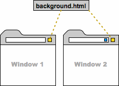
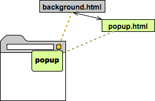
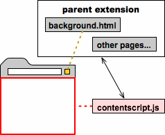
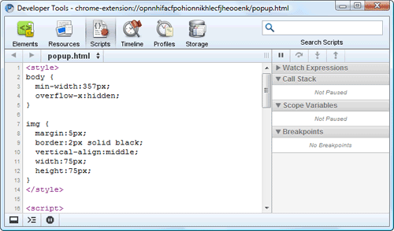
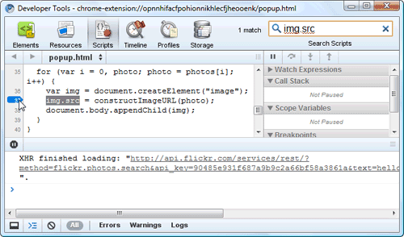
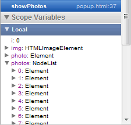
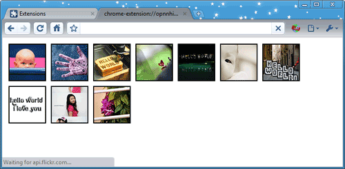

# 基础文档

# 基础文档

# 综述

# 综述

当读完了这个综述和入门之后，就可以开始创建应用（扩展）和 WebApp 了。 注意：WebApp 是通过应用（扩展）的方式实现的，所以除非特别声明，本页所有内容都适用于 WebApp。

## 基本概念

一个应用（扩展）其实是压缩在一起的一组文件，包括 HTML，CSS，Javascript 脚本，图片文件，还有其它任何需要的文件。 应用（扩展）本质上来说就是 web 页面，它们可以使用所有的浏览器提供的 API，从 XMLHttpRequest 到 JSON 到 HTML5 全都有。

应用（扩展）可以与 Web 页面交互，或者通过 content script 或 cross-origin XMLHttpRequests 与服务器交互。应用（扩展）还可以访问浏览器提供的内部功能，例如标签或书签等。

## 应用（扩展）的界面

很多应用（不包括 WebApp）会以 browser action 或 page action 的形式在浏览器界面上展现出来。每个应用（扩展）最多可以有一个 browser action 或 page action。当应用（扩展）的图标是否显示出来是取决于单个的页面时，应当选择 page action；当其它情况时可以选择 browser action。

 这个 gmail 提醒应用使用了 browser action，它在工具栏上增加一个图标

 这个新闻阅读应用也使用了 browser action，当点击时会弹出一个气泡窗口

 这个地图应用使用了 page action 和 content script（注入到页面内执行的脚本）

应用也可以通过其它方式提供界面，比如加入到上下文菜单，提供一个选项页面或者用一个 content script 改变页面的显示等。可以在"开发指南"中找到应用（扩展）特性的完整列表以及实现的细节。

## WebApp 界面

一个 WebApp 通常会打包一个包含了主要功能的 html 页面进来。例如下图中这个 WebApp 在 HTML 页面中显示了一个 flash 文件。 

更多信息，查看 [Packaged Apps](http://code.google.com/chrome/extensions/apps.html) 。

## 文件

每个应用（扩展）都应该包含下面的文件：

*   一个 manifest 文件
*   一个或多个 html 文件（除非这个应用是一个皮肤）
*   可选的一个或多个 javascript 文件
*   可选的任何需要的其他文件，例如图片

在开发应用（扩展）时，需要把这些文件都放到同一个目录下。发布应用（扩展）时，这个目录全部打包到一个应用（扩展）名是.crx 的压缩文件中。如果使用[Chrome Developer Dashboard](https://chrome.google.com/webstore/developer/dashboard),上传应用（扩展），可以自动生成.crx 文件。

## 引用文件

任何需要的文件都可以放到应用（扩展）中，但是怎么使用它们呢？一般的说，可以像在普通的 HTML 文件中那样使用相对地址来引用一个文件。下面的例子演示了如何引用 images 子目录下的文件 myimage.png

```
 
```

如果使用 360 极速版内置的调试器（开发人员工具），可以看到每一个应用（扩展）中的文件也可以用一个绝对路径来表示：

> **chrome-extension://***<extensionID>***/***<pathToFile>*

在这个 URL 中，<extensionid>是为每一个应用（扩展）生成的唯一 ID。从 chrome://extensions 页面中可以看到已经安装的所有应用（扩展）的唯一 ID。<pathtofile>是文件在应用（扩展）目录下的路径，也就是它的相对路径。</pathtofile></extensionid>

在这个 URL 中，<extensionid>名为 manifest.json 的文件包含了应用（扩展）的基本信息，例如最重要的文件列表，应用（扩展）所需要的权限等。下面是一个典型的应用（扩展），使用了 browser action 并访问 google.com </extensionid>

{ "name": "My Extension", "version": "2.1", "description": "Gets information from Google.", "icons": { "128": "icon_128.png" }, "background_page": "bg.html", "permissions": ["[`*.google.com/`](http://*.google.com/)", "[`*.google.com/`](https://*.google.com/)"], "browser_action": { "default_title": "", "default_icon": "icon_19.png", "default_popup": "popup.html" } }

详细信息，参考 Manifest Files 。

## 基本架构

绝大多数应用（扩展）都包含一个背景页面(background page)，用来执行应用（扩展）的主要功能。 

上图显示了安装了两个应用（扩展）的浏览器。两个应用（扩展）分别是黄色图标代表的 browser action 和蓝色图标代表的 page action。在 background.html 文件里定义了 browser action 和 javascript 代码。在两个窗口里 browser action 都可以工作。

## 页面

背景页面并不是应用（扩展）中唯一的页面。例如，一个 browser action 可以包含一个弹窗(popup)，而弹窗就是用 html 页面实现的。应用（扩展）还可以使用 chrome.tabs.create()或者 window.open()来显示内部的 HTML 文件。

应用（扩展）里面的 HTML 页面可以互相访问各自 DOM 树中的全部元素，或者互相调用其中的函数。

下图显示了一个 browser action 的弹窗的架构。弹窗的内容是由 HTML 文件（popup.html）定义的 web 页面。它不必复制背景页面(background.html)里的代码,因为它可以直接调用背景页面中的函数。 

更多细节可以参考 Browser Actions 和 页面间的通信 。

## <a name="contentScripts" style="color: #6B6B6B;">Content scripts</a>

如果一个应用（扩展）需要与 web 页面交互，那么就需要使用一个 content script。Content script 脚本是指能够在浏览器已经加载的页面内部运行的 javascript 脚本。可以将 content script 看作是网页的一部分，而不是它所在的应用（扩展）的一部分。

Content script 可以获得浏览器所访问的 web 页面的详细信息，并可以对页面做出修改。下图显示了一个 content script 可以读取并修改当前页面的 DOM 树。但是它并不能修改它所在应用（扩展）的背景页面的 DOM 树。 

Content script 与它所在的应用（扩展）并不是完全没有联系。一个 content script 脚本可以与所在的应用（扩展）交换消息，如下图所示。例如，当一个 content script 从页面中发现一个 RSS 种子时，它可以发送一条消息。或者由背景页面发送一条消息，要求 content script 修改一个网页的内容。 

更多的信息可以查看 Content Scripts 。

## <a name="pageComm" style="color: #6B6B6B;">页面间的通信</a>

一个应用（扩展）中的 HTML 页面间经常需要互相通信。由于一个应用（扩展）的所有页面是在同一个进程的同一个线程中运行的，因此它们之间可以直接互相调用各自的函数。

可以使用`chrome.extension`中的方法来获取应用（扩展）中的页面，例如 getViews()和 getBackgroundPage()。一旦一个页面得到了对应用（扩展）中其它页面的引用，它就可以调用被引用页面中的函数，并操作被引用页面的 DOM 树。

## 保存数据和隐身模式

应用（扩展）可以使用 HTML5 的 [Web Storage API](http://dev.w3.org/html5/webstorage/)（例如 localStorage）来保存数据，或者向服务器发出请求来保存数据。当需要保存数据的时候，首先需要确定是否从隐身模式窗口中发出的请求。缺省情况下，应用（扩展）是不会运行在隐身模式下的，而 webapp 是会的。需要明确用户在隐身模式下究竟需要应用（扩展）或 webapp 做什么。

隐身模式保证在该窗口下浏览不会留下痕迹。当处理隐身窗口的数据时，一定要遵循这个前提。例如，如果一个的应用（扩展）的功能是将浏览历史保存在云端（服务器），那么不要保存隐身模式下的浏览历史。另一方面，任何窗口下都可以保存应用（扩展）的数据，不论是否隐身。

重要规则：如果一条数据可能表明用户在网上看了什么或做了什么，不要在隐身模式下保存它。

要检查窗口是否在隐身模式下，检查 Tab 或 Window 对象的 incognito 属性。例如：

var bgPage = chrome.extension.getBackgroundPage();

function saveTabData(tab, data) { if (tab.incognito) { bgPage[tab.url] = data; // Persist data ONLY in memory } else { localStorage[tab.url] = data; // OK to store data }

## 后续

现在应用（扩展）的基本知识已经介绍完了，可以开始写自己的应用（扩展）了。更多的信息可以参考：

*   入门指南
*   调试指南
*   开发指南
*   代码例子

# 调试

# 调试

这个指南会向您介绍如何使用 Chromium 的内建开发工具进行应用（扩展）调试。

## 查看应用（扩展）信息

1.加载 Hello World 应用（扩展）。如果这个应用（扩展）正在运行中，你将在浏览器右边的地址栏上看到 Hello World 的图标。 如果这个应用（扩展）并未运行，你可以找到应用（扩展）文件，并且加载它们。如果你没有应用（扩展）文件，可以在这里下载它的 zip 文件，然后按创建扩展范例的方法加载它。

2.前往扩展页，地址 chrome://extensions，确认这个页面在开发者模式下。

3.查看 Hello World 应用（扩展）的信息，你能看到应用（扩展）的名称、描述、应用（扩展）ID。

## 观察 popup 页面

1.前往扩展页，地址 chrome://extensions，确认这个页面在开发者模式下，扩展页并不需要被打开，只要浏览器记住了这个设置即可。

2.右键点击 Hello World 图标 ，然后选择“审查弹出内容”菜单项，popup.html 将会被显示在开发工具窗口中。

3.如果脚本按钮没有被选中了，点击它。 

4.点击控制台按钮 ，（在开发者窗口的左下角，第二个按钮就是）这样你可以即看到代码，又看到控制台。

## 使用调试器

1.搜索”img.src”，然后在这个位置设置断点，只要在行号上单击即可设置。（比如：37 行）。 

2.确认你能看到 popup.html 标签，它将显示 20 个“hello world”图片。

3.在控制台上，重新加载这个页面。命令：location.reload(true);

> location.reload(true)

4.在工具窗口的右上方，你能看到局部变量。在这个例子中，它会显示出所有当前范围所见的变量。例如：在下面的屏幕截图上，变量 i=0，photos 则列出了一部分的 Element 列表。实际上，它包含了 20 个元素，每个代表一个图片。 

5.点击 play/pause 按钮 （在开发者工具窗口的上右方）做一次图像处理循环，每次你点击这个按钮，i 会加 1，popup 页面会显示更多另外的图标，当 i 是 10 的时候，popup 页看起来像如下图所示： 

6.点击 play/pause 按钮后面的的按钮，可以步进到函数调用的上层，为了让页面完成加载，点击之前的第 37 行，禁用之前设置的断点，接着按下 play/pause 按钮继续执行。

## 总结

这个指南示范了简单的应用（扩展）调试，总结一下：

1.在扩展管理页面上(chrome://extensions)，找到应用（扩展）ID;

2.查看应用（扩展）中的文件，使用类似这样的格式访问 chrome-extension://extensionId/filename

3.使用开发者工具设置脚本断点，单步调试，查看变量

4.使用控制台命令 location.reload(true)来重新加载当前的调试页面

# 格式：Manifest 文件

# 格式：Manifest 文件

## 目录

1.  字段说明
2.  字段的含义
    1.  app
    2.  default_locale
    3.  description
    4.  homepage_url
    5.  icons
    6.  incognito
    7.  intents
    8.  key
    9.  minimum_chrome_version
    10.  name
    11.  nacl_modules
    12.  offline_enabled
    13.  permissions
    14.  requirements
    15.  version
    16.  manifest_version
    17.  web_accessible_resources

每一个扩展、可安装的 WebApp、皮肤，都有一个[JSON](http://www.json.org/)格式的 manifest 文件，叫 manifest.json，里面提供了重要的信息 。

## 字段说明

下面的 JSON 示例了 manifest 支持的字段，每个字段都有连接指向专有的说明。必须的字段只有：name 和 version。

```
{
_// 必须的字段 _
  "name": "_My Extension_",
  "version": "_versionString_",
  "manifest_version": 2,
  _// 建议提供的字段 _
  "description": "_A plain text description_",
  "icons": { ... },
  "default_locale": "_en_",
  _// 多选一，或者都不提供 _
  "browser_action": {...},
  "page_action": {...},
  "theme": {...},
  "app": {...},
  _// 根据需要提供 _
  "background": {...},
  "chrome_url_overrides": {...},
  "content_scripts": [...],
  "content_security_policy": "_policyString_",
  "[file_browser_handlers](http://code.google.com/chrome/extensions/fileBrowserHandler.html)": [...],
  "homepage_url": "http://_path/to/homepage_",
  "incognito": "spanning" _or_ "split",
  "intents": {...}
  "key": "_publicKey_",
  "minimum_chrome_version": "_versionString_",
  "nacl_modules": [...],
  "offline_enabled": true,
  "omnibox": { "keyword": "_aString_" },
  "options_page": "_aFile_.html",
  "permissions": [...],
  "plugins": [...],
  "requirements": {...},
  "update_url": "http://_path/to/updateInfo_.xml",
  "web_accessible_resources": [...]
} 
```

## 字段的含义

部分字段的详细的含义如下：

### app

可安装的 webapp，包括打包过的 app，需要这个字段来指定 app 需要使用的 url。最重要的是 app 的启动页面------当用户在点击 app 的图标后，浏览器将导航到的地方。

更详细的信息，请参考文档 hosted apps 和[packaged apps](http://code.google.com/chrome/extensions/apps.html).：

### default_locale

指定这个扩展保的缺省字符串的子目录：_lcoales。如果扩展有 _locales 目录，这个字段是必须的。如果没有 _locales 目录，这个字段是必须不存在的。具体见 Internationalization.。

### description

描述扩种的一段字符串（不能是 html 或者其他格式，不能超过 132 个字符）。这个描述必须对浏览器扩展的管理界面和[Chrome Web Store](https://chrome.google.com/webstore)都合适。你可以指定本地相关的字符串，具体参考:Internationalization。

### homepage_url

这个扩展的主页 url。扩展的管理界面里面将有一个链接指向这个 url。如果你将扩展放在自己的网站上，这个 url 就很有用了。如果你通过了[Extensions Gallery](https://chrome.google.com/extensions)和[Chrome Web Store](https://chrome.google.com/webstore)来分发扩展，主页 缺省就是扩展的页面。

### icons

一个或者多个图标来表示扩展，app，和皮肤。你通常可以提供一个 128x128 的图标，这个图标将在 webstore 安装时候使用。扩展需要一个 48x48 的图标，扩展管理页面需要这个图标。同时，你还可以提供给一个 16x16 的图标作为扩页面的 fa 网页图标 。这个 16x16 的图标，还将显示在实验性的扩展[infobar](http://code.google.com/chrome/extensions/experimental.infobars.html)特性上。

图标要求是 png 格式，因为 png 格式是对透明支持最好的。你也可以用其他 webkit 支持的格式，如 BMP,GIF,ICON 和 JPEG。下面有个例子：

```
"icons":
  {
    "16": "icon16.png",             
    "48": "icon48.png",            
    "128": "icon128.png"
  }, 
```

注意：请只使用文档说明的图标大小。

可能你已经注意到了，chrome 有时候会将这些图标尺寸变小，比如，安装对话框将 128-像素图标缩小为 69-像素了。

然而，Chrome 的界面细节可能每个版本都不一样，但每次变动都假设开发者使用的是文档标注过的尺寸。如果你使用了其他的尺寸，你的图标可能看起来很丑，在将来的某个版本中。

如果你使用[Chrome Developer Dashboard](https://chrome.google.com/webstore/developer/dashboard)上传你的扩展、app、皮肤，你需要上传附带的图片，包括至少一张扩展的缩略图。更多信息请参考 ：[Chrome Web Store developer documentation](http://code.google.com/chrome/webstore/)。

### incognito

可选值："spanning"和"split"，指定当扩展在允许隐身模式下运行时如何响应。

扩展的缺省值是 Spanning，这意味着扩展将在一个共享的进程里面运行。隐身标签页的事件和消息都会发送到这个共享进程，来源通过 incognito 标志来区分。

可安装的 webapp 的缺省值是 split，这个意思是隐身模式下的 webapp 都将运行在他们自己的隐身进程中。如果 app 或扩展有背景页面，也将运行在隐身进程中。隐身进程和普通进程一样，只是 cookie 保存在内存中而已。每个进程只可看到和自己相关的事件和消息（比如，隐身进程只能看到隐身标签也更新）。这些进程之间不能互相通信。

根据经验，如果你的扩展或 app 需要在隐身浏览器里面开一个标签页，使用 split；如果你的扩展或 app 需要登记录到远程服务器或者本地永久配置，用 spanning。

### intents

一个字典，用于描述扩展或 app 所提供的全部 intent handler。字典里的每个键指定了一个 action verb。下面这个例子为"[`webintents.org/share`](http://webintents.org/share)"这个 action verb 指定了 2 个的 intent handler。

```
{
    "name": "test",
    "version": "1",
    "intents": {
      "http://webintents.org/share": [
        {
          "type": ["text/uri-list"],
          "href": "/services/sharelink.html",
          "title" : "Sample Link Sharing Intent",
          "disposition" : "inline"
        },
        {
          "type": ["image/*"],
          "href": "/services/shareimage.html",
          "title" : "Sample Image Sharing Intent",
          "disposition" : "window"
        }
      ]
    }  
  } 
```

“type”指定 handler 所支持的一组 MIME。

“href”指定了处理 intent 的页面 URL。对于托管的 apps，这个 URL 必须在属于允许 URL 集。对于扩展，这个页面必须是扩展自带的，其 URL 是相对扩展根目录的相对路径。

当用户触发 handler 对应的动作时，“title”会显示在 intent 选择界面中。

“disposition”可以是“inline”或“window”。当 intent 被触发时，“window”表示将在一个新标签中打开，而“inline”表示直接在当前标签页打开。

更多 Web Intent 信息请参考网站： [Web Intents specification](http://dvcs.w3.org/hg/web-intents/raw-file/tip/spec/Overview.html) 和 [webintents.org](http://www.webintents.org)。

### key

开发时为扩展指定的唯一标识值。

注意：通常您并不需要直接使用这个值，而是在您的代码中使用相对路径或者 chrome.extension.getURL()得到的绝对路径。

这个值并不是开发时显式指定的，而是 Chrome 在安装`.crx`时辅助生成的。(开发时可以通过[上传扩展](https://chrome.google.com/webstore/developer/dashboard)或者手工打包生成 crx 文件)。 安装完 crx，在 Chrome 的[用户数据目录](http://www.chromium.org/user-experience/user-data-directory)下的`Default/Extensions/_&lt;extensionId&gt;_/_&lt;versionString&gt;_/manifest.json`文件中，您可以看到这个扩展的 key。

### minimum_chrome_version

扩展，app 或皮肤需要的 chrome 的最小版本，如果有这个需要的话。这个字符串的格式和 version 字段一样。

### name

用来标识扩展的简短纯文本。这个文字将出现在安装对话框，扩展管理界面，和[store](https://chrome.google.com/webstore)里面。你可以指定一个本地相关的字符串为这个字段，具体参考：Internationalization。

### nacl_modules

一个或多个从 MIME 到处理这个 MIME 的本地客户端模块之间的映射。 例如，下段代码中加粗部分将一个本地客户端模块注册为处理 OpenOffice 电子表格 MIME。

```
{
    "name": "Native Client OpenOffice Spreadsheet Viewer",
    "version": "0.1",
    "description": "Open OpenOffice spreadsheets, right in your browser.",
    **"nacl_modules": [{
      "path": "OpenOfficeViewer.nmf",
      "mime_type": "application/vnd.oasis.opendocument.spreadsheet"
    }]**
  } 
```

"path" 指定一个 NaCl 的 manifest（就像扩展有各自的 manifest 一样，NaCl 也有自己的 manifest 文件，不同的是 NaCl 的以`.nmf`作为后缀）。 这个路径是相对于扩展根目录的。 更多 NaCl 信息和`.nmf` 文件格式请参考[NaCl 技术概述](http://code.google.com/chrome/nativeclient/docs/technical_overview.html)。

一个 MIME 只能与一个“.nmf”文件关联，但一个“.nmf”文件可处理多个 MIME。下面例子的扩展有 2 个“.nmf”文件，但处理了 3 个 MIME。

```
{
    "name": "Spreadsheet Viewer",
    "version": "0.1",
    "description": "Open OpenOffice and Excel spreadsheets, right in your browser.",
    "nacl_modules": [{
      "path": "OpenOfficeViewer.nmf",
      "mime_type": "application/vnd.oasis.opendocument.spreadsheet"
    },
    {
      "path": "OpenOfficeViewer.nmf",
      "mime_type": "application/vnd.oasis.opendocument.spreadsheet-template"
    },
    {
      "path": "ExcelViewer.nmf",
      "mime_type": "application/excel"
    }]
  } 
```

**注意：**扩展不在 manifest 中指定“nacl_modules”也可以使用 NaCl。仅在扩展希望自己的 NaCl 被浏览器知道并用于显示关联的 MIME 内容时才需要指定。

### offline_enabled

指定本扩展或 app 是否支持脱机运行。当 Chrome 检测到处于脱机状态，此项设置为“是”的 app 将会在新标签页中高亮显示。

### permissions

扩展或 app 将使用的一组权限。每个权限是一列已知字符串列表中的一个，如 geolocatioin 或者一个匹配模式，来指定可以访问的一个或者多个主机。权限可以帮助限定危险，如果你的扩展或者 app 被攻击。一些权限在安装之前，会告知用户，具体参考：[Permission Warnings](http://code.google.com/chrome/extensions/permission_warnings.html).

如果一个扩展 api 需要你的声明一个权限在 manifest 文件，一般的，api 的文档将告诉怎么做。例如，Tabs 页面告诉你这么声明一个 tabs 权限。

这是一个扩展的 manifest 文件的权限设置的一部分。

```
"permissions":
[    
    "tabs",    
    "bookmarks",    
    "http://www.blogger.com/",    
    "http://*.google.com/",    
    "unlimitedStorage"  
], 
```

下面的表格列举了一个扩展或者 app 可以使用的权限。

注意：托管的 app 能使用权限:xxx,其他的都不能使用。

| Permission | Description |
| --- | --- |
| *match pattern* | Specifies a*host permission*. Required if the extension wants to interact with the code running on pages. Many extension capabilities, such as cross-origin XMLHttpRequests,programmatically injected content scripts, and the cookies API require host permissions. For details on the syntax, see Match Patterns. |
| "background" | Makes Chrome start up early and and shut down late, so that apps and extensions can have a longer life. When any installed hosted app, packaged app, or extension has "background" permission, Chrome runs (invisibly) as soon as the user logs into their computer—before the user launches Chrome. The "background" permission also makes Chrome continue running (even after its last window is closed) until the user explicitly quits Chrome. **Note:**Disabled apps and extensions are treated as if they aren't installed. You typically use the "background" permission with a background page or (for hosted apps) a [background window](http://code.google.com/chrome/apps/docs/background.html). |
| "bookmarks" | Required if the extension uses the chrome.bookmarks module. |
| "chrome://favicon/" | Required if the extension uses the "chrome://favicon/*url*" mechanism to display the favicon of a page. For example, to display the favicon of [`www.google.com/`](http://www.google.com/), you declare the "chrome://favicon/" permission and use HTML code like this: `` |
| "contextMenus" | Required if the extension uses the chrome.contextMenus module. |
| "cookies" | Required if the extension uses the chrome.cookies module. |
| "experimental" | Required if the extension uses any [chrome.experimental.* APIs](http://code.google.com/chrome/extensions/experimental.html). |
| "geolocation" | Allows the extension to use the proposed HTML5 [geolocation API](http://dev.w3.org/geo/api/spec-source.html) without prompting the user for permission. |
| "history" | Required if the extension uses the chrome.history module. |
| "idle" | Required if the extension uses the [chrome.idle](http://code.google.com/chrome/extensions/idle.html) module. |
| "management" | Required if the extension uses the chrome.management module. |
| "notifications" | Allows the extension to use the proposed HTML5 [notification API](http://www.chromium.org/developers/design-documents/desktop-notifications/api-specification) without calling permission methods (such ascheckPermission()). For more information see Desktop Notifications. |
| "tabs" | Required if the extension uses the chrome.tabs or chrome.windows module. |
| "unlimitedStorage" | Provides an unlimited quota for storing HTML5 client-side data, such as databases and local storage files. Without this permission, the extension is limited to 5 MB of local storage. **Note:**This permission applies only to Web SQL Database and application cache (see issue [58985](http://crbug.com/58985)). Also, it doesn't currently work with wildcard subdomains such as[`*.example.com`](http://*.example.com). |

### requirements

指定本 app 或扩展所需的特殊技术功能。安装扩展时，扩展商店根据这个清单，必要时劝阻用户在不支持所需功能的电脑上安装这些扩展。

目前只支持指定“3D”，也就是 GPU 加速。您可以指定所需的 3D 相关功能，比如：

```
"requirements": {
    "3D": {
      "features": ["css3d", "webgl"]
    }
  } 
```

"css3d"的详细信息请参考[CSS 3D Transforms 规范](http://www.w3.org/TR/css3-3d-transforms/)，"webgl"请参考[WebGL API](http://www.khronos.org/webgl/)。 Chrome 3D 功能的支持情况请参考[WebGL and 3D graphics](http://www.google.com/support/chrome/bin/answer.py?answer=1220892)。 未来可能会增加更多技术功能的检测指定。

### version

扩展的版本用一个到 4 个数字来表示，中间用点隔开。这些数字有些规则：必须在 0 到 65535 之间，非零数字不能 0 开头，比如，99999 和 032 是不合法的。

下面是一些版本字符串例子：

*   "version": "1"
*   "version": "1.0"
*   "version": "2.10.2"
*   "version": "3.1.2.4567"

自动升级系统将比较版本来确定一个已经安装的扩展是否需要升级。如果一个发布的扩展有一个更新的版本字符串，比一个安装的扩展，这个扩展将自动升级。

版本字符串从比较从左边开始。如果这些数字相等，这个数字的右边的数字将被比较，这样持续下去。比如：1.2.0 就比 1.1.9.9999 更新。

缺少的数字将用 0 来代替。例子，1.1.9.9999 就比 1.1.更新。

具体信息请参考 Autoupdating。

### manifest_version

用整数表示 manifest 文件自身格式的版本号。从 Chrome 18 开始，开发者应该（不是必须，但是 2012 年底左右就必须了）指定版本号为 2（没有引号），如下所示：

```
"manifest_version": 2 
```

manifest 版本 1 从 Chrome 18 才开始逐步被弃用，版本 2 目前并不是必须的，但预计我们将在 2012 年底强制只支持版本 2。还没有准备好支持 manifest 版本 2 的扩展、应用和主题，可以明确指定版本 1，或者索性不提供本字段。

版本 1 到 2 之间的变化细节可以参考[`manifest_version`文档。](http://code.google.com/chrome/extensions/manifestVersion.html)

在 Chrome17（极速 5.2）或之前的指定版本 2 将会发生不可预料的事情。

### web_accessible_resources

一组字符串，指定本扩展在注入的目标页面上所需使用的资源的路径（相对于扩展的安装根目录）。例如，扩展在 example.com 上注入脚本以构建制界面，将其间所需的资源（图片、图标、样式、脚本等）加入白名单，如下所示：

```
{
    ...
    "web_accessible_resources": [
      "images/my-awesome-image1.png",
      "images/my-amazing-icon1.png",
      "style/double-rainbow.css",
      "script/double-rainbow.js"
    ],
    ...
  } 
```

这些资源的访问 URL 是 `chrome-extension://[PACKAGE ID]/[PATH]`，可通过调用`chrome.extension.getURL`构造出。 这些白名单资源是通过[CORS](http://www.w3.org/TR/cors/)头提供的，因此可被类似 XHR 这样的机制使用。

扩展的 content scripts 自身不需要加入白名单

#### 资源的缺省可用性

manifest_version 为 2 的扩展，缺省将不能使用除 web_accessible_resources 中指定外的任何其它任何扩展包内资源。

manifest*version 为 1 的扩展，缺省仍可访问任何扩展包内资源。*但是 _，一旦指定 web_accessible_resources，将也只能访问其中指定的资源。

# 模式匹配

# 模式匹配

内容脚本可以作用到模式匹配定义好的 URL 集合上. 你能对 manifest 文件的内容脚本段的部分进行一个或多个模式匹配操作. 这里描述模式匹配语法 — 当你指定内容脚本将影响哪些 URL 时你需要遵循的规则.

任意一个模式匹配本质上都是一个以认可的协议(例如：http, https, file, ftp 或者 chrome-extension)开头的 URL，只是 URL 你可以包含"*"字符. 这里有一种特殊的模式匹配<all_urls>，它表示所有已认可的协议开头的 URL 都被匹配. 每个模式匹配都由以下三部分构成:</all_urls>

*   *协议(scheme)*— 例如,http or file or*

    **注意:**file 协议不是缺省的(访问文件时可能需要明确指明使用 file 协议). 用户可以访问扩展管理页面或者设置页面来查看每个扩展独立的 file 协议设置.

*   *域名(host)*— 例如,www.google.com 或者*.google.com 或者*; 如果使用 file 协议, 这里就不需要*域名*部分

*   *路径(path)*— 例如,/*,/foo*, 或者/foo/bar

下边列出了基本语法:

```
_<url-pattern>_ := _<scheme>_://_<host>__<path>_
_<scheme>_ := '*' | 'http' | 'https' | 'file' | 'ftp' | 'chrome-extension'
_<host>_ := '*' | '*.' _<除 '/' 和 '*' 外的其它任意字符>_+
_<path>_ := '/' _<任意字符>_ 
```

'*'的含意依赖于它是出现在*协议*,*域名*, 或者*路径*中的那个部分. 如果*协议*部分是×, 那么它表示匹配以 http 和 https 协议开头的 URL. 如果*域名*部分是×, 那么它表示匹配任何域名. 如果*域名*部分是*.*域名*, 那么它表示匹配该域名及任何该域名下的子域名. 而在*路径*部分，每个'*'表示 0 个或多个字符. 下面的表展示了一些合法的模式匹配.

| 模式匹配 | 含意 | 能够匹配上的 URL 例子 |
| --- | --- | --- |
| [`*/*`](http://*/*) | 匹配任何 http 协议的 URL | [`www.google.com/`](http://www.google.com/) [`example.org/foo/bar.html`](http://example.org/foo/bar.html) |
| [`*/foo*`](http://*/foo*) | 匹配任何使用 http 协议的任何域名下，只要以/foo 开头的 URL | [`example.com/foo/bar.html`](http://example.com/foo/bar.html) [`www.google.com/foo`](http://www.google.com/foo) |
| [`*.google.com/foo*bar`](https://*.google.com/foo*bar) | 匹配任何使用 https 协议的 google.com 域名或其下子域名(例如 www.google.com, docs.google.com, 或者 google.com), 只要路径是以/foo 开头，以 bar 结尾的 URL | [`www.google.com/foo/baz/bar`](http://www.google.com/foo/baz/bar) [`docs.google.com/foobar`](http://docs.google.com/foobar) |
| [`example.org/foo/bar.html`](http://example.org/foo/bar.html) | 匹配指定的 URL | [`example.org/foo/bar.html`](http://example.org/foo/bar.html) |
| file:///foo* | 匹配以/foo 开头的任意本地文件 | file:///foo/bar.html file:///foo |
| [`127.0.0.1/*`](http://127.0.0.1/*) | 匹配任意以 http 协议的主机 ip 是 127.0.0.1 的 URL | [`127.0.0.1/`](http://127.0.0.1/) [`127.0.0.1/foo/bar.html`](http://127.0.0.1/foo/bar.html) |
| *://mail.google.com/* | 匹配任意以[`mail.google.com 或者 https://mail.google.com 开头的 URL`](http://mail.google.com 或者 https://mail.google.com 开头的 URL). | [`mail.google.com/foo/baz/bar`](http://mail.google.com/foo/baz/bar) [`mail.google.com/foobar`](https://mail.google.com/foobar) |
| <all_urls></all_urls> | 匹配所有认可的协议的 URL. (参看这一段开头的认可协议列表，里边包含了所有认可的协议.) | [`example.org/foo/bar.html`](http://example.org/foo/bar.html) file:///bar/baz.html |

这里展示一些*不合法*的模式匹配的例子:

| 错误的模式匹配 | 错误原因 |
| --- | --- |
| [`www.google.com`](http://www.google.com) | 没有说明*路径* |
| [`*foo/bar`](http://*foo/bar) | 在*域名*部分使用'*'时，'*'后边只能是'.' 或者 '/' |
| [`foo.*.bar/baz`](http://foo.*.bar/baz) | 如果'*'出现在*host*部分时, '*'只能出现在开头 |
| http:/bar | 少写了*协议*分隔符("/" 应该是"//") |
| foo://* | 无效的*协议* |