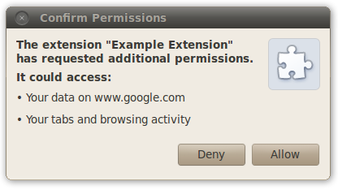

# 实现扩展

# 无障碍性(a11y)

当你设计一款扩展，需要让扩展对于诸如视觉缺陷，失聪，行动不便的残疾人没有使用障碍。

所有人 — 不仅仅是有特殊需求的人 — 都应该能从那些无障碍扩展所提供的相应模式中获益。例如，键盘的快捷键对于盲人，灵敏度较差的那些人非常重要，然而他们也能提高高级用户在无鼠标状态下的工作效率。 字幕和手抄本提供了聋人获取影音内容的通道，然而他们对语言学习者也非常有用。

人们可以通过各种方式和扩展交互。他们可能使用标准的显示器、键盘、鼠标，他们也可能使用显示放大器和键盘。另外还有一种情况是*屏幕阅读机*，一种为盲人和有视觉缺陷的人解释屏幕内容的辅助工具。屏幕阅读机可以大声朗读或者输出盲文。

虽然你不能预测人们会使用何种工具，但通过一系列的指引，你可以写出一款对大多数人无障碍的扩展。虽然本篇的指引不能让你的扩展对每一个人都没有使用障碍，不过这些指引确实是个好的开始。

## 使用无障碍的 UI 控件

首先，请使用支持无使用障碍的 UI 控件。最便捷的获取无障碍控件的方法是用标准 HTML 控件。如果你要创建自定义控件，请记住从设计之初就考虑控件的无障碍性，要比完工之后再支持无障碍性容易的多。

### 标准控件

在任何时候都尝试使用标准的 HTML UI 控件。标准的 HTML 控件 (如以下图例所示) 支持键盘无障碍性，可伸缩性，而且能被屏幕阅读机所理解。


### 自定义控件中的 ARIA

ARIA 是一份通过一系列标准 DOM 属性使 UI 控件能被屏幕阅读器接入的规范。这些属性为屏幕阅读器提供了功能和当前页面控件状态的线索。 ARIA 是 [W3C 进行过程中的项目。](http://www.w3.org/WAI/intro/aria)

为插件中的自定义控件添加 ARIA 支持包含修改 DOM 属性 ，为 Google Chrome 添加用户交互时引发事件的属性。屏幕阅读器相应这些事件并描述控件的功能。ARIA 定义的 DOM 属性分为*角色*，*状态*，和 *属性。*

ARIA *角色* 属标明了控件类型并描述了其行为。它表现为 DOM 属性角色，并附带一组预定义的 ARIA 角色值。因为 ARIA 角色是静态的，角色属性不应该改变它的值。

[ARIA 角色规范](http://www.w3.org/WAI/PF/aria/roles) 包含了如何挑选正确角色的细节信息。例如，如果你的插件包含工具条，工具栏 DOM 元素的角色属性应该如下设置：

```js
<div role="toolbar"> 
```

ARIA 属性也用于描述一类特殊角色控件的当前状态和属性。*状态* 是动态的而且应当在用户交互时被更新。例如，角色为 "checkbox"的控件可以为 "checked" or "unchecked". *属性* 总体上来说不是动态的，不过和描述控件特殊信息的状态相似。想了解 ARIA 状态和属性的更多信息，请参见[W3C States and Properties specification](http://www.w3.org/TR/wai-aria/states_and_properties).

**注释:** 你不需要为一种特定角色使用所有的状态和属性。

如下是一个添加 ARIA 属性 aria-activedescendant 到工具栏控件的例子:

```js
<div role="toolbar" tabindex="0" aria-activedescendant="button1"> 
```

[aria-activedescendant](http://www.w3.org/WAI/PF/aria/states_and_properties#aria-activedescendant) 属性定义了当工具栏获取焦点时，哪一个工具栏的子控件获取了焦点。在此例中，工具栏的第一个控件（拥有 id "button1"）是能获取焦点的子控件。代码 tabindex="0" 定义了工具栏中的子控件获取焦点的 DOM 文档顺序。

如下是样例工具栏的完整定义:

```js
<div role="toolbar" tabindex="0" aria-activedescendant="button1">
  
  
  
</div> 
```

一旦 ARIA 角色，状态，属性添加到了控件的 DOM 节点，Google Chrome 触发了合适的事件到屏幕阅读器。因为 ARIA 支持还是一项正在进行中的工作，Google Chrome 可能不会触发 ARIA 属性的所有事件，而屏幕阅读器也可能不能识别所有被触发的事件。你可以在[Chromium Accessibility Design Document](http://www.chromium.org/developers/design-documents/accessibility#TOC-WAI-ARIA-Support) 获取 Google Chrome 在 ARIA 支持上的信息。

如想获取添加 ARIA 控件到自定义控件的快速指南，请参见 [Dave Raggett's presentation from WWW2010](http://www.w3.org/2010/Talks/www2010-dsr-diy-aria/) 。

### 自定义控件的焦点信息

请确保你扩展的操作和导航控件可以接受键盘焦点。操作控件可能包含按钮，树，列表框。导航控件包含标签和菜单栏。

默认来说，能在 HTML DOM 中接受键盘焦点的控件是锚，按钮和表单空间。然而，设置 HTML 属性 tabIndex 为 0，把 DOM 属性放置到默认的标签序列，使他们能接受键盘焦点。 例如:

```js
_element_.tabIndex = 0 
```

设置 tabIndex = -1 从 tab 序列中移出了元素，但是语法上仍然允许元素接受键盘焦点。如下是设置键盘焦点的实例：

```js
_element_.focus(); 
```

请保证你的自定义控件包含键盘的支持，不仅对不使用鼠标用户非常重要，而且屏幕阅读器通过键盘来决定去描述哪个控件。

## 键盘入口的支持

用户在他们不想使用鼠标的时候也应该能使用你的扩展。

### 导航

请确认用户可以不用鼠标在你扩展的不同部分导航。也请确认任何页面或者浏览器的弹出是可以通过键盘导航的。.

在 Windows 上，可以使用**Shift+Alt+T** 切换键盘焦点至工具栏，这样就可以前往页面动作和浏览器动作的图标。有关于 [键盘和鼠标](http://www.google.com/support/chrome/bin/static.py?hl=en&page=guide.cs&guide=25799&from=25799&rd=1) 的帮助主题罗列出了 Google Chrome 所有的键盘快捷键，其中在 **Google Chrome 功能快捷键** 中也介绍了工具栏导航的诸多细节。

**注释:** Google Chrome 6 的 Windows 版本是第一个支持工具栏键盘导航的版本。Linux 的支持也在计划中。在 Mac OS X 上，Voice Over，Apple 屏幕阅读器提供了工具栏的接入。

请确保有键盘焦点的用户界面是易于辨认的。通常情况下在界面周围有焦点的外框，但是如果 CSS 被重度使用，外框线将被抑制，对比度可能被减弱。下面是焦点外框的两个例子。

 

### 快捷键

尽管最常见的快捷键导航提供了用 TAB 键在扩展界面中切换焦点的策略，然而这不是使用用户界面最简单高效的做法。如果提供了显示的键盘快捷键，键盘导航会变得更便捷。

如果要实现快捷键，控件上需要添加键盘响应。DHTML 风格指南工作组的 [键盘快捷键指南](http://dev.aol.com/dhtml_style_guide) 是一份很好的参考。

一个保证键盘快捷键易察觉性的方法是把他们罗列出来。扩展的 Options page 很适合完成此类事物。.

比如说工具栏，简单的 JS 键盘处理器可能如下所示。请注意为了反映当前的激活工具栏按钮，在响应用户输入后 ARIA aria-activedescendant 属性是如何更新的。

```js
<head>
<script>        
 function optionKeyEvent(event) {
  var tb = event.target;
  var buttonid;
  ENTER_KEYCODE = 13;
  RIGHT_KEYCODE = 39;
  LEFT_KEYCODE = 37;
  // Partial sample code for processing arrow keys.
  if (event.type == "keydown") {
    // Implement circular keyboard navigation within the toolbar buttons
    if (event.keyCode == ENTER_KEYCODE) {
      ExecuteButtonAction(getCurrentButtonID());
      _// getCurrentButtonID defined elsewhere_
    } else if (event.keyCode == event.RIGHT_KEYCODE) {
      // Change the active toolbar button to the one to the right (circular).
      var buttonid = getNextButtonID();
      _// getNextButtonID defined elsewhere_
      tb.setAttribute("aria-activedescendant", buttonid);
    } else if (event.keyCode == event.LEFT_KEYCODE) {
      // Change the active toolbar button to the one to the left (circular).
      var buttonid = getPrevButtonID();
      _// getPrevButtonID defined elsewhere_
      tb.setAttribute("aria-activedescendant", buttonid);
    } else {
      return true;
    }
    return false;
  }
}  
</script>        
<div role="toolbar" tabindex="0" aria-activedescendant="button1" id="tb1"
     onkeydown="return optionKeyEvent(event);"
     onkeypress="return optionKeyEvent(event);">
        
       
       
</div> 
```

## 提供无障碍的内容

以下的指引可能为大众所熟知，因为他们反应了所有网页内容好的经验，不仅仅是扩展。

### 文字

评估你扩展中的文字。很多人可能发现在扩展中增加字体的大小会非常适用。如果你使用键盘快捷键，请确保他们不和 Google Chrome 自带的缩放快捷键冲突。

[200% 测试](http://www.w3.org/TR/2008/REC-WCAG20-20081211/#visual-audio-contrast-scale)可以作为你 UI 灵活性的指示器。如果你增大字符大小或者放大页面至 200%，你的扩展是否还有用？

请尽量避免在图像中夹杂文字: 用户不能改变以图像方式显示的文字大小，屏幕阅读器也不能解读图像。考虑适用网络字体，比如[Google Font API](http://code.google.com/apis/webfonts/) 所提供的字体。 网络字体中的文字可供搜索，能缩放自如，并对屏幕阅读机的用户也是无障碍的。

### 颜色

请确保背景色和你扩展中的前景色/ 文字颜色有鲜明的对比度。 [对比度测试工具](http://snook.ca/technical/colour_contrast/colour.html) 能检测到你的背景色和前景色是否提供了合适的对比度。如果你在 Windows 环境中开发，你可以使用高对比度模式来检查你扩展的对比度。 当检测对比度时，请确认你扩展中依靠颜色、图像来传输信息的部分是容易分辨的。对于一些特定的图像，你可以使用诸如[Vischeck simulation tool](http://www.vischeck.com/vischeck/) 的实用工具来检查在不同颜色缺陷下，图像的显示情况。

你可以考虑提供多种颜色主题，或者给用户自定义颜色主题来改善对比度的权利。

### 声音

如果扩展依赖影音来传输信息，请确保提供相应的字幕和副本。请参见 [Described and Captioned Media Program guidelines](http://www.dcmp.org/ciy/) 以获取有关于字幕的更多信息。

### 图像

请为你的图像提供信息化的可替代文本。如下所示:

```js
 
```

尽量用可替代的文字表明图像的意图，这比繁复描述图像内容好的多。间隔图像或者纯装饰图像应该用（""）的可替代问题，或者 HTML 和 css 中移除。

如果必须在图像中使用文字，在可替代文字中添加图像文字。[WebAIM article on appropriate alt text](http://www.webaim.org/techniques/alttext/) 是个好的参考。

## 示例

想查看实现键盘导航和 ARIA 属性的例子，请参见[examples/extensions/news_a11y](http://src.chromium.org/viewvc/chrome/trunk/src/chrome/common/extensions/docs/examples/extensions/news_a11y/) (与 [examples/extensions/news](http://src.chromium.org/viewvc/chrome/trunk/src/chrome/common/extensions/docs/examples/extensions/news/) 比较） 是实现键盘导航和 ARIA 属性的好的例子。想查看源代码中更多的例子，请参见 Samples。

# 背景页

扩展常常用一个单独的长时间运行的脚本来管理一些任务或者状态。 Background pages to the rescue.

如同 architecture overview 的解释。背景页是一个运行在扩展进程中的 HTML 页面。它在你的扩展的整个生命周期都存在，同时，在同一时间只有一个实例处于活动状态。

在一个有背景页的典型扩展中，用户界面（比如，浏览器行为或者页面行为和任何选项页）是由沉默视图实现的。当视图需要一些状态，它从背景页获取该状态。当背景页发现了状态改变，它会通知视图进行更新。

### 清单

请在扩展清单中注册背景页。一般，背景页不需要任何 HTML，仅仅需要 js 文件，比如：

```js
{
  "name": "My extension",
  ...
  **"background": {
    "scripts": ["background.js"]
  }**,
  ...
} 
```

浏览器的扩展系统会自动根据上面`scripts`字段指定的所有 js 文件自动生成背景页。

如果您的确需要自己的背景页，可以使用`page`字段，比如：

```js
{
  "name": "My extension",
  ...
  **"background": {
    "page": "background.html"
  }**,
  ...
} 
```

如果你需要浏览器更早启动 — 例如，你想显示通知 — 那么，你也许也希望指定"background"权限。

### 细节

可以用类似于帧之间通讯的方式，直接使用脚本调用在一个扩展的多个页面之间进行通讯。`chrome.extension.getViews()` 方法会返回属于你的扩展的每个活动页面的窗口对象列表，而`chrome.extension.getBackgroundPage()` 方法返回背景页。

### 范例

下面的代码片段演示了扩展如何在背景页中与其他页面交互。同时也展示如何使用背景页来处理事件，如用户点击。

例子中的扩展有一个背景页，多个由 image.html 创建的 view 页面。（通过`chrome.tabs.create()`）。

```js
_//In background.js:_
// React when a browser action's icon is clicked.
chrome.browserAction.onClicked.addListener(function(tab) {
  var viewTabUrl = chrome.extension.getURL('image.html');
  var imageUrl = _/* an image's URL */_;
  // Look through all the pages in this extension to find one we can use.
  var views = chrome.extension.getViews();
  for (var i = 0; i < views.length; i++) {
    var view = views[i];
    // If this view has the right URL and hasn't been used yet...
    if (view.location.href == viewTabUrl && !view.imageAlreadySet) {
      // ...call one of its functions and set a property.
      view.setImageUrl(imageUrl);
      view.imageAlreadySet = true;
      break; // we're done
    }
  }
});
_//In image.html:_
<html>
  <script>
    function setImageUrl(url) {
      document.getElementById('target').src = url;
    }
  </script>
  <body>
    <p>
    Image here:
    </p>
    
  </body>
</html> 
```

# Content Scripts

## Contents

1.  Manifest
    1.  Include 和 exclude 语句
2.  编程式注入
    1.  <a>h3Name</a>
3.  执行环境
    1.  <a>h3Name</a>
4.  与嵌入的页面通信
    1.  <a>h3Name</a>
5.  安全性
    1.  <a>h3Name</a>
6.  引用扩展里的文件
    1.  <a>h3Name</a>
7.  例子
    1.  <a>h3Name</a>
8.  [视频（Youtube）](http://code.google.com/chrome/extensions/content_scripts.html#videos)
    1.  <a>h3Name</a>

## Content Scripts

Content scripts 是在 Web 页面内运行的 javascript 脚本。通过使用标准的 DOM，它们可以获取浏览器所访问页面的详细信息，并可以修改这些信息。

下面是 content scipt 可以做的一些事情范例：

*   从页面中找到没有写成超链接形式的 url，并将它们转成超链接。
*   放大页面字体使文字更清晰
*   找到并处理 DOM 中的[microformat](http://microformats.org/)

当然，content scripts 也有一些限制，它们不能做的事情包括 ：

*   不能使用除了 chrome.extension 之外的 chrome.* 的接口
*   不能访问它所在扩展中定义的函数和变量
*   不能访问 web 页面或其它 content script 中定义的函数和变量
*   不能做 cross-site XMLHttpRequests

这些限制其实并不像看上去那么糟糕。Content scripts 可以使用 messages 机制与它所在的扩展通信，来间接使用 chrome.*接口，或访问扩展数据。Content scripts 还可以通过共享的 DOM 来与 web 页面通信。更多功能参见执行环境。

## Manifest

如果 content scipt 的代码总是需要注入，可以在 extension manifest 中的 content_scipt 字段注册它。如下面的例子：

```js
{
  "name": "My extension",
  ...
  **"content_scripts": [
    {
      "matches": ["http://www.google.com/*"],
      "css": ["mystyles.css"],
      "js": ["jquery.js", "myscript.js"]
    }
  ]**,
  ...
} 
```

如果只是在某些情况下需要注入，可以使用 permission 字段，详见 Programmatic injection。

```js
{
  "name": "My extension",
  ...
  **"permissions": [
    "tabs", "http://www.google.com/*"
  ]**,
  ...
} 
```

使用 `content_scripts` 字段，一个扩展可以向一个页面注入多个 content_script 脚本；每个 content script 脚本可以包括多个 javascript 脚本和 css 文件。content_script 字段中的每一项都可以包括下列属性：

| Name | Type | Description |
| --- | --- | --- |
| `matches` | array of strings | *必须。* 定义哪些页面需要注入 content script。查看 Match Patterns 以了解详细语法。 |
| `css` | array of strings | *可选。*需要向匹配页面中注入的 CSS 文件。这些文件将在页面的 DOM 树创建和显示之前，按照定义的顺序依次注入。 |
| `js` | array of strings | *可选。* 需要向页面中注入的 javascript 文件，按定义顺序注入。 |
| `run_at` | string | *可选。* 控制 content script 注入的时机。可以是 document_start， document_end 或者 document_idle。缺省时是 document_idle。如果是 document_start, 文件将在所有 CSS 加载完毕，但是没有创建 DOM 并且没有运行任何脚本的时候注入。如果是 document_end，则文件将在创建完 DOM 之后，但还没有加载类似于图片或 frame 等的子资源前立刻注入。如果是 document_idle，浏览器会在 document_end 和发出[window.onload](http://www.whatwg.org/specs/web-apps/current-work/#handler-onload)事件之间的某个时机注入。具体的时机取决与文档加载的复杂度，为加快页面加载而优化。**注意：**在 document_idle 的情况下，content script 不一定会接收到 window.onload 事件，因为它有可能在事件发出之后才加载。在大多数情况下， 在 content script 中监听 onload 事件是不必要的，因为浏览器会确保在 DOM 创建完成后才执行它。 如果一定要在 window.onload 的时候运行，可以通过[document.readyState](http://www.whatwg.org/specs/web-apps/current-work/#dom-document-readystate)属性来检查 onload 事件是否已经发出。 |
| `all_frames` | boolean | *可选。*控制是在匹配页面的所有 frame 中运行还是只在最上层的 frame 中运行。缺省是 false，也就是只在最上层 frame 中运行。 |
| `include_globs` | array of string | *可选。*控制将 content_script 注入到哪些匹配的页面中。模拟 Greasemonkey 中的@include 关键字。 详细信息可以查看下面的 Include and exclude globs。 |
| `exclude_globs` | array of string | *可选。*控制将 content_script 注入到哪些匹配的页面中。模拟 Greasemonkey 中的@exclude 关键字。 详细信息可以查看下面的 Include and exclude globs。 |

### Include 和 exclude 语句

一个 content script 被注入页面的条件是： 页面 url 匹配任意一条 match 模式， 并且匹配任意一条 include glob 模式，并且不匹配任何 exclude glob 模式。 由于 matches 属性是必选的，因此 include glob 和 exclude glob 都只能用来限制哪些匹配的页面会被影响。

另外， 这两个属性与 matches 属性的语法是不同的， 它们更灵活一些。 在这两个属性中可以包含*号和？号作为通配符。 其中*可以匹配任意长度的字符串，而？匹配任意的单个字符。

例如，语句"[`???.example.com/foo/*`](http://???.example.com/foo/*)"" 可以匹配下面的所有情况：

*   "[`www.example.com/foo/bar`](http://www.example.com/foo/bar)"
*   "[`the.example.com/foo/`](http://the.example.com/foo/)"

但是它不能匹配下面的这些情况：

*   "[`my.example.com/foo/bar`](http://my.example.com/foo/bar)"
*   "[`example.com/foo/`](http://example.com/foo/)"
*   "[`www.example.com/foo`](http://www.example.com/foo)"

## 编程式注入

如果不需要将 javascript 和 css 注入到每一个匹配的网页里面，可以通过程序来控制代码的注入。 例如， 可以只在用户点击了一个 browser action 图标后才注入脚本。

如果要将代码注入页面，扩展必须具有 cross-origin 权限， 还必须可以使用 chrome.tabs 模块。 可以通过在 manifest 文件的 permissions 字段里声明来取得这些权限。

一旦设置好了权限，就可以通过调用 executeScript()来注入 javascript 脚本。如果要注入 css，可以调用 insertCSS()。

下面的代码（见例子[make_page_red](http://src.chromium.org/viewvc/chrome/trunk/src/chrome/common/extensions/docs/examples/api/browserAction/make_page_red/)） 演示了点击按钮后向当前标签的页面中注入并执行 javascript 代码。

```js
_/* in background.html */_
chrome.browserAction.onClicked.addListener(function(tab) {
  chrome.tabs.executeScript(null,
                           {code:"document.body.bgColor='red'"});
});

_/* in manifest.json */_
"permissions": [
  "tabs", "http://*/*"
], 
```

当浏览器显示一个 http 网页并且用户点击了扩展的 browser action 按钮后，扩展会将页面的 bgcolor 属性设置为红色。 如果这个页面没有用 css 设置它的背景颜色的话， 它会变成红色。

一般来说，可以将代码放在文件里面而不是像上面那个例子那样直接注入。 可以这样写：

```js
chrome.tabs.executeScript(null, {file: "content_script.js"}); 
```

## 执行环境

Content script 是在一个特殊环境中运行的，这个环境成为 isolated world（隔离环境）。它们可以访问所注入页面的 DOM,但是不能访问里面的任何 javascript 变量和函数。 对每个 content script 来说，就像除了它自己之外再没有其它脚本在运行。 反过来也是成立的： 页面里的 javascript 也不能访问 content script 中的任何变量和函数。

例如，这个简单的页面：

```js
hello.html
==========
<html>
  <button id="mybutton">click me</button>
  <script>
    var greeting = "hello, ";
    var button = document.getElementById("mybutton");
    button.person_name = "Bob";
    button.addEventListener("click", function() {
      alert(greeting + button.person_name + ".");
    }, false);
  </script>
</html> 
```

现在，将下面这个脚本注入 hello.html：

```js
contentscript.js
================
var greeting = "hola, ";
var button = document.getElementById("mybutton");
button.person_name = "Roberto";
button.addEventListener("click", function() {
  alert(greeting + button.person_name + ".");
}, false); 
```

然后，如果按下按钮， 可以同时看到两个问候。

隔离环境使得 content script 可以修改它的 javascript 环境而不必担心会与这个页面上的其它 content script 冲突。 例如，一个 content script 可以包含 JQuery v1 而页面可以包含 JQuery v2， 它们之间不会产生冲突。

另一个重要的优点是隔离环境可以将页面上的脚本与扩展中的脚本完全隔离开。这使得开发者可以在 content script 中提供更多的功能，而不让 web 页面利用它们。

## 与嵌入的页面通信

尽管 content script 的执行环境与所在的页面是隔离的，但它们还是共享了页面的 DOM。 如果页面需要与 content script 通信（或者通过 content script 与扩展通信）， 就必须通过这个共享的 DOM。

下面这个例子是通过自定义的 DOM 事件和把数据放到固定的地方来实现的：

```js
http://foo.com/example.html
===========================
var customEvent = document.createEvent('Event');
customEvent.initEvent('myCustomEvent', true, true);

function fireCustomEvent(data) {
  hiddenDiv = document.getElementById('myCustomEventDiv');
  hiddenDiv.innerText = data
  hiddenDiv.dispatchEvent(customEvent);
} 
```

```js
contentscript.js
================
var port = chrome.extension.connect();

document.getElementById('myCustomEventDiv').addEventListener('myCustomEvent', function() {
  var eventData = document.getElementById('myCustomEventDiv').innerText;
  port.postMessage({message: "myCustomEvent", values: eventData});
}); 
```

在上面的例子中，html 页面（不属于扩展）创建了一个自定义事件， 当它向 DOM 中的一个特定元素写入事件数据后就会激活并派发这个自定义事件。 Content script 在这个特定元素上监听这个自定义事件， 从这个元素中获取数据，并向扩展进程 post 一个消息。 通过这种方式， 页面建立了与扩展的通信链接。 这个方法也适用于反向的通信。

## 安全性

在写 content script 的时候，有两个安全问题必须注意。 首先， 要小心不要给原页面带来新的安全漏洞。 例如， 如果 content script 要从其它网站获取数据（比如通过背景页面做 XMLHttpRequest 调用）， 在将数据注入前，应该进行处理以防止[cross-site scripting](http://en.wikipedia.org/wiki/Cross-site_scripting)攻击，比如用 innerText 注入而不是用 innerHTML 注入。特别要小心的是在一个 HTTPS 的页面上获取 HTTP 的内容，因为这个内容很可能是被人用[man-in-the-middle](http://en.wikipedia.org/wiki/Man-in-the-middle_attack)方式破坏过的。

其次，尽管在独立环境中运行 content script 的机制已经提供了一些保护，如果不加区分的使用 web 页面上的内容还是可以被恶意的 web 页面攻击的。

```js
contentscript.js
================
var data = document.getElementById("json-data")
// WARNING! Might be evaluating an evil script!
var parsed = eval("(" + data + ")")

contentscript.js
================
var elmt_id = ...
// WARNING! elmt_id might be "); ... evil script ... //"!
window.setTimeout("animate(" + elmt_id + ")", 200); 
```

建议使用安全一些的 API：

```js
contentscript.js
================
var data = document.getElementById("json-data")
// JSON.parse does not evaluate the attacker's scripts.
var parsed = JSON.parse(data)

contentscript.js
================
var elmt_id = ...
// The closure form of setTimeout does not evaluate scripts.
window.setTimeout(function() {
  animate(elmt_id);
}, 200); 
```

## 引用扩展里的文件

通过 chrome.extension.getURL()来获取扩展里文件的 URL。可以像使用其它 url 一样使用这些 URL，如下面的例子所示：

```js
_//Code for displaying <extensiondir>/images/myimage.png:</extensiondir>_
var imgURL = **chrome.extension.getURL("images/myimage.png")**;
document.getElementById("someImage").src = imgURL; 
```

## 例子

例子[contentscript_xhr](http://src.chromium.org/viewvc/chrome/trunk/src/chrome/common/extensions/docs/examples/howto/contentscript_xhr)显示了一个扩展如何从 content script 里进行 cross-site 请求。可以在[examples/api/messaging](http://src.chromium.org/viewvc/chrome/trunk/src/chrome/common/extensions/docs/examples/api/messaging/) 里的消息通信部分找到更多例子。

可以看[make_page_red](http://src.chromium.org/viewvc/chrome/trunk/src/chrome/common/extensions/docs/examples/api/browserAction/make_page_red/) 和[email_this_page](http://src.chromium.org/viewvc/chrome/trunk/src/chrome/common/extensions/docs/examples/extensions/email_this_page/) 这两个例子了解程序注入。

更多例子和源代码，可以查看例子

# 跨域 XMLHttpRequest 请求

普通网页能够使用[XMLHttpRequest](http://www.w3.org/TR/XMLHttpRequest/)对象发送或者接受服务器数据, 但是它们受限于[同源策略](http://en.wikipedia.org/wiki/Same_origin_policy). 扩展可以不受该限制. 任何扩展只要它先获取了跨域请求许可，就可以进行跨域请求。

**注意:**页面内容脚本不能直接发起跨域请求. 然而, 任何一个页面内容脚本都可以发送消息给父扩展，请求父扩展发起一次跨域请求。关于使用这一技术的例子，请参照[contentscript_xhr example](http://src.chromium.org/viewvc/chrome/trunk/src/chrome/common/extensions/docs/examples/howto/contentscript_xhr).

## 扩展所属域

每个正在运行的扩展都存在于自己独立的安全域里. 当没有获取其他权限时，扩展能够使用 XMLHttpRequest 获取来自安装该扩展的域的资源. 例如, 假设有一个扩展包含一个叫 config.json 的 JSON 配置文件,该文件位于 config_resources 目录, 那么该扩展能够使用下面这段代码获取文件内容:

```js
var xhr = new XMLHttpRequest();
xhr.onreadystatechange = handleStateChange; // Implemented elsewhere.
xhr.open("GET", chrome.extension.getURL('/config_resources/config.json'), true);
xhr.send(); 
```

如果某个扩展希望访问自己所属域以外的资源，比如说来自[`www.google.com 的资源(假设该扩展不是来自 www.google.com`](http://www.google.com 的资源(假设该扩展不是来自 www.google.com)), 浏览器不会允许这样的请求，除非该扩展获得了相应的跨域请求允许。

## 获取跨域请求允许

通过添加域名或者域名匹配到 manifest 文件的 permissions 段, 该扩展就拥有了访问除了自己所属域以外的其他域的访问权限.

```js
{
  "name": "My extension",
  ...
  **"permissions": [
    "http://www.google.com/"
  ]**,
  ...
} 
```

跨域允许设置可以使用完整域名, 例如:

*   "[`www.google.com/`](http://www.google.com/)"
*   "[`www.gmail.com/`](http://www.gmail.com/)"

或者使用模式匹配, 例如:

*   "[`*.google.com/`](http://*.google.com/)"
*   "[`*/`](http://*/)"

模式匹配"[`*/`](http://*/)" 表示可以发起到所有域的 HTTP 请求. 注意在这里, 模式匹配有点像内容脚本匹配, 但是这里的任何域名后的路径信息都被忽略

这里还需要注意访问权限是根据访问协议(匹配模式里的 http 或者 https 或者其他协议名)及域名来授予的. 例如某个扩展希望同时基于 https 和 http 协议访问某个域或者某些域, 那么它必须分别获取基于这两种协议的访问允许(类似下面这样的声明):

```js
"permissions": [
  "http://www.google.com/",
  "https://www.google.com/"
] 
```

## 安全性考虑

每当使用通过 XMLHttpRequest 获取的资源时, 你编写的背景页需要注意不要成为[跨域脚本](http://en.wikipedia.org/wiki/Cross-site_scripting)的牺牲品. 特别注意避免使用像下面这样的危险 API:

```js
background.html
===============
var xhr = new XMLHttpRequest();
xhr.open("GET", "http://api.example.com/data.json", true);
xhr.onreadystatechange = function() {
  if (xhr.readyState == 4) {
    // 警告! 这里有可能执行了一段恶意脚本!
    var resp = eval("(" + xhr.responseText + ")");
    ...
  }
}
xhr.send();

background.html
===============
var xhr = new XMLHttpRequest();
xhr.open("GET", "http://api.example.com/data.json", true);
xhr.onreadystatechange = function() {
  if (xhr.readyState == 4) {
    // 警告! 这样处理有可能被注入恶意脚本!
    document.getElementById("resp").innerHTML = xhr.responseText;
    ...
  }
}
xhr.send(); 
```

实际上我们应该首选不会执行脚本的安全 API:

```js
background.html
===============
var xhr = new XMLHttpRequest();
xhr.open("GET", "http://api.example.com/data.json", true);
xhr.onreadystatechange = function() {
  if (xhr.readyState == 4) {
    // JSON 解析器不会执行攻击者设计的脚本.
    var resp = JSON.parse(xhr.responseText);
  }
}
xhr.send();

background.html
===============
var xhr = new XMLHttpRequest();
xhr.open("GET", "http://api.example.com/data.json", true);
xhr.onreadystatechange = function() {
  if (xhr.readyState == 4) {
    // innerText 不会给攻击者注入 HTML 元素的机会.
    document.getElementById("resp").innerText = xhr.responseText;
  }
}
xhr.send(); 
```

另外在使用通过协议 HTTP 获取的资源时要特别小心. 如果你开发的扩展被应用在恶意网络环境中，网络攻击者(又叫 ["中间人攻击"](http://en.wikipedia.org/wiki/Man-in-the-middle_attack)) 可能篡改服务器响应内容从而可能攻击你编写的扩展. 事实上，你应该尽可能地首选使用 HTTPS 协议.

# 国际化 (i18n)

## 目录

1.  如何支持多种语言
2.  预定义的 message
3.  语言环境
    1.  已支持的语言环境
    2.  扩展怎么找到字符串
    3.  如何设置浏览器语言
4.  示例
    1.  例: getMessage
    2.  例: getAcceptLanguages
5.  API 介绍: chrome.i18n

国际化 (i18n)

一个支持国际化的扩展能很容易被本地化，但原始不支持自动确认语言和地区。

为了国际化您的扩展,您需要把所有用户可见字符串保存在文件名为 messages.json 的文件里。每当你本地化您的扩展时，您需要在*locales/localeCode 下增加这个 messages.json 文件，lo_caleCode* 是一个形如 en 代表英语的编码。

下面是一个支持英语(en)、西班牙语(es)和韩语(ko)的国际化扩展文件层次结构图。


## 如何支持多种语言

假设您有一个如下图所列文件的扩展:


为了国际化这个扩展，您需要先命名每个用户可见的字符串，然后将它们保存在 messages.json 文件里。这个扩展的 manifest、CSS 和 JavaScript 代码文件就能根据每个字符串的名字提取到他们的本地化版本。

下图是一个国际化扩展的文件规范示意图（它只支持英语字符串）


**重要提示:**如果一个扩展有 _locales 目录，那么 manifest 文件必须定义"default_locale"字段内容。

国际化扩展的一些方法、规则或技巧:

*   你能使用任何一种被支持的 locales. 如果您使用未支持的 locale，Google Chrome 会忽略它。

*   在 manifest.json 和 CSS 文件中，像下图一样引用一个字符串：

    ```js
    __MSG__messagename___ 
    ```

*   在您的扩展 JavaScript 程序中，像下图一样引用一个字符串：

    ```js
    chrome.i18n.getMessage("_messagename_") 
    ```

*   每次调用 getMessage()，最多能返回 9 个字符串。查看 Examples: getMessage 连接了解更多信息

*   国际化系统已经提供了一些 message, 像 @@bidi_dir 和 @@ui_locale。 查看 Predefined messages 连接了解全部预定义 message 名称。
*   在 message.json 文件里，每个用户可用的字符串都有一个名字项，一个"message"项和一个可选的"description"项。这个名字如"extName"或"search_string"是字符串的 ID, "message"是字符串在当前语言环境中的值。"description"有一些解释信息。示例：

    ```js
    {
      "search_string": {
        "message": "hello%20world",
        "description": "The string we search for. Put %20 between words that go together."
      },
      ...
    } 
    ```

    了解更多信息，请查看[Formats: Locale-Specific Messages](http://code.google.com/chrome/extensions/i18n-messages.html).

一旦国际化了扩展，就很容易支持其它语言了。1、拷贝一个 message.json,翻译其字符串，然后将它保存在 _locales 目录下。例如:为了支持西班牙语，只要翻译好一个 message.json，放在 _locales/es 目录下。下图展示了上述扩展在支持了西班牙语以后的文件层次图。


## 预定义 messages

国际化系统提供一些预定义 messages 来帮助您本地化扩展。这些包括@@ui*locale(您能用它检测当前 UI 系统的语言信息),也包括一些以@@bidi*作前部的 message(用来检测文字方向书写习惯，像英语的是从左到右书写习惯)，它们(@@bidi_)有相似的名字， 例举于:gadgets BIDI (bi-directional) API.

@@extension_id message 能用在任意扩展 的 CSS 和 JavaScript 文件中，无论其是否已经本地化，但不能用在 manifest.json 文件中。

**注意:**Content script CSS files 不能用一些预定义 message，像 @@extension_id。更多信息参见[bug 39899](http://crbug.com/39899).

下表描述了每个预定义的 message。

| Message 名字 | 描述 |
| --- | --- |
| @@extension_id | 这个扩展的 ID; 您可以在扩展内部用这个字符串构造 URL 用于访问某些资源。 没有本地化的扩展也可以使用这个 message. |

**注意:** 您不能在 manifest 文件中使用这个 message | | @@ui_locale | 当前语言; 您可以用这个字符串构造和语言环境相关的 URL。 | | @@bidi_dir | 当前语言环境的文字方向, 要么是 "ltr" (代表从左到向的语言，如英语)。要么是 rtl" (代表右到左的语言，如日语)。 | | @@bidi_reversed_dir | 其值是对@@bidi_dir 取反。如果 @@bidi_dir 是 "ltr", 那么它是 "rtl"， 否则它是 "ltr".。 | | @@bidi_start_edge | 如果 @@bidi_dir 是 "ltr", 那么它是 "left"， 否则它是 "right". | | @@bidi_end_edge | 如果 @@bidi_dir 是 "ltr", 那么它是 "right";，否则它是 "left". |

一个在 CSS 文件中，用@@extension_id 构造一个 URL 的示例：

```js
body {
  **background-image:url('chrome-extension://__MSG_@@extension_id__/background.png');**
} 
```

如果扩展的 ID 是 abcdefghijklmnopqrstuvwxyzabcdef，那么上述代码中的粗线部份变成：

```js
background-image:url('chrome-extension://abcdefghijklmnopqrstuvwxyzabcdef/background.png'); 
```

一个在 CSS 文件中用@@bidi_* messages 的例子：

```js
body {
  **direction: __MSG_@@bidi_dir__;**
}

div#header {
  margin-bottom: 1.05em;
  overflow: hidden;
  padding-bottom: 1.5em;
  **padding-__MSG_@@bidi_start_edge__: 0;**
  **padding-__MSG_@@bidi_end_edge__: 1.5em;**
  position: relative;
} 
```

从左到右的语言，如英语。粗线变成：

```js
dir: ltr;
padding-left: 0;
padding-right: 1.5em; 
```

## 语言环境

扩展能使用所有 Google Chrome 支持的语言，,附加几个有几种地区变化的语言(如 en : en_GB 代表英式英语， en_US 代表美式英语)。

### 已支持的语言

你的扩展能使用下列的任一种语言:

am ar bg bn ca cs da de el en en_GB en_US es es_419 et fi fil fr gu he hi hr hu id it ja kn ko ltlv ml mr nl or pl pt pt_BR pt_PT ro ru sk sl sr sv sw ta te th tr uk vi zh zh_CN zh_TW

### 扩展怎么查找字符串

您不是必须为每个语言定义各个字符串。支持国际化的扩展自带自动搜索功能，只要默认语言的 message.json 文件中字义了这些字符串，无论是什么语言，您的扩展都能运行起来。下面介绍扩展系统怎么搜索 message.json：

1.  在用户首选的存在的语言中搜索 messages 文件 。举个例子：如果 Google Chrome 的语言设置为英式英语(en_GB),系统会先查找 _locales/en_GB/messages.json，如果这个文件和其 message 存在，系统停止搜索。
2.  如果用户首选的语言编码有一个带下划线的地区标识码。如:en_US。那么系统会再次搜索 en(不带 US)的 message 文件。果这个文件和 message 存在，系统停止搜索。
3.  搜索扩展默认语言的 messages 文件。举例：默认语言是 "ES"，那么，搜索 _locales/es/messages.json.。

下图中，"colores"的 message 有三种语言支持，"extName"有两种。美式英语用户始终会看到标签"Colors"，英式英语用户会看到标签"Clours"，他们会同时看到标签"Hello World"。因为默认语言是西班牙语，所以非英语用户会看到标签"Colores"和扩展名称"Hola mundo"。


### 怎么设置浏览器的语言

为了测试翻译，您可能需要设置浏览器的语言.这部份介绍怎么在 Windows,Mac OS X, and Linux 上设置语言。

#### Windows

你可以在 locale-specific 快捷方式或 Google Chrome UI 上改变语言。用快捷方式建立更快，并且这种方法能同时使用多种语言。

##### 使用 locale-specific 快捷方式

创建和使用快捷方式，运行特定语言的 Google Chrome：

1.  复制一个 Google Chrome 的桌面快捷方式。
2.  用语言编码命名新的快捷方式，如 cn_chrome.lnk。
3.  选择快捷方式的连接属性，加入--lang 和--user-data-dir 参数。如：

    ```js
    _path_to_chrome.exe_ --lang=_locale_ --user-data-dir=c:_locale_profile_dir_ 
    ```

4.  双击新的快捷方式运行 Chrome。

示例：用西班牙语创建此类快捷方式:

```js
_path_to_chrome.exe_ --lang=es --user-data-dir=c:chrome-profile-es 
```

示例：你可以创建任意多的快捷方式,，让你的多种语言测试变很容易。

```js
_path_to_chrome.exe_ --lang=en --user-data-dir=c:chrome-profile-en
_path_to_chrome.exe_ --lang=en_GB --user-data-dir=c:chrome-profile-en_GB
_path_to_chrome.exe_ --lang=ko --user-data-dir=c:chrome-profile-ko 
```

**注意:**不是必须指定--user-data-dir，但是正如您所见，加这个参数也很容易。并且每为个语言指定一个 user-data-dir 目录，可以让你在同一时间运行几种语言的浏览器。 不过有一个缺点，因为语言数据是不共享的，所以您需要安装多次扩展(需要为为每种语言安装一次)。呵呵，当然你不想使用这种语言也可以不安装。查看[Creating and Using Profiles](http://www.chromium.org/developers/creating-and-using-profiles)连接获得更多信息。

##### 使用 UI

怎么使用 windows 版本 Google Chrome UI 改变语言

1.  设置按钮（扳手图标）->选项
2.  选择当前标签页
3.  将页面滚动到底
4.  点击"改变字符和语言设置"
5.  选择语言标签
6.  使用下拉列表设置 Google Chrome 语言
7.  重启 Chrome

#### Mac OS X

在 Mac 上改变语言，您需要使用系统 preferences

1.  从 Apple menu 上选择**System Preferences**
2.  在**Personal**部份,选择**International**
3.  选择你的语言和地域
4.  重启 chrome

#### Linux

Linux 上改变语言，先退出 Google Chrome，再如下设置环境变量，重启即可:

```js
LANGUAGE=es ./chrome 
```

## 一些例子

您能轻松的在[examples/api/i18n](http://src.chromium.org/viewvc/chrome/trunk/src/chrome/common/extensions/docs/examples/api/i18n/)目录下找到国际化的例子。[xamples/extensions/news](http://src.chromium.org/viewvc/chrome/trunk/src/chrome/common/extensions/docs/examples/extensions/news/)目录下有更完整的例子。samples 有代码级的其它例子和帮助。

### 函数 getMessage 示例

下面的代码介绍了怎么得到和显示一个本地化的字符串。用"string1"和"string2"替换 message 的两个占位符。

```js
function getMessage() {
  var message = chrome.i18n.getMessage("click_here", ["string1", "string2"]);
  document.getElementById("languageSpan").innerHTML = message;
} 
```

如何提供和使用一个字符串。

```js
_// In JavaScript code_
status.innerText = chrome.i18n.getMessage("error", errorDetails);

_// In messages.json_
"error": {
  "message": "Error: $details$",
  "description": "Generic error template. Expects error parameter to be passed in.",
  "placeholders": {
    "details": {
      "content": "$1",
      "example": "Failed to fetch RSS feed."
    }
  }
} 
```

[Locale-Specific Messages](http://code.google.com/chrome/extensions/i18n-messages.html) 了解更多占位符的信息。关于调用函数 getMessage()的更多信息参见 API reference.

### 函数 getAcceptLanguages 示例

下例代码介绍了怎么取得所有可用的语言，把它们以"，"号连接成字符串并显示。

```js
function getAcceptLanguages() {
  chrome.i18n.getAcceptLanguages(function(languageList) {
    var languages = languageList.join(",");
    document.getElementById("languageSpan").innerHTML = languages;
  })
} 
```

调用函数 getAcceptLanguages()的更多细节请参见 API reference.

## API 介绍: chrome.i18n

### 方法

#### getAcceptLanguages

chrome.i18n.getAcceptLanguages(functioncallback)

取得所有的可用语言，这个和浏览器使用的语言不同， 用 window.navigator.language.取得这浏览器使用的语言

#### 参数

callback*(function)*

#### callback function

这个回调参数应该是一个函数，类似于：

```js
function(array of string languages) {...}; 
```

languages*(array of string )*

浏览器可接受的语言数组, 类似于 en-US,en,zh-CN

#### getMessage

string chrome.i18n.getMessage(string messageName, string or array of string substitutions)

用指定的 message 取得字符串。如果 message 不存在，此方法返回空串。如果调用格式错误，如*messageName*不是一个串或是*substitution*为空或大于 9 个元素。此函数返回"undefined"

#### 参数

messageName*(string)*

message 名字, 在[messages.json](http://code.google.com/chrome/extensions/i18n-messages.html)文件中使用的名字

substitutions*(optionalstring or array of string)*

如果 message 需要这个参数，设定 1 到 9 个子串。

#### 返回

*(string)*

当前语言设置的 Message

# 消息传递

## 目录

1.  一次简单的请求
    1.  <a>h3Name</a>
2.  长时间保持连接
    1.  <a>h3Name</a>
3.  扩展之间的消息传递
    1.  <a>h3Name</a>
4.  安全策略
    1.  <a>h3Name</a>
5.  范例
    1.  <a>h3Name</a>
6.  API reference
    1.  Properties
        1.  propertyName
    2.  Methods
        1.  methodName
    3.  Events
        1.  eventName
    4.  Types
        1.  id

For information on how to use experimental APIs, see the chrome.experimental.* APIs page.

消息传递自从 content script 内容运行在网页环境而不是在扩展中，我们经常需要一些方法和其余的扩展进行通信。例如，一个 RSS 阅读扩展可能会使用 content scripts 去检测 RSS 阅读扩展应该提供给哪个页面，然后通知后台页面以便显示一个页面交互图标。

通过使用消息传递机制在扩展和 content scripts 中通信，任何一方可以收到另一方传递来的消息，并且在相同的通道上答复。这个消息可以包含 任何一个有效的 JSON 对象(null, boolean, number, string, array, or object)。这里有一些简单的 API 对于 一次简单的请求，还有更多复杂的 API，它们可以帮助你长时间保持连接在一个共享的环境中交换大量的信息，它也可以帮助你传递消息给另外一个你知道 ID 的扩展 ，在扩展之间的消息传递这里会有详细的讲解。

## 一次简单的请求

如果你仅仅需要给你自己的扩展的另外一部分发送一个消息（可选的是否得到答复），你可以简单地使用 chrome.extension.sendRequest()或者 chrome.tabs.sendRequest()方法。这个方法可以帮助你传送一次 JSON 序列化消息从 content script 到扩展，反之亦然。如果接受消息的一方存在的话，可选的回调参数允许处理传回来的消息。

像下面这个例子一样，可以从 content script 发起一个请求：

```js
contentscript.js
================
chrome.extension.sendRequest({greeting: "hello"}, function(response) {
  console.log(response.farewell);
}); 
```

传递一个请求到扩展很容易，你需要指定哪个标签发起这个请求。下面这个例子展示了如何指定标签发起一个请求。

```js
background.html
===============
chrome.tabs.getSelected(null, function(tab) {
  chrome.tabs.sendRequest(tab.id, {greeting: "hello"}, function(response) {
    console.log(response.farewell);
  });
}); 
```

接受消息的一方，需要启动一个 chrome.extension.onRequest 事件监听器用来处理消息。这个方法在 content script 和扩展中都是一样的。这个请求将会保留直到你做出了回应。下面的这个例子是一个很好的做法调用一个空对象请求然后得到答复的例子。

```js
chrome.extension.onRequest.addListener(
  function(request, sender, sendResponse) {
    console.log(sender.tab ?
                "from a content script:" + sender.tab.url :
                "from the extension");
    if (request.greeting == "hello")
      sendResponse({farewell: "goodbye"});
    else
      sendResponse({}); // snub them.
  }); 
```

**小提示：**如果多个页面都发起了相同的请求，都在等待答复，只有第一个发起请求的页面会得到响应，其他的将会被忽略。

## 长时间的保持连接

有时候持续长时间的保持会话会比一次简单的请求有用。你可以建立一个长时间存在的通道从 content script 到扩展, 反之亦然,使用 chrome.extension.connect()或者 chrome.tabs.connect()方法，你可以把这个通道命名，为了更方便区分不同类型的连接。

一个有用的例子就是自动填写表单扩展。content script 可以建立一个通道在登录页面和扩展之间，同时发出一条消息给扩展，告诉扩展需要填写的内容。共享的连接允许扩展保持共享状态，从而连接几个来自 content script.的消息。

当建立连接，两端都有一个 Port 对象通过这个连接发送和接收消息。

下面展示了如何从 content script 建立一个通道，发送和接受消息：

```js
contentscript.js
================
var port = chrome.extension.connect({name: "knockknock"});
port.postMessage({joke: "Knock knock"});
port.onMessage.addListener(function(msg) {
  if (msg.question == "Who's there?")
    port.postMessage({answer: "Madame"});
  else if (msg.question == "Madame who?")
    port.postMessage({answer: "Madame... Bovary"});
}); 
```

从扩展到 content script 发送一个请求看起来非常简单，除了你需要指定哪个标签需要连接， 简单的办法就是上面例子中的 chrome.tabs.connect(tabId, {name: "knockknock"}).

为了处理正在等待的连接，你需要用 chrome.extension.onConnect 事件监听器，对于 content script 或者扩展页面，这个方法都是一样的，但你的扩展的另外一个部分调用"connect()"， 这个事件一旦被触发，通过这个连接你可以利用 Port 对象进行发送和接收消息，下面的例子展示了如何处理连接：

```js
chrome.extension.onConnect.addListener(function(port) {
  console.assert(port.name == "knockknock");
  port.onMessage.addListener(function(msg) {
    if (msg.joke == "Knock knock")
      port.postMessage({question: "Who's there?"});
    else if (msg.answer == "Madame")
      port.postMessage({question: "Madame who?"});
    else if (msg.answer == "Madame... Bovary")
      port.postMessage({question: "I don't get it."});
  });
}); 
```

你可能想知道这个连接什么时候被关闭。例如，如果你在为每个开放的端口维护分开的状态，如果你想知道它什么时候关闭，因此，需要监听 Port.onDisconnect 事件，这个事件被激发，要么是通道调用了 Port.disconnect()这个方法，要么这个页面包含的端口没有被加载(例如这个标签是个导航栏) ，onDisconnect()保证仅仅被激发一次。

## 扩展之间的消息传递

除了在扩展的组件之间传送消息，你还可以使用消息 API 来和其他的扩展之间进行通信，你可以使用一个其他扩展也可以利用的公共 API。

对于扩展内部来说，监听一个传入的请求和连接是一样的，你可以使用 chrome.extension.onRequestExternal 或者 chrome.extension.onConnectExternal 方法，如下面的例子所示：

```js
// For simple requests:
chrome.extension.onRequestExternal.addListener(
  function(request, sender, sendResponse) {
    if (sender.id == blacklistedExtension)
      sendResponse({});  // don't allow this extension access
    else if (request.getTargetData)
      sendResponse({targetData: targetData});
    else if (request.activateLasers) {
      var success = activateLasers();
      sendResponse({activateLasers: success});
    }
  });

// For long-lived connections:
chrome.extension.onConnectExternal.addListener(function(port) {
  port.onMessage.addListener(function(msg) {
    // See other examples for sample onMessage handlers.
  });
}); 
```

同样，传递一个消息到另外一个扩展和把消息传递给自己扩展的另外一部分是一样的，唯一不同的是你必须知道你要传给消息的扩展的 ID 例如：

```js
// The ID of the extension we want to talk to.
var laserExtensionId = "abcdefghijklmnoabcdefhijklmnoabc";

// Make a simple request:
chrome.extension.sendRequest(laserExtensionId, {getTargetData: true},
  function(response) {
    if (targetInRange(response.targetData))
      chrome.extension.sendRequest(laserExtensionId, {activateLasers: true});
  });

// Start a long-running conversation:
var port = chrome.extension.connect(laserExtensionId);
port.postMessage(...); 
```

## 安全策略

无论是从 content script 还是从扩展接收消息，你的页面不应该[cross-site scripting](http://en.wikipedia.org/wiki/Cross-site_scripting)，特别是避免使用那些不安全的 API 例如下面的例子：

```js
background.html
===============
chrome.tabs.sendRequest(tab.id, {greeting: "hello"}, function(response) {
  // WARNING! Might be evaluating an evil script!
  var resp = eval("(" + response.farewell + ")");
});

background.html
===============
chrome.tabs.sendRequest(tab.id, {greeting: "hello"}, function(response) {
  // WARNING! Might be injecting a malicious script!
  document.getElementById("resp").innerHTML = response.farewell;
}); 
```

相反的，选择更安全的 API 而不是运行脚本。

```js
background.html
===============
chrome.tabs.sendRequest(tab.id, {greeting: "hello"}, function(response) {
  // JSON.parse does not evaluate the attacker's scripts.
  var resp = JSON.parse(response.farewell);
});

background.html
===============
chrome.tabs.sendRequest(tab.id, {greeting: "hello"}, function(response) {
  // innerText does not let the attacker inject HTML elements.
  document.getElementById("resp").innerText = response.farewell;
}); 
```

## 范例

你可以在这个[examples/api/messaging](http://src.chromium.org/viewvc/chrome/trunk/src/chrome/common/extensions/docs/examples/api/messaging/) 目录下找到消息传递的例子，也可以找到[contentscript_xhr](http://src.chromium.org/viewvc/chrome/trunk/src/chrome/common/extensions/docs/examples/howto/contentscript_xhr) (contents script 和扩展之间传递消息的例子)，更多的内容和源码，请查看 Smples.

## API reference: chrome.apiname

### Properties

#### getLastError

chrome.extensionlastError

### Methods

#### method name

void chrome.module.methodName(, ``)

Undocumented.

A description from the json schema def of the function goes here.

#### Parameters

#### Returns

#### Callback function

The callback *parameter* should specify a function that looks like this:

If you specify the *callback* parameter, it should specify a function that looks like this:

```js
function(Type param1, Type param2) {...}; 
```

This function was added in version . If you require this function, the manifest key minimum_chrome_version can ensure that your extension won't be run in an earlier browser version.

### Events

#### event name

chrome.bookmarksonEvent.addListener(function(Type param1, Type param2) {...});

Undocumented.

A description from the json schema def of the event goes here.

#### Parameters

### Types

#### type name

# Optional Permissions

## 内容

1.  在一个扩展中实现可选权限
    1.  步骤 1：确定哪些权限作为可选，哪些作为必选。
    2.  步骤 2：在 manifest 文件中声明可选权限
    3.  步骤 3：扩展运行过程中请求可选权限
    4.  步骤 4：扩展运行过程中检查的当前已有的权限
    5.  步骤 5：扩展运行过程删除不再需要的权限
2.  API 参考：Chrome.permissions
    1.  方法
        1.  contains
        2.  getAll
        3.  remove
        4.  request
    2.  事件
        1.  onAdded
        2.  onRemoved
    3.  类型
        1.  Permissions

`Chrome.permissions`用于实现可选权限。在您扩展的运行过程中，而不是在安装的时候请求权限。这能帮助用户清楚为什需要此权限，且仅在必要的时候才运行扩展使用此权限。

关于权限的相关信息及每个权限的详细信息，可参见 manifest 章节的 permissions。

## 实现可选权限

### 步骤 1：确定哪些权限作为可选，哪些权限作为必选。

为了满足基本的功能，扩展需要一些必须的权限，而另一些权限则可以在扩展运行过程再请求用户授予。

可选权限的优势：

*   扩展激活时仅仅需要少量的权限，扩展运行中需要时才请求用户授予更多的权限。
*   当扩展运行过程中请求更多权限时，可以更清楚地向用户解释为什么需要这些特定的权限。
*   可以避免 Chrome 浏览器禁止扩展升级（原因：当一个扩展的新版本相比老版本需要更多必选权限时，Chrome 会阻止这样的扩展的自动升级）。

必选权限的优点：

*   扩展可以一次性提示用户接受所需的权限。
*   扩展运行过程可以确保拥有相关权限，从而简化了扩展的开发。

### 步骤 2：在 manifest 文件中声明可选权限

在 extension manifest 中用`optional_permissions`关键字声明可选权限，与声明 permissions 相同：

```js
{
        "name": "My extension",
        ...
        **"optional_permissions": [ "tabs", "http://www.google.com/" ],**
        ...
} 
```

</a>

您可以指定下列任何可选权限：

*   *host permissions*
*   appNotifications
*   background
*   bookmarks
*   clipboardRead
*   clipboardWrite
*   contentSettings
*   contextMenus
*   cookies
*   debugger
*   history
*   idle
*   management
*   notifications
*   pageCapture
*   tabs
*   topSites
*   webNavigation
*   webRequest
*   webRequestBlocking

**版本说明：**此列表适用于 Chrome 17。在之后的版本中会提供更多的可选权限。

### 步骤 3：请求可选权限

通过调用`permissions.request()`请求权限，并且需要获得用户授权：

```js
document.querySelector('#my-button').addEventListener('click', function(event) {
        // Permissions must be requested from inside a user gesture, like a button's
        // click handler.
        Chrome.permissions.request({
          permissions: ['tabs'],
          origins: ['http://www.google.com/']
        }, function(granted) {
          // The callback argument will be true if the user granted the permissions.
          if (granted) {
            doSomething();
          } else {
            doSomethingElse();
          }
        });
}); 
```

</a>

如果添加与用户看到和接受的权限不同。Chrome 会提示用户[warning messages](http://code.google.com/chrome/extensions/permission_warnings.html)。比如，上面的示例代码会导致这样的提示：



### 步骤 4：检查扩展的当前权限

检查扩展是否拥有特定的权限，可以通过`permission.contains()`实现：

```js
Chrome.permissions.contains({
        permissions: ['tabs'],
        origins: ['http://www.google.com/']
      }, function(result) {
        if (result) {
          // The extension has the permissions.
        } else {
          // The extension doesn't have the permissions.
        }
}); 
```

</a>

### 步骤 5：删除权限

您应该删除不再需要的权限。当某个用户已授权权限被删除后，使用`permissions.request()`再次添加此权限时不会再提示用户。

```js
Chrome.permissions.remove({
        permissions: ['tabs'],
        origins: ['http://www.google.com/']
      }, function(removed) {
        if (removed) {
          // The permissions have been removed.
        } else {
          // The permissions have not been removed (e.g., you tried to remove
          // required permissions).
        }
}); 
```

</a>

## API 参考：Chrome.permissions

### 方法

#### contains

Chrome.permissions.contains(Permissions `permissions`, function `callback`)

检查是否拥有某些权限。

#### 参数

`permissions`*( Permissions )*

Undocumented.

`callback`*( function )*

Undocumented.

#### Callback function

如果需要指定*回调函数*，则回调函数格式如下：

```js
function(boolean result) {...}; 
```

`result`*( boolean )*

如果扩展已拥有指定的权限，返回 true。

#### getAll

Chrome.permissions.getAll(function `callback`)

获取扩展当前的权限。

#### 参数

`callback`*( function )*

Undocumented.

#### Callback function

如果需要指定*回调函数*，则回调函数格式如下：

```js
function(Permissions permissions) {...}; 
```

`permissions`*( Permissions )*

扩展当前拥有的权限。

#### remove

Chrome.permissions.remove(Permissions `permissions`, function `callback`)

删除指定的权限。如果在删除过程中出现异常，Chrome.extension.lastError 将会被设置

#### 参数

`permissions`*( Permissions )*

Undocumented.

`callback`*( optional function )*

Undocumented.

#### Callback function

如果需要指定*回调函数*，则回调函数格式如下：

```js
function(boolean removed) {...}; 
```

`removed`*( boolean )*

如果成功删除，返回 true。

#### request

Chrome.permissions.request(Permissions `permissions`, function `callback`)

请求指定的权限。所请求的权限必需包含在 manifest 文件的 optional_permissions 里。如果在删除过程中出现异常，Chrome.extension.lastError 将会被设置

#### 参数

`permissions`*( Permissions )*

Undocumented.

`callback`*( optional function )*

Undocumented.

#### Callback function

如果需要指定*回调函数*，则回调函数格式如下：

```js
function(boolean granted) {...}; 
```

`granted`*( boolean )*

如果用户授予请求的权限，返回 true。

### 事件

#### onAdded

Chrome.permissions.onAdded.addListener(function(Permissions permissions) {...});

在扩展获得新的权限时触发。

#### 参数

`permissions`*( Permissions )*

新获得的权限。

#### onRemoved

Chrome.permissions.onRemoved.addListener(function(Permissions permissions) {...});

Fired when access to permissions has been removed from the extension.

#### 参数

`permissions`*( Permissions )*

被删除的权限。

### 类型

#### Permissions

*( object )*

Undocumented.

`permissions`*( optional array of string )*

权限名列表（不包括 hosts 或者 origins）。

`origins`*( optional array of string )*

原始权限列表。

# NPAPI 插件

使用 HTML 和 JavaScript 开发新扩展是十分容易的事情，不过如果你想在扩展中重用已经开发完成的代码和功能，你可以通过使用 NPAPI 插件到达目的。NPAPI 插件使 JavaScript 代码能够调用本地二进制代码。

## 警告

**NPAPI 是重型武器，当别的方法无法到达你的目的时，才建议使用。**

运行在 NPAPI 插件中的代码拥有当前用户的全部权限，不能利用 Google Chrome 的沙箱技术和其他安全防护技术。 在处理不可信任的输入， 如 content scripts 和 XMLHttpRequest 时，你必须格外小心。

鉴于使用 NPAPI 可能引入的风险，使用了 NPAPI 的扩展在提交给[web store](https://chrome.google.com/webstore)或者[extension gallery](https://chrome.google.com/extensions) 时要经过人工审核。

## 更多信息

如何开发一个 NPAPI 插件超出了本文的范畴，具体请参看：[Mozilla's NPAPI plugin reference](https://developer.mozilla.org/en/Plugins)以获得更多帮助。

如果你已经拥有一个 NPAPI 插件，通过如下步骤，你的扩展将能够调用它。

1.  在你扩展的 manifest.json 文件中加入一个节，描述如何找到你的插件，以及其他一些信息，:

    ```js
    {
      "name": "My extension",
      ...
      **"plugins": [
        { "path": "content_plugin.dll", "public": true },
        { "path": "extension_plugin.dll" }
      ]**,
      ...
    } 
    ```

    "path" 属性用于描述如何找到你的插件，路径是相对于 manifest 文件位置的。 "public" 属性指明是否允许普通页面加载你的插件，默认是 false，也就是只有你的扩展才能加载这个插件。

2.  创建一个 HTML 文件，mime-type 为：application/x-my-extension" ，用于加载你的插件。

    ```js
    &lt;embed type="application/x-my-extension" id="pluginId"&gt;
    &lt;script&gt;
      var plugin = document.getElementById("pluginId");
      var result = plugin.myPluginMethod();  // call a method in your plugin
      console.log("my plugin returned: " + result);
    &lt;/script&gt; 
    ```

    这个页面可以被后台页面包含，或者任何你扩展会用到的其他页面。如果你的插件的 "public" 属性是 true，，你可以通过脚本在页面中直接使用它。

## 安全注意事项

在你的扩展中包含一个 NPAPI 插件是一件危险的事情。因为 NPAPI 插件拥有访问你本地机器的完全权限而不受控制。如果你的插件不够健壮，包含漏洞，黑客可以通过溢出攻击利用漏洞来安装恶意软件到用户的机器。 有鉴于此，请尽可能的避免在扩展中使用 NPAPI 插件。

将 NPAPI 的 "public" 属性设置为 true，也会增加你扩展受到攻击的可能性。因为这样一来，插件直接暴露给了页面内容，恶意网站能通过页面直接操纵你的插件。有鉴于此，尽量避免将"public"属性设置为 true。