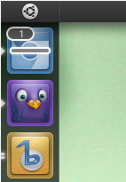

# 教程

# 快速入门

## 简介

Electron 可以让你使用纯 JavaScript 调用丰富的原生 APIs 来创造桌面应用。你可以把它看作是专注于桌面应用而不是 web 服务器的，io.js 的一个变体。

这不意味着 Electron 是绑定了 GUI 库的 JavaScript。相反，Electron 使用 web 页面作为它的 GUI，所以你能把它看作成一个被 JavaScript 控制的，精简版的 Chromium 浏览器。

## 主进程

在 Electron 里，运行 `package.json` 里 `main` 脚本的进程被称为**主进程**。在主进程运行的脚本可以以创建 web 页面的形式展示 GUI。

## 渲染进程

由于 Electron 使用 Chromium 来展示页面，所以 Chromium 的多进程结构也被充分利用。每个 Electron 的页面都在运行着自己的进程，这样的进程我们称之为**渲染进程**。

在一般浏览器中，网页通常会在沙盒环境下运行，并且不允许访问原生资源。然而，Electron 用户拥有在网页中调用 io.js 的 APIs 的能力，可以与底层操作系统直接交互。

## 主进程与渲染进程的区别

主进程使用 BrowserWindow 实例创建网页。每个 BrowserWindow 实例都在自己的渲染进程里运行着一个网页。当一个 BrowserWindow 实例被销毁后，相应的渲染进程也会被终止。

主进程管理所有页面和与之对应的渲染进程。每个渲染进程都是相互独立的，并且只关心他们自己的网页。

由于在网页里管理原生 GUI 资源是非常危险而且容易造成资源泄露，所以在网页面调用 GUI 相关的 APIs 是不被允许的。如果你想在网页里使用 GUI 操作，其对应的渲染进程必须与主进程进行通讯，请求主进程进行相关的 GUI 操作。

在 Electron，我们提供用于在主进程与渲染进程之间通讯的 [ipc](https://github.com/electron/electron/blob/master/docs-translations/zh-CN/api/ipc-main-process.md) 模块。并且也有一个远程进程调用风格的通讯模块 [remote](https://github.com/electron/electron/blob/master/docs-translations/zh-CN/api/remote.md)。

# 打造你第一个 Electron 应用

大体上，一个 Electron 应用的目录结构如下：

```
your-app/
├── package.json
├── main.js
└── index.html 
```

`package.json`的格式和 Node 的完全一致，并且那个被 `main` 字段声明的脚本文件是你的应用的启动脚本，它运行在主进程上。你应用里的 `package.json` 看起来应该像：

```
{
  "name"    : "your-app",
  "version" : "0.1.0",
  "main"    : "main.js"
} 
```

**注意**：如果 `main` 字段没有在 `package.json` 声明，Electron 会优先加载 `index.js`。

`main.js` 应该用于创建窗口和处理系统时间，一个典型的例子如下：

```
var app = require('app');  // 控制应用生命周期的模块。
var BrowserWindow = require('browser-window');  // 创建原生浏览器窗口的模块

// 保持一个对于 window 对象的全局引用，不然，当 JavaScript 被 GC，
// window 会被自动地关闭
var mainWindow = null;

// 当所有窗口被关闭了，退出。
app.on('window-all-closed', function() {
  // 在 OS X 上，通常用户在明确地按下 Cmd + Q 之前
  // 应用会保持活动状态
  if (process.platform != 'darwin') {
    app.quit();
  }
});

// 当 Electron 完成了初始化并且准备创建浏览器窗口的时候
// 这个方法就被调用
app.on('ready', function() {
  // 创建浏览器窗口。
  mainWindow = new BrowserWindow({width: 800, height: 600});

  // 加载应用的 index.html
  mainWindow.loadURL('file://' + __dirname + '/index.html');

  // 打开开发工具
  mainWindow.openDevTools();

  // 当 window 被关闭，这个事件会被发出
  mainWindow.on('closed', function() {
    // 取消引用 window 对象，如果你的应用支持多窗口的话，
    // 通常会把多个 window 对象存放在一个数组里面，
    // 但这次不是。
    mainWindow = null;
  });
}); 
```

最后，你想展示的 `index.html` ：

```
<!DOCTYPE html>
<html>
  <head>
    <title>Hello World!</title>
  </head>
  <body>
    <h1>Hello World!</h1>
    We are using io.js <script>document.write(process.version)</script>
    and Electron <script>document.write(process.versions['electron'])</script>.
  </body>
</html> 
```

# 运行你的应用

一旦你创建了最初的 `main.js`， `index.html` 和 `package.json` 这几个文件，你可能会想尝试在本地运行并测试，看看是不是和期望的那样正常运行。

## electron-prebuild

如果你已经用 `npm` 全局安装了 `electron-prebuilt`，你只需要按照如下方式直接运行你的应用：

```
electron . 
```

如果你是局部安装，那运行：

```
./node_modules/.bin/electron . 
```

## 手工下载 Electron 二进制文件

如果你手工下载了 Electron 的二进制文件，你也可以直接使用其中的二进制文件直接运行你的应用。

### Windows

```
$ .\electron\electron.exe your-app\ 
```

### Linux

```
$ ./electron/electron your-app/ 
```

### OS X

```
$ ./Electron.app/Contents/MacOS/Electron your-app/ 
```

`Electron.app` 里面是 Electron 发布包，你可以在[这里](https://github.com/electron/electron/releases)下载到。

# 以发行版本运行

在你完成了你的应用后，你可以按照[应用部署](https://github.com/electron/electron/blob/master/docs-translations/zh-CN/tutorial/application-distribution.md)指导发布一个版本，并且以已经打包好的形式运行应用。

# 桌面环境集成

不同的操作系统在各自的桌面应用上提供了不同的特性。例如，在 windows 上应用曾经打开的文件会出现在任务栏的跳转列表，在 Mac 上，应用可以把自定义菜单放在鱼眼菜单上。

本章将会说明怎样使用 Electron APIs 把你的应用和桌面环境集成到一块。

## 最近文档 (Windows & OS X)

Windows 和 OS X 提供获取最近文档列表的便捷方式，那就是打开跳转列表或者鱼眼菜单。

跳转列表： 

鱼眼菜单： 

为了增加一个文件到最近文件列表，你可以使用 [app.addRecentDocument](https://github.com/electron/electron/blob/master/docs-translations/zh-CN/api/app.md) API:

```
var app = require('app');
app.addRecentDocument('/Users/USERNAME/Desktop/work.type'); 
```

或者你也可以使用 [app.clearRecentDocuments](https://github.com/electron/electron/blob/master/docs/tutorial/clearrecentdocuments) API 来清空最近文件列表。

```
app.clearRecentDocuments(); 
```

## Windows 需注意

为了这个特性在 Windows 上表现正常，你的应用需要被注册成为一种文件类型的句柄，否则，在你注册之前，文件不会出现在跳转列表。你可以在 [Application Registration](https://msdn.microsoft.com/en-us/library/windows/desktop/ee872121%28v=vs.85%29.aspx) 里找到任何关于注册事宜的说明。

## OS X 需注意

当一个文件被最近文件列表请求时，`app` 模块里的 `open-file` 事件将会被发出。

## 自定义的鱼眼菜单(OS X)

OS X 可以让开发者定制自己的菜单，通常会包含一些常用特性的快捷方式。

### 菜单中的终端


使用 `app.dock.setMenu` API 来设置你的菜单，这仅在 OS X 上可行：

```
var app = require('app');
var Menu = require('menu');
var dockMenu = Menu.buildFromTemplate([
  { label: 'New Window', click: function() { console.log('New Window'); } },
  { label: 'New Window with Settings', submenu: [
    { label: 'Basic' },
    { label: 'Pro'}
  ]},
  { label: 'New Command...'}
]);
app.dock.setMenu(dockMenu); 
```

## 用户任务(Windows)

在 Windows，你可以特别定义跳转列表的 `Tasks` 目录的行为，引用 MSDN 的文档：

> Applications define tasks based on both the program's features and the key things a user is expected to do with them. Tasks should be context-free, in that the application does not need to be running for them to work. They should also be the statistically most common actions that a normal user would perform in an application, such as compose an email message or open the calendar in a mail program, create a new document in a word processor, launch an application in a certain mode, or launch one of its subcommands. An application should not clutter the menu with advanced features that standard users won't need or one-time actions such as registration. Do not use tasks for promotional items such as upgrades or special offers.
> 
> It is strongly recommended that the task list be static. It should remain the same regardless of the state or status of the application. While it is possible to vary the list dynamically, you should consider that this could confuse the user who does not expect that portion of the destination list to change.

### IE 的任务

 不同于 OS X 的鱼眼菜单，Windows 上的用户任务表现得更像一个快捷方式，比如当用户点击一个任务，一个程序将会被传入特定的参数并且运行。

你可以使用 [app.setUserTasks](https://github.com/electron/electron/blob/master/docs/api/app.md#appsetusertaskstasks) API 来设置你的应用中的用户任务：

```
var app = require('app');
app.setUserTasks([
  {
    program: process.execPath,
    arguments: '--new-window',
    iconPath: process.execPath,
    iconIndex: 0,
    title: 'New Window',
    description: 'Create a new window'
  }
]); 
```

调用 `app.setUserTasks` 并传入空数组就可以清除你的任务列表：

```
app.setUserTasks([]); 
```

当你的应用关闭时，用户任务会仍然会出现，在你的应用被卸载前，任务指定的图标和程序的路径必须是存在的。

### 缩略图工具栏

在 Windows，你可以在任务栏上添加一个按钮来当作应用的缩略图工具栏。它将提供用户一种用户访问常用窗口的方式，并且不需要恢复或者激活窗口。

在 MSDN，它被如是说：

> This toolbar is simply the familiar standard toolbar common control. It has a maximum of seven buttons. Each button's ID, image, tooltip, and state are defined in a structure, which is then passed to the taskbar. The application can show, enable, disable, or hide buttons from the thumbnail toolbar as required by its current state.
> 
> For example, Windows Media Player might offer standard media transport controls such as play, pause, mute, and stop.

### Windows Media Player 的缩略图工具栏

 你可以使用 [BrowserWindow.setThumbarButtons](https://github.com/electron/electron/blob/master/docs-translations/zh-CN/api/browser-window.md) 来设置你的应用的缩略图工具栏。

```
var BrowserWindow = require('browser-window');
var path = require('path');
var win = new BrowserWindow({
  width: 800,
  height: 600
});
win.setThumbarButtons([
  {
    tooltip: "button1",
    icon: path.join(__dirname, 'button1.png'),
    click: function() { console.log("button2 clicked"); }
  },
  {
    tooltip: "button2",
    icon: path.join(__dirname, 'button2.png'),
    flags:['enabled', 'dismissonclick'],
    click: function() { console.log("button2 clicked."); }
  }
]); 
```

调用 `BrowserWindow.setThumbarButtons` 并传入空数组即可清空缩略图工具栏：

```
win.setThumbarButtons([]); 
```

## Unity launcher 快捷方式(Linux)

在 Unity,你可以通过改变 `.desktop` 文件来增加自定义运行器的快捷方式，详情看 [Adding shortcuts to a launcher](https://help.ubuntu.com/community/UnityLaunchersAndDesktopFiles#Adding_shortcuts_to_a_launcher)。

### Audacious 运行器的快捷方式：


## 任务栏的进度条(Windows & Unity)

在 Windows，进度条可以出现在一个任务栏按钮之上。这可以提供进度信息给用户而不需要用户切换应用窗口。

Unity DE 也具有同样的特性，在运行器上显示进度条。

### 在任务栏上的进度条：


### 在 Unity 运行器上的进度条



给一个窗口设置进度条，你可以调用 [BrowserWindow.setProgressBar](https://github.com/electron/electron/blob/master/docs-translations/zh-CN/api/browser-window.md) API：

```
var window = new BrowserWindow({...});
window.setProgressBar(0.5); 
```

在 OS X，一个窗口可以设置它展示的文件，文件的图标可以出现在标题栏，当用户 Command-Click 或者 Control-Click 标题栏，文件路径弹窗将会出现。

### 展示文件弹窗菜单：


你可以调用 [BrowserWindow.setRepresentedFilename](https://github.com/electron/electron/blob/master/docs-translations/zh-CN/api/browser-window.md) 和 [BrowserWindow.setDocumentEdited](https://github.com/electron/electron/blob/master/docs-translations/zh-CN/api/browser-window.md) APIs：

```
var window = new BrowserWindow({...});
window.setRepresentedFilename('/etc/passwd');
window.setDocumentEdited(true); 
```

# 在线/离线事件探测

使用标准 HTML5 APIs 可以实现在线和离线事件的探测，就像以下例子：

*main.js*

```
var app = require('app');
var BrowserWindow = require('browser-window');
var onlineStatusWindow;

app.on('ready', function() {
  onlineStatusWindow = new BrowserWindow({ width: 0, height: 0, show: false });
  onlineStatusWindow.loadURL('file://' + __dirname + '/online-status.html');
}); 
```

*online-status.html*

```
<!DOCTYPE html>
<html>
  <body>
    <script> var alertOnlineStatus = function() {
        window.alert(navigator.onLine ? 'online' : 'offline');
      };

      window.addEventListener('online',  alertOnlineStatus);
      window.addEventListener('offline',  alertOnlineStatus);

      alertOnlineStatus(); </script>
  </body>
</html> 
```

也会有人想要在主进程也有回应这些事件的实例。然后主进程没有 `navigator` 对象因此不能直接探测在线还是离线。使用 Electron 的进程间通讯工具，事件就可以在主进程被使，就像下面的例子：

*main.js*

```
var app = require('app');
var ipc = require('ipc');
var BrowserWindow = require('browser-window');
var onlineStatusWindow;

app.on('ready', function() {
  onlineStatusWindow = new BrowserWindow({ width: 0, height: 0, show: false });
  onlineStatusWindow.loadURL('file://' + __dirname + '/online-status.html');
});

ipc.on('online-status-changed', function(event, status) {
  console.log(status);
}); 
```

*online-status.html*

```
<!DOCTYPE html>
<html>
  <body>
    <script> var ipc = require('ipc');
      var updateOnlineStatus = function() {
        ipc.send('online-status-changed', navigator.onLine ? 'online' : 'offline');
      };

      window.addEventListener('online',  updateOnlineStatus);
      window.addEventListener('offline',  updateOnlineStatus);

      updateOnlineStatus(); </script>
  </body>
</html> 
```