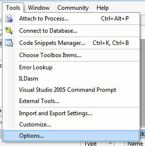
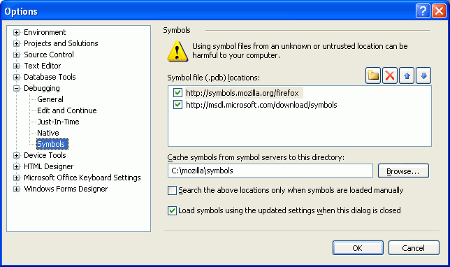

# 开发

# 开发

# 代码规范

# 编码规范

以下是 Electron 项目的编码规范。

## C++ 和 Python

对于 C++ 和 Python，我们遵循 Chromium 的[编码规范](http://www.chromium.org/developers/coding-style)。你可以使用 `script/cpplint.py` 来检验文件是否符合要求。

我们目前使用的 Pyhton 版本是 Python 2.7。

C++ 代码中用到了许多 Chromium 中的接口和数据类型，所以希望你能熟悉它们。Chromium 中的[重要接口和数据结构](https://www.chromium.org/developers/coding-style/important-abstractions-and-data-structures)就是一篇不错的入门文档，里面提到了一些特殊类型、域内类型（退出作用域时自动释放内存）、日志机制，等等。

## CoffeeScript

对于 CoffeeScript，我们遵循 GitHub 的[编码规范](https://github.com/styleguide/javascript) 及以下规则:

*   文件**不要**以换行符结尾，我们要遵循 Google 的编码规范。
*   文件名使用 `-` 而不是 `_` 来连接单词，比如 `file-name.coffee` 而不是 `file_name.coffee`，这是沿用 [github/atom](https://github.com/github/atom) 模块的命名方式（`module-name`）。这条规则仅适用于 `.coffee` 文件。

## API 命名

当新建一个 API 时，我们倾向于使用 getters 和 setters 而不是 jQuery 单函数的命名方式，比如 `.getText()` 和 `.setText(text)` 而不是 `.text([text])`。这里有关于该规则的[讨论记录](https://github.com/electron/electron/issues/46)。

# 源码目录结构

# 源码目录结构

Electron 的源代码主要依据 Chromium 的拆分约定被拆成了许多部分。

为了更好地理解源代码，您可能需要了解一下 [Chromium 的多进程架构](http://dev.chromium.org/developers/design-documents/multi-process-architecture)。

## 源代码的结构

```
Electron
├──atom - Electron 的源代码
|  ├── app - 系统入口代码
|  ├── browser - 包含了主窗口、UI 和其他所有与主进程有关的东西，它会告诉渲染进程如何管理页面
|  |   ├── lib - 主进程初始化代码中 JavaScript 部分的代码
|  |   ├── ui - 不同平台上 UI 部分的实现
|  |   |   ├── cocoa - Cocoa 部分的源代码
|  |   |   ├── gtk - GTK+ 部分的源代码
|  |   |   └── win - Windows GUI 部分的源代码
|  |   ├── default_app - 在没有指定 app 的情况下 Electron 启动时默认显示的页面
|  |   ├── api - 主进程 API 的实现
|  |   |   └── lib - API 实现中 Javascript 部分的代码
|  |   ├── net - 网络相关的代码
|  |   ├── mac - 与 Mac 有关的 Objective-C 代码
|  |   └── resources - 图标，平台相关的文件等
|  ├── renderer - 运行在渲染进程中的代码
|  |   ├── lib - 渲染进程初始化代码中 JavaScript 部分的代码
|  |   └── api - 渲染进程 API 的实现
|  |       └── lib - API 实现中 Javascript 部分的代码
|  └── common - 同时被主进程和渲染进程用到的代码，包括了一些用来将 node 的事件循环
|      |        整合到 Chromium 的事件循环中时用到的工具函数和代码
|      ├── lib - 同时被主进程和渲染进程使用到的 Javascript 初始化代码
|      └── api - 同时被主进程和渲染进程使用到的 API 的实现以及 Electron 内置模块的基础设施
|          └── lib - API 实现中 Javascript 部分的代码
├── chromium_src - 从 Chromium 项目中拷贝来的代码
├── docs - 英语版本的文档
├── docs-translations - 各种语言版本的文档翻译
├── spec - 自动化测试
├── atom.gyp - Electron 的构建规则
└── common.gypi - 为诸如 `node` 和 `breakpad` 等其他组件准备的编译设置和构建规则 
```

## 其他目录的结构

*   **script** - 用于诸如构建、打包、测试等开发用途的脚本
*   **tools** - 在 gyp 文件中用到的工具脚本，但与 `script` 目录不同， 该目录中的脚本不应该被用户直接调用
*   **vendor** - 第三方依赖项的源代码，为了防止人们将它与 Chromium 源码中的同名目录相混淆， 在这里我们不使用 `third_party` 作为目录名
*   **node_modules** - 在构建中用到的第三方 node 模块
*   **out** - `ninja` 的临时输出目录
*   **dist** - 由脚本 `script/create-dist.py` 创建的临时发布目录
*   **external_binaries** - 下载的不支持通过 `gyp` 构建的预编译第三方框架

# 与 NW.js（原 node-webkit）在技术上的差异

# Electron 和 NW.js (原名 node-webkit) 在技术上的差异

**备注：Electron 的原名是 Atom Shell。**

与 NW.js 相似，Electron 提供了一个能通过 JavaScript 和 HTML 创建桌面应用的平台，同时集成 Node 来授予网页访问底层系统的权限。

但是这两个项目也有本质上的区别，使得 Electron 和 NW.js 成为两个相互独立的产品。

**1\. 应用的入口**

在 NW.js 中，一个应用的主入口是一个页面。你在 `package.json` 中指定一个主页面，它会作为应用的主窗口被打开。

在 Electron 中，入口是一个 JavaScript 脚本。不同于直接提供一个 URL，你需要手动创建一个浏览器窗口，然后通过 API 加载 HTML 文件。你还可以监听窗口事件，决定何时让应用退出。

Electron 的工作方式更像 Node.js 运行时。 Electron 的 APIs 更加底层，因此你可以用它替代 [PhantomJS](http://phantomjs.org/) 做浏览器测试。

**2\. 构建系统**

为了避免构建整个 Chromium 带来的复杂度，Electron 通过 [`libchromiumcontent`](https://github.com/brightray/libchromiumcontent) 来访问 Chromium 的 Content API。`libchromiumcontent` 是一个独立的、引入了 Chromium Content 模块及其所有依赖的共享库。用户不需要一个强劲的机器来构建 Electron。

**3\. Node 集成**

在 NW.js，网页中的 Node 集成需要通过给 Chromium 打补丁来实现。但在 Electron 中，我们选择了另一种方式：通过各个平台的消息循环与 libuv 的循环集成，避免了直接在 Chromium 上做改动。你可以看 [`node_bindings`](https://github.com/electron/electron/tree/master/atom/common) 来了解这是如何完成的。

**4\. 多上下文**

如果你是有经验的 NW.js 用户，你应该会熟悉 Node 上下文和 web 上下文的概念。这些概念的产生源于 NW.js 的实现方式。

通过使用 Node 的[多上下文](http://strongloop.com/strongblog/whats-new-node-js-v0-12-multiple-context-execution/)特性，Electron 不需要在网页中引入新的 JavaScript 上下文。

# 构建系统概览

# Build System Overview

Electron 使用 [gyp](https://gyp.gsrc.io/) 来生成项目 ，使用 [ninja](https://ninja-build.org/) 来构建项目. 项目配置可以在 `.gyp` 和 `.gypi` 文件中找到.

## Gyp 文件

下面的 `gyp` 文件包含了构建 Electron 的主要规则 :

*   `atom.gyp` 定义了 Electron 它自己是怎样被构建的.
*   `common.gypi` 调整 node 的构建配置，来让它结合 Chromium 一起构建.
*   `vendor/brightray/brightray.gyp` 定义了 `brightray` 是如何被构建的，并且包含了默认配置来连接到 Chromium.
*   `vendor/brightray/brightray.gypi` 包含了常用的创建配置.

## 创建组件

在 Chromium 还是一个相当大的项目的时候，最后链接阶段会花了好几分钟，这让开发变得很困难. 为了解决这个困难，Chromium 引入了 "component build" ，这让每个创建的组建都是分隔开的共享库，让链接更快，但是这浪费了文件大小和性能.

在 Electron 中，我们采用了一个非常相似的方法 : 在创建 `Debug` , 二进制文件会被链接进入一个 Chromium 组件的共享版本库来达到快速链接; 在创建 `Release`, 二进制文件会被链接进入一个静态版本库, 所以我们可以有最小的二进制文件 size 和最佳的体验.

## Minimal Bootstrapping

在运行 bootstrap 脚本的时候，所有的 Chromium 预编译二进制文件会被下载.默认静态库和共享库会被下载，并且项目的最后大小会在 800MB 到 2GB 之间，这取决于平台类型.

默认，`libchromiumcontent` 是从 Amazon Web Services 上下载下来的.如果设置了 `LIBCHROMIUMCONTENT_MIRROR` 环境变量，bootstrap 脚本会从这里下载下来. [`libchromiumcontent-qiniu-mirror`](https://github.com/hokein/libchromiumcontent-qiniu-mirror) 是 `libchromiumcontent` 的映射.如果你不能连接 AWS，你可以切换下载路径：`export LIBCHROMIUMCONTENT_MIRROR=http://7xk3d2.dl1.z0.glb.clouddn.com/` 如果只是想快速搭建一个 Electron 的测试或开发环境，可以通过 `--dev` 参数只下载共享版本库:

```
$ ./script/bootstrap.py --dev
$ ./script/build.py -c D 
```

## Two-Phase Project Generation

在 `Release` 和 `Debug` 构建的时候后，Electron 链接了不同配置的库 .然而 `gyp`不支持为不同的配置文件进行不同的链接设置.

为了规避这个问题，Electron 在运行 `gyp` 的时候，使用了一个 `gyp` 的变量 `libchromiumcontent_component`来控制应该使用哪个链接设置，并且只生成一个目标.

## Target Names

与大多数的项目不同，它们使用 `Release` 和 `Debug` 作为目标名字，而 Electron 使用使用的是 `R` 和 `D`.这是因为如果只定义了一个 `Release` 或 `Debug` 构建配置，`gyp` 会随机崩溃，并且在同一时候，Electron 只生成一个目标，如上所述.

这只对开发者可用，如果想重新构建 Electron ，将不会成功.

# 构建步骤（OS X）

# Build Instructions (OS X)

遵循下面的引导，在 OS X 上构建 Electron .

## 前提

*   OS X >= 10.8
*   [Xcode](https://developer.apple.com/technologies/tools/) >= 5.1
*   [node.js](http://nodejs.org) (外部)

如果你通过 Homebrew 使用 Python 下载，需要安装下面的 Python 模块:

*   pyobjc

## 获取代码

```
$ git clone https://github.com/electron/electron.git 
```

## Bootstrapping

bootstrap 脚本也是必要下载的构建依赖，来创建项目文件.注意我们使用的是 [ninja](https://ninja-build.org/) 来构建 Electron，所以没有生成 Xcode 项目.

```
$ cd electron
$ ./script/bootstrap.py -v 
```

## 构建

创建 `Release` 、 `Debug` target:

```
$ ./script/build.py 
```

可以只创建 `Debug` target:

```
$ ./script/build.py -c D 
```

创建完毕, 可以在 `out/D` 下面找到 `Electron.app`.

## 32 位支持

在 OS X 上，构建 Electron 只支持 64 位的，不支持 32 位的 .

## 测试

测试你的修改是否符合项目代码风格，使用:

```
$ ./script/cpplint.py 
```

测试有效性使用:

```
$ ./script/test.py 
```

# 构建步骤（Windows）

# Build Instructions (Windows)

遵循下面的引导，在 Windows 上构建 Electron .

## 前提

*   Windows 7 / Server 2008 R2 or higher
*   Visual Studio 2013 with Update 4 - [download VS 2013 Community Edition for free](https://www.visualstudio.com/news/vs2013-community-vs).
*   [Python 2.7](http://www.python.org/download/releases/2.7/)
*   [Node.js](http://nodejs.org/download/)
*   [Git](http://git-scm.com)

如果你现在还没有安装 Windows , [modern.ie](https://www.modern.ie/en-us/virtualization-tools#downloads) 有一个 timebombed 版本的 Windows ，你可以用它来构建 Electron.

构建 Electron 完全的依赖于命令行，并且不可通过 Visual Studio. 可以使用任何的编辑器来开发 Electron ，未来会支持 Visual Studio.

**注意:** 虽然 Visual Studio 不是用来构建的，但是它仍然 **必须的** ，因为我们需要它提供的构建工具栏.

**注意:** Visual Studio 2015 不可用. 请确定使用 MSVS **2013**.

## 获取代码

```
$ git clone https://github.com/electron/electron.git 
```

## Bootstrapping

bootstrap 脚本也是必要下载的构建依赖，来创建项目文件.注意我们使用的是 `ninja` 来构建 Electron，所以没有生成 Visual Studio 项目.

```
$ cd electron
$ python script\bootstrap.py -v 
```

## 构建

创建 `Release` 、 `Debug` target:

```
$ python script\build.py 
```

可以只创建 `Debug` target:

```
$ python script\build.py -c D 
```

创建完毕, 可以在 `out/D`(debug target) 或 `out\R` (release target) 下面找到 `electron.exe`.

## 64bit Build

为了构建 64 位的 target,在运行 bootstrap 脚本的时候需要使用 `--target_arch=x64` :

```
$ python script\bootstrap.py -v --target_arch=x64 
```

其他构建步骤完全相同.

## Tests

测试你的修改是否符合项目代码风格，使用:

```
$ python script\cpplint.py 
```

测试有效性使用:

```
$ python script\test.py 
```

在构建 debug 时为 Tests 包含原生模块 (例如 `runas`) 将不会执行(详情 [#2558](https://github.com/electron/electron/issues/2558)), 但是它们在构建 release 会起效.

运行 release 构建使用 :

```
$ python script\test.py -R 
```

## 解决问题

### Command xxxx not found

如果你遇到了一个错误，类似 `Command xxxx not found`, 可以尝试使用 `VS2012 Command Prompt` 控制台来执行构建脚本 .

### Fatal internal compiler error: C1001

确保你已经安装了 Visual Studio 的最新安装包 .

### Assertion failed: ((handle))->activecnt >= 0

如果在 Cygwin 下构建的，你可能会看到 `bootstrap.py` 失败并且附带下面错误 :

```
Assertion failed: ((handle))->activecnt >= 0, file src\win\pipe.c, line 1430

Traceback (most recent call last):
  File "script/bootstrap.py", line 87, in <module>
    sys.exit(main())
  File "script/bootstrap.py", line 22, in main
    update_node_modules('.')
  File "script/bootstrap.py", line 56, in update_node_modules
    execute([NPM, 'install'])
  File "/home/zcbenz/codes/raven/script/lib/util.py", line 118, in execute
    raise e
subprocess.CalledProcessError: Command '['npm.cmd', 'install']' returned non-zero exit status 3 
```

这是由同时使用 Cygwin Python 和 Win32 Node 造成的 bug.解决办法就是使用 Win32 Python 执行 bootstrap 脚本 (假定你已经在目录 `C:\Python27` 下安装了 Python):

```
$ /cygdrive/c/Python27/python.exe script/bootstrap.py 
```

### LNK1181: cannot open input file 'kernel32.lib'

重新安装 32 位的 Node.js.

### Error: ENOENT, stat 'C:\Users\USERNAME\AppData\Roaming\npm'

简单创建目录 [应该可以解决问题](http://stackoverflow.com/a/25095327/102704):

```
$ mkdir ~\AppData\Roaming\npm 
```

### node-gyp is not recognized as an internal or external command

如果你使用 Git Bash 来构建，或许会遇到这个错误，可以使用 PowerShell 或 VS2012 Command Prompt 来代替 .

# 构建步骤（Linux）

# Build Instructions (Linux)

遵循下面的引导，在 Linux 上构建 Electron .

## Prerequisites

*   Python 2.7.x. 一些发行版如 CentOS 仍然使用 Python 2.6.x ，所以或许需要 check 你的 Python 版本，使用 `python -V`.
*   Node.js v0.12.x. 有很多方法来安装 Node. 可以从 [Node.js](http://nodejs.org)下载原文件并且编译它 .也可以作为一个标准的用户在 home 目录下安装 node .或者尝试使用仓库 [NodeSource](https://nodesource.com/blog/nodejs-v012-iojs-and-the-nodesource-linux-repositories).
*   Clang 3.4 或更新的版本.
*   GTK+开发头文件和 libnotify.

在 Ubuntu, 安装下面的库 :

```
$ sudo apt-get install build-essential clang libdbus-1-dev libgtk2.0-dev \
                       libnotify-dev libgnome-keyring-dev libgconf2-dev \
                       libasound2-dev libcap-dev libcups2-dev libxtst-dev \
                       libxss1 libnss3-dev gcc-multilib g++-multilib 
```

在 Fedora, 安装下面的库 :

```
$ sudo yum install clang dbus-devel gtk2-devel libnotify-devel libgnome-keyring-devel \
                   xorg-x11-server-utils libcap-devel cups-devel libXtst-devel \
                   alsa-lib-devel libXrandr-devel GConf2-devel nss-devel 
```

其它版本的也许提供了相似的包来安装，通过包管理器，例如 pacman. 或一个可以编译源文件的.

## 使用虚拟机

如果在虚拟机上构建 Electron，你需要一个固定大小的设备，至少需要 25 gigabytes .

## 获取代码

```
$ git clone https://github.com/electron/electron.git 
```

## Bootstrapping

bootstrap 脚本也是必要下载的构建依赖，来创建项目文件.需要使用 Python 2.7.x 来让脚本成功执行.正确下载文件会花费较长的时间. 注意我们使用的是 `ninja` 来构建 Electron，所以没有生成 `Makefile` 项目.

```
$ cd electron
$ ./script/bootstrap.py -v 
```

### 交叉编译

如果想创建一个 `arm` target ，应当还要下载下面的依赖 :

```
$ sudo apt-get install libc6-dev-armhf-cross linux-libc-dev-armhf-cross \
                       g++-arm-linux-gnueabihf 
```

为了编译 `arm` 或 `ia32` targets, 你应当为 `bootstrap.py` 脚本使用 `--target_arch` 参数:

```
$ ./script/bootstrap.py -v --target_arch=arm 
```

## 构建

创建 `Release` 、 `Debug` target:

```
$ ./script/build.py 
```

这个脚本也许会在目录 `out/R` 下创建一个巨大的可执行的 Electron . 文件大小或许会超过 1.3 gigabytes. 原因是 Release target 二进制文件包含了 调试符号 .运行 `create-dist.py` 脚本来减小文件的 size :

```
$ ./script/create-dist.py 
```

这会在 `dist` 目录下创建一个有大量小文件的工作空间. 运行 create-dist.py 脚本之后, 或许你想删除仍然在 `out/R` 下的 1.3+ gigabyte 二进制文件.

可以只创建 `Debug` target:

```
$ ./script/build.py -c D 
```

创建完毕, 可以在 `out/D`下面找到 `electron`.

## Cleaning

删除构建文件 :

```
$ ./script/clean.py 
```

## 解决问题

确保你已经安装了所有的依赖 .

### Error While Loading Shared Libraries: libtinfo.so.5

预构建的 `clang` 会尝试链接到 `libtinfo.so.5`. 取决于 host 架构, 适当的使用 `libncurses`:

```
$ sudo ln -s /usr/lib/libncurses.so.5 /usr/lib/libtinfo.so.5 
```

## Tests

测试你的修改是否符合项目代码风格，使用:

```
$ ./script/cpplint.py 
```

测试有效性使用:

```
$ ./script/test.py 
```

# 在调试中使用 Symbol Server

# Setting Up Symbol Server in Debugger

调试 symbols 让你有更好的调试 sessions. 它们有可执行的动态库的函数信息，并且提供信息来获得洁净的呼叫栈. 一个 Symbol 服务器允许调试器自动加载正确的 symbols, 二进制文件 和 资源文件，不用再去强制用户下载巨大的调试文件. 服务器函数类似 [Microsoft's symbol server](http://support.microsoft.com/kb/311503) ，所以这里的记录可用.

注意，因为公众版本的 Electron 构建是最优化的，调试不一定一直简单.调试器将不会给显示出所有变量内容，并且因为内联，尾调用，和其它编译器优化，执行路径会看起来很怪异 . 唯一的解决办法是搭建一个不优化的本地构建.

Electron 使用的官方 symbol 服务器地址为 `http://54.249.141.255:8086/atom-shell/symbols` . 你不能直接访问这个路径，必须将其添加到你的调试工具的 symbol 路径上.在下面的例子中，使用了一个本地缓存目录来避免重复从服务器获取 PDB. 在你的电脑上使用一个恰当的缓存目录来代替 `c:\code\symbols` .

## Using the Symbol Server in Windbg

Windbg symbol 路径被配制为一个限制带星号字符的字符串. 要只使用 Electron 的 symbol 服务器, 将下列记录添加到你的 symbol 路径 (**注意:** 如果你愿意使用一个不同的地点来下载 symbols，你可以在你的电脑中使用任何可写的目录来代替 `c:\code\symbols`):

```
SRV*c:\code\symbols\*http://54.249.141.255:8086/atom-shell/symbols 
```

使用 Windbg 菜单或通过输入 `.sympath` 命令，在环境中设置一个 `_NT_SYMBOL_PATH` 字符串.如果你也想从微软的 symbol 服务器获得 symbols ，你应当首先将它们先列出来 :

```
SRV*c:\code\symbols\*http://msdl.microsoft.com/download/symbols;SRV*c:\code\symbols\*http://54.249.141.255:8086/atom-shell/symbols 
```

## 在 Visual Studio 中使用 symbol 服务器

 

## Troubleshooting: Symbols will not load

在 Windbg 中输入下列命令，打印出未什么 symbols 没有加载 :

```
> !sym noisy
> .reload /f chromiumcontent.dll 
```