# 组件

# 组件

# 页面与对话框

# 页面与对话框

Jquery Mobile 支持包含历史回退按钮的自动 ajax 读取外部页面的功能，一组页面转场动画，以及将页面显示为对话框的简易工具。

# 页面

# 页面

## 页面结构 Anatomy of a Page

Jquery Mobile 中的"页面"结构已经优化为支持单个的页面，或者在一个页面内嵌入的多个“page”。

使用这种模型的目的是使 WEB 开发人员使用最佳实践创建 WEB 网站，使得普通的链接不需要任何特殊配置就可以工作，而且能创造出富媒体的像本地应用一样通过标准的 http 无法创造出的用户体验。

## mobile 页面结构 Mobile page structure

Jquery Mobile 网站必须使用 HTML5 文档声明开始，使得网站能够适用 HTML5 的特性（不支持 HTML5 的旧浏览器会静默地忽略 HTML5 的文档声明和一些自定义属性）。 在 head 标签内需要引用 Jquery,Jquery Mobile 和 mobile 的主题 CSS 文件，像如下一样开始：

**HTML 代码:**

```
<!DOCTYPE html> 
<html> 
<head> 
　<title>Page Title</title> 
<link rel="stylesheet" href="http://code.Jquery.com/mobile/1.0a3/Jquery.mobile-1.0a3.min.css" />
<script type="text/javascript" src="http://code.Jquery.com/Jquery-1.5.min.js"></script>
<script type="text/javascript" src="http://code.Jquery.com/mobile/1.0a3/Jquery.mobile-1.0a3.min.js"></script>
</head> 
<body> 

...

</body>
</html> 
```

在 body 标签内，移动设备上每一个视图或者"page"被一个带有 data-role="page"的容器（通常是 div）所标示：:

```
<div  data-role="page">   ...  </div> 
```

在 page 容器内，任何有效的 html 标签都可以使用，但是对于 Jquery Mobile 的典型页面来说，page 容器的直接子结点应该为使用"data-role"标记属性为"header""content"和"footer"的 3 个容器。

**HTML 代码:**

```
<div data-role="page"> 
　<div data-role="header">...</div> 
　 <div data-role="content">...</div> 
　 <div data-role="footer">...</div> 
</div> 
```

## 一个完整的独立页面实例:　Complete single page template

集合在一起后，这就是一个标准的 Jquery Mobile 页面的样板了。

**html 代码:**

```
<!DOCTYPE html> 
<html> 
　<head> 
　　<title>Page Title</title> 
　　<link rel="stylesheet" href="http://code.Jquery.com/mobile/1.0a3/Jquery.mobile-1.0a3.min.css" />
　　<script type="text/javascript" src="http://code.Jquery.com/Jquery-1.4.3.min.js"></script>
　　<script type="text/javascript" src="http://code.Jquery.com/mobile/1.0a3/Jquery.mobile-1.0a3.min.js"></script>
　</head> 
<body> 

　<div data-role="page">

　　<div data-role="header">
　　　<h1>Page Title</h1>
　　　</div><!-- /header -->

　　　<div data-role="content"> 
　　　<p>Page content goes here.</p> 
　　</div><!-- /content -->

　<div data-role="footer">
　　<h4>Page Footer</h4>
　</div><!-- /footer -->
　</div><!-- /page -->

</body>
</html> 
```

## 外部页面的链接　External page linking

Jquery Mobile 会自动构建 AJAX 驱动的站点和应用。默认情况下，当你点击了一个指向外部页面(比如：products.html)的链接，JQmoblie 的分析链接地址，然后产生一个 ajax 请求（Hajax）,显示一个读取中的提示框。如果 AJAX 请求成功，新页面的内容会添加到 DOM 中，所有 MOBILE 组件都会自动初始化，所以新的页面会通过页面转场动画看到。如果 AJAX 请求失败，JQmoblie 会显示一个小错误提示框（默认的主题为 E）,然后过一会就消失了，不会影响你继续浏览。

## 本地，内部的页面　Local, internal linked "pages"

一个单独的 HTML 文档内可以包含多个由"data-role="page"标记的 DIV 容器，他们在加载时共同加载，但是被解释成不同的页面（个人认为这是 Jquery Mobile 的独到之处），每一个 page 区块需要由一个独特的 ID(id="foo")标记，通过给内部链接地址定义为(herf="#foo"),互相跳转。当连接被点击时，JQmoblie 会在文档内寻找带有 ID 的 page 容器，然后通过页面转场显示。但请注意如果你的移动页面包括几个"page",然后通过某个链接被一个外部页面通过 AJAX 加载，你需要给这个链接添加 rel="external"和 data-ajax="false"的属性。这样就告知 Jquery Mobile 完全地加载一个页面，清理掉 AJAX 在 URL 的哈希值。这是很关键的，因为 AJAX 页面使用哈希值（"#"）记录 AJAX 历史，但是包含多个 PAGE 的页面也是用哈希值指向某个 PAGE，所以这样在哈希值上就会产生冲突。例如：一个指向包含多个内部 PAGE 页面的链接应该如下：

```
<a href="multipage.html" rel="external">Multi-page link</a> 
```

下面是一个包含 2 个"PAGE"的页面，两个 DIV 通过 ID 标记和导航。请注意通过 ID 标记内部页面的做法只需要支持内部的页面链接,如果每个页面是分离的 HTML 文档,则属性可加也可不加。：

```
<body> 

　<!-- Start of first page -->
　<div data-role="page" id="foo">

　<div data-role="header">
　　<h1>Foo</h1>
　</div><!-- /header -->

　　<div data-role="content"> 
　　　<p>I'm first in the source order so I'm shown as the page.</p> 
　　　<p>View internal page called <a href="#bar">bar</a></p> 
　</div><!-- /content -->

　<div data-role="footer">
　　<h4>Page Footer</h4>
　</div><!-- /header -->
　</div><!-- /page -->

　　<!-- Start of second page -->
　<div data-role="page" id="bar">

　<div data-role="header">
　　h1>Bar</h1>
　</div><!-- /header -->

　<div data-role="content"> 
　<p>I'm first in the source order so I'm shown as the page.</p> 
　<p><a href="#foo">Back to foo</a></p> 
　　</div><!-- /content -->

　<div data-role="footer">
　　<h4>Page Footer</h4>
　</div><!-- /header -->
　</div><!-- /page -->

</body> 
```

**请注意**：我们对于所有 AJAX 的"page"使用的是哈希值来跟踪导航历史，所以现在还不可以通过外部页面的一个 ID 指向那一个锚点，因为 Jquery Mobile 会寻找带有该 ID 的"page",而不是滚屏到带有该 ID 的内容上。

## 后退链接　Back linking

如果你添加了 data-rel="back"属性给某个链接，那对于该链接的任何点击行为，都是后退的行为，会无视链接的 herf，后退到浏览器历史的上一个地址。 当想链接到一个命名好的页面，或者要关闭对话框时特别有用。使用这一特性时要注意：务必请使用一个有意义的 herf 值实际地指向要引用的地址（因为这样也会让 GRADE-C 的浏览器也支持这个按钮）。而且如果你只是要看到一个翻转的页面转场而不是真正的回到上一个历史记录的地址，你就要使用 data-direction="reverse"属性，而不是后退按钮。

## 后退链接　Back linking

如果你添加了 data-rel="back"属性给某个链接，那对于该链接的任何点击行为，都是后退的行为，会无视链接的 herf，后退到浏览器历史的上一个地址。 当想链接到一个命名好的页面，或者要关闭对话框时特别有用。使用这一特性时要注意：务必请使用一个有意义的 herf 值实际地指向要引用的地址（因为这样也会让 GRADE-C 的浏览器也支持这个按钮）。而且如果你只是要看到一个翻转的页面转场而不是真正的回到上一个历史记录的地址，你就要使用 data-direction="reverse"属性，而不是后退链接。

## 重定向以及链接到目录　Redirects and linking to directories

当连接到的是一个目录地址（比如 href="typesofcats/"而不是 href="typesofcats/index.html"），你必须在地址后面加一个斜杠("/")。因为 Jquery Mobile 假定最后一个斜杠后的部分为文件名，当接下来引用到的页面生成基地址的会的时候会删除它。但是，你可以通过已经指定好的 data-url 地址来返回到上一个 page 容器，就可以绕过这一个问题。Jquery Mobile 会使用那个 data-url 值来更新 url，来替代过去请求的那个页面 。这样你也允许你通过返回 url 的更改来作为重定向的结果。例如：你想通过 post 方式提交表单到 /login.html"，但是提交成功以后返回一个 url 为 "/account 。这个工具就可以让你在这种情况下控制历史记录堆栈。以下是一个实例：有一个链接是指向 "docs-links-urltest/index.html" ，该链接是指向目录的索引页，返回的页面会使用 "docs/pages/docs-links-urltest/" 更新哈希值，这是通过代码里的 data-url 值完成的。请注意 data-url 值会替换整个哈希值，由你来把他替换成当刷新或者下层链接时 URL 发出的请求能解析正确的页面.更多技术细节请参见导航模型 Ajax, hashes and history

# 页面转场 Page transitions

# 页面转场 Page transitions

Jquery Mobile 框架内置 6 中基于 css 的页面转场效果，你可以给任何对象或页面（比如关闭页面或想换到新页面或者回到上一个页面）添加。默认情况下，Jquery Mobile 应用的是从右到左划入的转场效果

**给链接添加 data-transition 属性，可以设定自定义的页面转场效果**

```
<a href="index.html" data-transition="pop">I'll pop</a> 
```

**1pop 2slideup 3slidedown 4pop 5fade 6flip**

另外，如果给链接增加 data-direction="reverse"属性，则强制指定为回退的转场效果

# 创建对话框 Creating dialogs

# 创建对话框 Creating dialogs

通过给指向页面的链接增加 data-rel="dialog"的属性，可以把任何指向的页面表现对对话框。当应用了对话框的属性之后，qjmobile 框架会给新页面增加圆角，页面周围增加 margin，以及深色的背景，使得对话框浮在页面之上

**HTML 代码:**

```
<a href="foo.html" data-rel="dialog">Open dialog</a> 
```

## 对话框的转场 Transitions

因为 Jquery Mobile 里对话框也是一个标准的"page",所以他会以默认的 slide 转场效果打开。而且像其他的页面一样，你也可以通过给链接添加 data-transition 的属性指定对话框的转场效果。为了让对话框看起来效果更好，我们推?quot;pop", "slideup"，"flip"三种转场效果

**HTML 代码:**

```
<a href="foo.html" data-rel="dialog" data-transition="pop">Open dialog</a> 
```

## 关闭对话框 Closing dialogs

对话框内的任何链接被点击时，Jquery Mobile 会自动关闭对话框，用回退效果转场到指向该对话框的页面。要在对话框内创建一?取消"按钮，只需要把该链接的 herf 指向打开该对话框的按钮然后给链接加上 data-rel="back"属性。这样制作的后退链接在不支持 js 的设备上也同样管用

对于 js 生成的链接，可以把链接的 herf 设为"#",添加 data-rel="back"属性。也可以手动地调用对话框的 close()方法关闭对话框，比如? $('.ui-dialog').dialog('close').

## 设置关闭按钮的文字 Setting the close button text

就像页面插件一样，你可以设置程序或属性两种方法设置对话框关闭按钮的文字。程序的设置可以通过更改 mobileinit 绑定的事件，然后? $.mobile.dialog.prototype.options.closeBtnText 设置一个字符串。或者给标记代码增加 data-close-btn-text 属性来设置文字

## 历史和后退按钮的行为 History & Back button behavior

因为对话框是典型地用来给页面起支持作用的，所以 Jquery Mobile 不会在历史记录的哈希值里包含对话框。这就意味着当点击对话框后退按钮时，他不会出现在你的浏览器历史记录里。比如说，如果你在一个页面上，点击了一个按钮打开了一个对话框，然后关闭了这个对话框，到了另一个页面。这时如果你点击浏览器的后退按钮，那你会回到第一个页面，而不是对话框

# Jquery Mobile 的导航模型 Jquery Mobile's navigation model

# Jquery Mobile 的导航模型 Jquery Mobile's navigation model

在 Jquery Mobile 中，一个页面"就是一个 data-role 属性被设为"page"的容器，通常为 div 容器，里面包含了"header", "content",“footer"三个容器，各自可以容纳普通的 html 元素，表单和自定义的 Jquery Mobile 组件

页面载入的基本工作流程如下：首先一个页面通过正常的 http 请求到，然后”page"容器被请求，插入到页面的 dom 当中。所以 dom 文档中可能同时有多个"page"容器，每一个都可以通过链接到他们的 data-url 被访问到

当一个 url 被初始化请求，可能会有一个或多个"page"在相应，而只有第一个被显示。存储多个“page"的好处在于可以使你预读有可能被访问的静态页面

## Ajax 驱动的页面导航 Ajax-driven page navigation

Jquery Mobile 中所有的导航都是基于 location.hash 的改变和更新实现的。当可实施时，页面的转变都会在当前页面与下一个页面间使用平滑的转场效果，不管它已经在当前的 dom 文档中，还是自动通过 ajax 读取的

Jquery Mobile 会在第一个”真正"的页面加载完毕时创建哈希值，其值为相对于 url 的完整路径，hash 值始终会被维护为一个可用的 URL?所以 Jquery Mobile 中任何的 'page'容器都可以添加到收藏夹或者引用为一个链接。要获取非基于 hash 的 URL，只要删除地址中的“#”并刷新页面即可

通常，Jquery Mobile 中，任何链接被点击都会造成 hash 值的变化。当链接被点击时。Jquery mobile 将确保该链接是引用一个本地 URL，如果是这样，它会阻止链接的默认的点击行为，并通过 Ajax 请求引用的网址,当页面成功返回，它将 location.hash 设置到新的页面相对的 URL

在框架中，页面的改变，包括已经存在于 DOM 之中得页面转变和需要通过 ajax 加载的页面转变，都是使用$.mobile.changePage() 函数 $.mobile.changePage()包括所有寻找页面以及页面间切换的逻辑,以及如何处理不同情况下请求的响应. $.mobile.changePage()函数可以在外部被调用，该函数接受如下的参熟 to, transition, back, changeHash. to 参数可以是一个字符串（比如文件 url 或者当前页面的元素 ID 值 或是一个数组（第一个数组元素为任意你想转自的当前页面中的 page，第二个元素为转去的页面），或者一个对象（含有如下属性： url，type（get 或 post），data（用于序列化的参数）），后者在加载含有表单数据时的页面十分有用，transition 参数接受一个字符串来表示采用何种转场效果，例如"slide"?back 参数接受一个布尔值， 表示转场应该前进还是相反。最后，changeHash 参数接受一个布尔值表示你是否?根据一个成功的页面更改来更新 url

$.mobile.changePage()函数在 Jquery Mobile 中很多地方都有用到。例如，当一个链接被点击时， 它的 href 属性被解析，然?.mobile.changePage()会处理。当表单被提交时，Jquery Mobile 手机一部分表单的属性，将数据序列化，然后.mobile.changePage() 再次接手该次提交并响应 同样的，创建对话框的链接也是由.mobile.changePage() 来打开相应引用页，但是不更新哈希值，使对话框不会在历史记录中

另一个 Jquery Mobile 页面导航模型中的关键要素是 base 元素,它被插入到 head 中，在每次页面变化时，该元素都会被修改以确保资源（css，js，图片等）都能够从正确的地址取到。在不支持动态更新 base 元素的浏览器（FF3.6）里，Jquery Mobile 会遍历所有页面引用的资源并把它们的 href 和 src 加上基地址作为前缀

哈希值会在一次独立的点击时发生时变化，比如一个用户点击后退按钮，会通过 hashchange 事件进行处理，该事件通过 Jquery Mobile 的哈希值改变的特殊事件插件（作者 Ben Alman）绑定到 window 对象。当一个哈希值更改是，或者第一次页面加载时 hashchange 事件处理程序会发 location.hash.mobile.changePage()函数，以加载或者显示引用的页面

引用的页面存在 DOM 当中之后 .mobile.changePage()函数会在当前页和引用页间应用一个转场，以显示页面。页面转场会通过添加和移除指定了 css 动画的 class 来实现。例如，在一个向左滑动的转场效果中，已经存在的页面会被加一个名为 "slideleft""out" 的 class，将要显示的页面会被加上 "slideleft" 为"in" 的 class。动画结束后,"in"”out"的 class 被删除，退出的页面"ui-page-active"的 class 被删

## base url 管理解释 Developer explanation of base url management:

Jquery Mobile 使用 1 生成的绝对 URL 地址，2 操作生成元素的 href 属性的两种办法的结合管理 http 请求,这两种方法的结合允许我们创建包含完整路径信息 URL 来加载页面，base 元素将指示资源正确的被加载（比如图片和样式表）

## 自动生成的页面和子哈希表 Auto-generated pages and sub-hash urls

一些 Jquery Mobile 的控件可能会根据情况动态地把一个页面的内容分离为多个可导航的页面，并通过层次化的链接来访问。比如说 list 控件，他会把一个嵌套的列表(ul 或者 ol)分离为多个页面，每一个页面赋予一个 data-url 属性，可以想正常的"page"页面一样被链接到。但是为了链接到这些页面，生成他们的源页面必须首先从服务器请求到，所以通过自动生成的页面会应用这样的特殊 data-url 结构:

```
<div data-url="page.html&subpageidentifier"> 
```

所以例如通过列表控件生成的一个页面会拥有这样的 data-url 属性： data-url="artists.html&ui-page=listview-1

一个页面被请求到后，Jquery Mobile 会在&ui-page 处拆开 url 地址，使得 http 请求的是 artists.html。在这个例子中，url 应该为：[`example.com/artists.html&ui-page=listview-1`](http://example.com/artists.html&ui-page=listview-1) 而 Jquery Mobile 会请求： artists.html，然后他会生成子页面，创建 div 容器标记 data-url="artists.html&ui-page=listview-1"的属性，最后作为活动页面显示

注意，元素 data-url 属性包含的是完整的 url 路径，而不仅仅是&ui-page=之后的部分。这样 Jquery Mobile 就可以通过一个一致的机制来为页面的 data-url 属性匹配 URL

## 不使用 ajax 导航的情况 Cases when Ajax navigation will not be used

有时我们要用正常的 http 请求而不用 Ajax 请求，比如链接到别的网站的情况。通过给链接加下面的属性，可以将链接指定为正常的 http 请求:

```
rel=external

target (打开规则, 例如"_blank") 
```

## 表单的提交 Form submissions

Jquery Mobile 也会自动通过导航模型处理表单的提交。更多细节请阅读表单章节:

## 已知的限制 Known limitations

当某链接指向的是一个不带文件名的目录时,比如 href="typesofcats/" 而不是 href="typesofcats/index.html"),路径后必须加一个反斜杠("/")。因为 Jquery Mobile 会假定 url 里最后一个反斜杠后面的部分为文件名，从将来的引用到的页面创建基地址时会删除掉这个文件名

在 jqmoible 驱动的网站中，页面内所有指向唯一资源的引用都需要放在“page"容器内（拥有 data-role=page 属性的容器） 例如，指向针对某一个页面的样式表和 js 的链接可放在 div 中。但是我们推荐使用 Jquery Mobile 的 page 事件来当该页面加载完成时触发特定的脚本执行 ; 你可以从服务器返回一个已经在标签中指定了 data-url 属性的页面,Jquery Mobile 会利用此来更新 hash。这可以使你确保带有斜杠的目录路径解析正确，因此也可以用于未来请求所需的基地址.

而相反的，所有非唯一的资源（全局资源）应该在 html 文档 标签中被引用,或者至少在'page'元素外面，以防止脚本重复运行.

"ui-page"词名用于子 hash 值的 url 引用，可以设置为任何你喜欢的值，以便配合你自己的 URL 结构，该值存储于 Jquery.mobile.subPageUrlKey 中

# 链接的格式 Link formats

# 链接的格式 Link formats

Jquery Mobile 支持所有标准的 html 格式，为了让体验更加流畅,Jquery Mobile 会把同一个域下的所有指向页面的链接都会自动转为 ajax 请求，并且用动画的转场效果实现切换

指向别的域的链接或者是含有 rel="external", data-ajax="false" 属性的链接以及含有 target 属性的链接不会通过 ajax 加载，页面会整体被刷新。如果一个 html 文档内含有多?pages"容器，可以通过?pages"容器设置 id 属性，然后将链接指向 id.

所有其他类型的链接别如：mailto:以及 tel: 不会被 Jquery Mobile 影响到。更多细节请参见链接导航模型

# 给页面主题样式 Page Theming

# 给页面主题样式 Page Theming

Jquery Mobile 内建了一套样式主题系统，让你给页面添加样式时有丰富的选择。 针对每一个页面的组件，都有详细的主题样式文档，但是我们先看一下怎样应用主题样式

给 header 和 footer 容器增加 data-theme 属性，并设定为 a,b,c,d,e.可以应用任何一套主题样式。而当给页面内容添加 data-theme 属性时，我们推荐给整个 content 容器 data-role="page"添加，而不是某个 div 或容器，这样背景也就可以应用到整个页面。

默认的样式是混搭了多种主题样式的样子，使得各个组件层次分明


给下面是 5 套应用了主题样式的页面

主题 A


主题 B


主题 C


主题 D


主题 E


# 工具栏

# 工具栏

工具栏在此是指在移动网站和应用中的头部，尾部和内容中的工具条。所以 Jquery Mobile 提供了一套标准的工具和导航栏的工具，可以在绝大多数情况下直接使用

# 工具栏

# 工具栏

## 工具栏综述 Toolbar basics

在 Jquery Mobile 中，有两种标准的工具栏：**头部栏和尾部栏**

头部栏的作用为网站的标题，通常是移动网站页面的第一个元素，一般包括页面的标题文字和最多两个按钮

尾部栏通常是移动网站页面的最后一个元素，在内容和作用上比头部栏更自由一些，但一般也要包含文字和按钮

在头部栏或尾部栏里放置一个水平的导航栏或选项卡栏的做法是很普遍的，所以 Jquery Mobile 包含导航栏组件，即把无序列表 ul 转化成水平的按钮栏，使用也非常方便

## 工具栏定位的设置 Toolbar positioning options

在页面中设置头部栏和尾部栏的位置定位有几种方法。默认情况下，工具栏的定位的属性为**"inline"**.在这种模式下，头部栏和尾部栏通过 html 自动的文档流放置，保证了他们能在所有的设备上可见，而不需要依靠 css 和 js 的定位的支持固定的定位模式可以使工具条在页面处于固定的位置，而不需要通过 js 设置。工具条处于他们在页面自然的位置上，就像 inline 模式一样，但是当他被滚动出屏幕之外时，Jquery Mobile 会自动通过动画使滚动条重新出现在屏幕的顶部或底部任何时候，点击屏幕会切换固定定位模式的工具条的显示：当工具条消失时点击屏幕会让他出现，再点击则会让它消失。这样用户就有选择在最大化浏览时要不要隐藏工具栏， 要给工具栏设置固定的定位模式，只需给工具栏的容器加“data-position="fixed"的属性即可全屏的定位模式与固定的定位模式基本相同，但是当他被滚动出屏幕之外时，不会自动重新显示，除非点击屏幕。这对于图片或视频类有提升代入感的应用是非常有用的，当浏览时你想全屏都显示内容，而工具栏可以通过点击屏幕呼出。注意这种模式下工具栏会**遮住页面内容**，所以最好用在比较特殊的场合下

# 头部栏

# 头部栏

## 头部栏结构 Header structure

头部栏是处于页面顶部的工具栏，通常包含页面标题文字，文字左边和/或右边可以放置几个可选的按钮用作导航操作

标题文字一般用 h1 标签，但是从 h1-h6 都是可以的，这样可以使结构有弹性。比如说，一个页面内包含了多个"page"标记的页面，这样可以给主"page"的标题文字用 h1 标签，次级"page"的标题文字用 h2 标签。所有的头部默认下在样式上都是相同的，保持的外观的一致性

```
<div data-role="header"> 
　 <h1>Page Title</h1> 
</div> 
```

## 默认的头部的特性　Default header features

头部栏的主题样式默认情况下为"a"(黑色)，但是你可以很轻松的设置主题样式

**默认的头部栏**


**看见 back 按钮了吗**Jquery Mobile 会自动给每个页面的头部栏生成一"back"按钮，来简化把按钮放进头部栏的过程。如果你不想?quot;back"按钮放进头部栏，你可以自己加一个需要的按钮或者给头部栏添加”data-backbtn="false"属性

## 添加按钮 Adding buttons

在标准的头部栏的设置下，标题文字两边各有一个可放置按钮的位置。每一个按钮通常都是都是 a,但是任何有效的按钮标记的元素都可以。为了节省空间，工具栏里的按钮都是内联按钮，所以按钮的宽度只容纳 icon 和里面的文字

## 创建自定义的后退按钮 Creating custom back buttons

给 a 标签增加 data-rel="back"的属性，任何链接都可以样式化为后退按钮，行为上为后退到上一个历史记录的页面，无视该链接的 herf 地址。这对于要链接回到一个命名好的页面的情况是很有用的**但是注意请给链接设定一个有意义的 herf 地址，指向实际要连接的页面，使得 C 级浏览器也能够使用这个按钮**而且要注意如果你只是需要一个后退的页面转场效果，而不是真正的后退到上一个历史记录的页面，应该用 data-direction="reverse" 的属性，而不是用 data-rel="back"属性的按钮

## 按钮默认的定位 Default button positioning

头部的按钮是头部栏容器的直接子节点，第一个链接定位于头部栏左边，第二个链接放在右边，在这个例子中，根据两个链接在源代码中的位置，取消在左边，保存在右边

```
<div data-role="header" data-position="inline">
　 <a href="index.html" data-icon="delete">Cancel</a>
　 <h1>Edit Contact</h1>
　 <a href="index.html" data-icon="check">Save</a>
</div> 
```

**按钮默认的定位**


按钮会自动应用他们的父容器的主题样式，所以应用了"a"主题样式的头部栏里的按钮也会应用"a"主题样式，我们通过给按钮增加 data-theme 的属性并设置，可以使按钮看起来有所区别

```
<div data-role="header" data-position="inline">
　 <a href="index.html" data-icon="delete">Cancel</a>
　 <h1>Edit Contact</h1>
　 <a href="index.html" data-icon="check" data-theme="b">Save</a>
</div> 
```


## 通过 class 控制按钮的定位　Controlling button position with classes

按钮的位置可以通过 class 设置，而不依赖他们在源代码中的顺序。如果你想把唯一一个按钮放在右边，这时就非常有用了。两个控制的类为 ui-btn-right 和 ui-btn-left

在这个例子中，我们要把头部栏唯一一个按钮放于右边，首先给头部栏增加 data-backbtn="false"属性来阻止头部栏自动生成后退按钮的行为，然后给自己的按钮增加 ui-btn-right 的 class

```
<div data-role="header" data-position="inline" data-backbtn="false">
<h1>Page Title</h1>
<a href="index.html" data-icon="gear" class="ui-btn-right">Options</a>
</div> 
```


## 自定义头退按钮的文字　Customizing the back button text

如果你想设置后退按钮的文字，需要给页面?page"元素增加 data-back-btn-text="文字"的属性，或者通过程序来实现?$.mobile.page.prototype.options.backBtnText = "文字";

如果你想配置后退按钮的主题样式，使用 $.mobile.page.prototype.options.backBtnTheme = "a" 如果你要用这段程序，需要在 mobileinit 时间的处理程序中使用

## 自定义头部栏的配置　Custom header configurations

如果你想创建一个不遵循默认配置的头部栏，在 header 容器里用 div 包裹你的自定义内容就好，Jquery Mobile 不会自动生成按钮，所以你可以给你的头部栏自定义你的样式

# 尾部栏

# 尾部栏

## 尾部栏结构 Footer bar structure

尾部栏除了使用的 data-role 的属性与头部栏不同之外，基本的结构与头部栏是相同的

```
<div data-role="footer"> 
　 <h4>Footer content</h4> 
</div> 
```

尾部工具栏默认下应用的主题样式为"a"(黑色)，但是你可以很轻松的设置主题样式

**默认的尾部栏**


尾部栏的设置与头部栏基本相同。最大的不同是，尾部栏被设定为结构尽量简单，所以 Jquery Mobile 不会自动给尾部栏生成按钮

## 添加按钮 Adding buttons

给尾部栏添加任何有效的按钮标记的元素都都会生成按钮。为了节省空间，工具栏里的按钮都是内联按钮，所以按钮的宽度只容纳 icon 和里面的文字

默认情况下，工具栏内部容纳组件与导航时是不留 padding 的。如果要给工具栏增加 padding,请增加一个 ui-bar 的 class.

```
<div data-role="footer" class="ui-bar">
　 <a href="index.html" data-role="button" data-icon="delete">Remove</a>
　 <a href="index.html" data-role="button" data-icon="plus">Add</a>
　 <a href="index.html" data-role="button" data-icon="arrow-u">Up</a>
　 <a href="index.html" data-role="button" data-icon="arrow-d">Down</a>
</div> 
```

要想把几个按钮打包成一个按钮组，则需要把这些按钮用一个容器包裹，并给该容器增加 data-role="controlgroup"和 data-type="horizontal"属性

```
<div data-role="controlgroup" data-type="horizontal"> 
```

**尾部的成组按钮**


## 增加表单元素 Adding form elements

表单元素和其他元素也可以添加进工具栏中。这是一个把 select 添加到尾部栏的实例：


## 持续的尾部栏 Persistent footers

有些情况下你需要一个尾部栏为全局导航元素，希望页面转场时尾部栏也固定并显示。创造一个持续的尾部栏可以做到这一点

给尾部栏添加 data-id 属性，并且在所有关联的页面的尾部栏设定同样的 data-id 的值，就可以使尾部栏在页面转场时也固定并显示， **例如**给当前页面和目标页面的尾部栏添加 id="myfooter" 属性，Jquery Mobile 会在页面转场动画的时候保持尾部栏固定 请注意：这个效果只有在头部栏和尾部栏设定为固定的定位模式（data-position="fixed" ）时在才有用，这样他们在页面转场时才不被隐藏

# 导航栏

# 导航栏

## 简易的导航栏 Simple navbar

Jquery Mobile 提供了一个基本的导航栏组件，每一行可以最多放 5 个按钮，通常在顶部或者底部

导航栏的代码为一个 ul 列表，被一个容器包裹，这个容器需要有 data-role="navbar"属性。要设定某一个链接为活动（selected）状态，给链接增加 class="ui-btn-active" 即可。我们给尾部栏设置了一个导航栏，把 one 项设置为活动状态

```
<div data-role="footer">
　 <div data-role="navbar">
　　 <ul>
　　　 <li><a href="a.html" class="ui-btn-active">One</a></li>
　　　 <li><a href="b.html">Two</a></li>
　　 </ul>
　 </div><!-- /navbar -->
</div><!-- /footer --> 
```

尾部工具栏默认下应用的主题样式为"a"(黑色)，但是你可以很轻松的设置主题样式

导航栏内每项的宽度都被设定为相同的，所以按钮的宽度为浏览器宽度 1/2.新增加一项的话，每项的宽度自动匹配为 1/3,以此类推。如果导航栏多于 5 项，导航栏自动表现为多行

**两个按钮的导航栏**

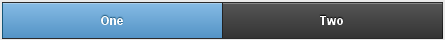

**三个按钮的导航栏**

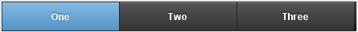

**五个按钮的导航栏**


**多余 5 项的导航**


## 头部的导航栏 Navbars in headers

如果要给页面头部增加一个导航栏，你也可以保留头部栏的页面标题和按钮。只需要把导航栏容器放进头部栏容器内

**头部的导航栏**

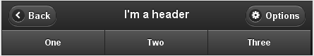

## 导航栏的图标 Icons in navbars

给导航栏的列表项链接增加 data-icon 属性，可以给链接设置一个标准的移动网站的图标。给列表项链接增加 data-iconpos="top"属性，可以给链接的图标设置位置为在文字上方

**导航栏的图标**


## 使用第三方的图标?Using 3rd party icon sets

你可以可以把任何你喜欢的第三方的 icon 组库加入到自己的项目中。只需要在 css 中自定义 icon 的地址和位置就可以了。下面一个实例为使用了 Glyphish icon 组的导航栏

**导航栏的图标**

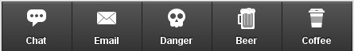

Icons by Joseph Wain / glyphish.com. Licensed under the Creative Commons Attribution 3.0 United States License.

## 给导航栏主题样式 Theming navbars

给导航栏设置 data-theme 属性，，可以给导航栏设置主题样式

**导航栏的主题**


# 固定定位的工具栏会在滚屏后重新出现 Fixed toolbars will re-appear after you scroll

# 固定定位的工具栏会在滚屏后重新出现 Fixed toolbars will re-appear after you scroll

这个页面是一个使用 Jquery Mobile 设定了固定定位的头部栏和尾部栏的实例。页面的文档流是正常的，让我们能够正常的布局文档，而不用通过脚本写。头部栏和尾部栏在文档流中的正常位置，但是当他们被滚动出屏幕后，你可以通过点击屏幕，使他们重新出现。再次点击或者滚动屏幕会使他们重新出现在文档流中（在顶部或底部）

要给头部栏或底部栏设置这样的行为，需要给工具栏的容器增加 data-position="fixed"属性

```
<div data-role="header" data-position="fixed">
　 <h1>Fixed toolbars</h1>
</div> 
```

# 全屏的固定的工具栏　Fullscreen fixed toolbar

# 全屏的固定的工具栏　Fullscreen fixed toolbar

这个页面展示“全屏"工具栏模式。这个工具栏一般用在比较特殊的场合，比如想要把内容撑满全屏，然后头部栏和尾部栏随着点击页面而出现和消失-在图片，照片和视频浏览器经常需要这样

要打开工具栏的这种特性，给页面的"page"增加 data-fullscreen="true"属性，然后给头部工具栏和尾部栏的容器增加 data-position="fixed"属性

注意在这种模式下工具栏会**遮住**页面的内容，所以当工具栏可见时不是全部内容都能够看见的

# 持续的尾部栏　Persistent footer nav bar

# 持续的尾部栏　Persistent footer nav bar

这个页面是一个持续的尾部导航栏的示例。在页面的底部，你会看到一个持续的水平导航栏。点击任何链接，你会看到页面会转场到另一个，但是尾部栏保持了固定。因 2 个页面都是用了同样的 data-id 属性

# 给头部栏和尾部栏设置主题样式

# 给头部栏和尾部栏设置主题样式

头部栏和尾部栏都默认都设”a"主题样式（黑色），因为这两个工具栏在视觉上为页面最首要的

## 给头部栏和尾部栏设置主题样式　Theming headers and footers

给头部栏和尾部栏设置 data-theme 属性，并指定不同的字母（a, b, c 等）。下面一个例子是把头部栏的主题样式设?b"(蓝色)

```
<div data-role="header" data-theme="b"> 
　 <h1>Page Title</h1> 
</div> 
```

## 给导航栏的按钮设置主题样式　Theming buttons in toolbars

头部栏里的任何加入的任何链接会自动设为与此工具栏相同的主题样式。给链接增加 data-theme 属性并设置，可以让按钮的主题样式与工具栏的不相一致。例如：如果我们给头部栏设定的主题样式为"c"(浅灰)，里面的两个按钮的主题样式默认也会为"c",如果我们想让按钮有所区别，可以给按钮设置 data-theme?b"(蓝色)

```
<a href="add-user.php" data-theme="b">Save</a> 
```

**不同主题的头部栏**

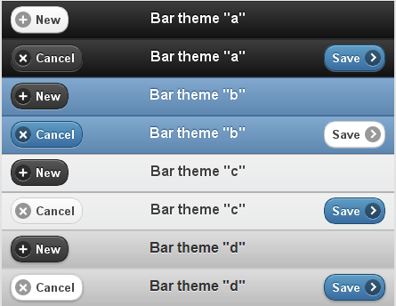

**不同主题的尾部栏**

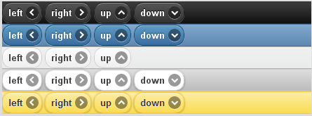

# 按钮

# 按钮

按钮是 Jquery Mobile 的核心组件，在其他的组件中也广泛应用。起导航作用的按钮应该写为链接，在表单内起提交作用的按钮-Jquery Mobile 会同样的样式来标记。

# 按钮标记选项 Button markup options

# 按钮标记选项 Button markup options

起导航作用的按钮应该写为链接，在表单内起提交作用的按钮,Jquery Mobile 会同样的用样式来标记。

## 将链接样式化为按钮 Styling links as buttons

在 page 的区域内，可以通过给链接加 data-role="button"的属性样式化为按钮。Jquery Mobile 会给链接加一些必要的 class 来把他表现为按钮。

**html 代码：**

```
<a href="index.html" data-role="button">Link button</a> 
```

**基于连接的按钮：**


## 表单按钮 Form buttons

为了容易的样式化按钮，Jquery Mobile 自动把 type 为 submi,reset,button 或 image 的按钮元素或输入元素样式化为按钮，所以没有必要增加 data-role="button"的属性

基于表单(form-based)的按钮的原始按钮(input)是隐藏的，但是依然保留其标记。 当一个按钮的点击事件触发时，也会在原始的表单按钮上触发点击事件。

# 给按钮添加图标 Adding Icons to Buttons

# 给按钮添加图标 Adding Icons to Buttons

Jquery Mobile 框架包含了一组最常用的移动应用程序所需的图标，为了减少下载的大小，Jquery Mobile 包含的是的白色的图标 sprite 图片，并自动在图标后添加一个半透明的黑圈以确保在任何背景色下图片都能够清晰显示。

给链接添加 data-icon 属性，可以添加按钮的图标

**html 代码**

```
<a href="index.html" data-role="button" data-icon="delete">Delete</a> 
```

**带有图标的按钮：**


## 图标 Icon set

data-icon 属性可以被用来创建如下所示的图标

**左箭头** `data-icon="arrow-l"`

**右箭头** `data-icon="arrow-r"`

**上箭头** `data-icon="arrow-u"`

**下箭头** `data-icon="arrow-d"`

**删除** `data-icon="delete"`

**添加** `data-icon="Plus"`

**减少** `data-icon="minus"`

**检查** `data-icon="Check"`

**齿轮** `data-icon="gear"`

**前进** `data-icon="Forward"`

**后退** `data-icon="Back"`

**网格** `data-icon="Grid"`

**五角?** `data-icon="Star"`

**警告** `data-icon="Alert"`

**信息** `data-icon="info"`

**首页** `data-icon="home"`

**搜索** `data-icon="Search"`

## 图标组 Icon set

默认情况下，所有按钮图标出现在按钮的文本的左侧。

可以通过 data-iconpos="top" / "bottom" 属性来覆盖此默认

```
<a href="index.html" data-role="button" data-icon="delete"** data-iconpos="right"**>Delete</a> 
```

**一个图标在右边的按钮：**


也可以用 data-iconpos="top"创建图标在文本上方的按钮

**一个图标在文字上方的按钮：**


也可以用 data-iconpos="bottom"创建图标在文本下方的按钮

**一个图标在文字下方的按钮：**


你可以通过 data-iconpos="notext"创建一个只有图标的按钮。button 插件会在屏幕上隐藏文本，但是会把文本作为 title 属性作为 screen readers 的问容和支持小提示的浏览器， 例如，把前例中的 data-iconpos="right"替换为 data-iconpos="notext"

```
<a href="index.html" data-role="button" data-icon="delete"** data-iconpos="notext"**>Delete</a> 
```

**一个只有图标的按钮**


## 自定义图标 Custom Icons

要使用自定义图标，指定一个唯一的 data-icon 值（比如 data-icon=“myapp-email ”）?Jquery Mobile 的 button 插件会生成一个 class 值添加上去，该值由 ui-icon-与 data-icon 的值组合而成（ui-icon-myapp-email ），然后在 css 中指定这个类的背景图片地址。为了保持视觉效果的一致，请使用 png-8 格式的白色 8*18 的透明图标

## 图标和地址 Icons and themes

在白色图标后的半透明的黑色圆圈确保了在任何背景色下图片都能够清晰显示，也使它能很好的工作在 Jquery Mobile 主题系统中。以下是一些在不同主题样式下图标按钮的例子

**"A"主题下的图标按钮**


**"B"主题下的图标按钮**


**"C"主题下的图标按钮**


# 内联按钮 Inline buttons

# 内联按钮 Inline buttons

默认情况下，body 里的所有按钮都会被样式化为块级元素，撑大到与页面等宽

但是，如果你想让按钮外观紧凑，宽度只符合里面的文字和 icon，那就给按钮添加 data-inline="true"的属性

**内联的按钮：**


如果你有多个按钮想在一行横排，可以在按钮上增加 data-inline="true"的属性，这样就可以把按钮样式化为最小宽度，并且浮动，使他们在同一行横排

```
<div data-inline="true">
　 <a href="index.html" data-role="button">Cancel</a>
　 <a href="index.html" data-role="button" data-theme="b">Save</a>
</div> 
```

**内联的按钮组**

如果你想多个按钮在通过一行横排并且容器自动撑大到与页面同宽，可以使用 内容分栏 把多个普通的块级按钮 放入同一行内

# 组按钮 Grouped buttons

# 组按钮 Grouped buttons

有时候，你想把一组按钮放进一个单独的容器内，使他们看起来想一个独立的导航部件。你可以把一组按钮包裹在一个容器内，然后给该容器添加 data-role="controlgroup"属性，Jquery Mobile 会创建一个垂直的按钮组，删除掉按钮间的 margin 和阴影，然后只在第一个按钮和最后一个按钮产生圆角，使他们看起来是一组按钮

```
<div data-role="controlgroup">
　<a href="index.html" data-role="button">Yes</a>
　<a href="index.html" data-role="button">No</a>
　<a href="index.html" data-role="button">Maybe</a>
</div> 
```

**按钮组：**

默认情况下，组按钮表现为垂直列表，如果给容器添加 data-type="horizontal"的属性，则可以转换为水平按钮的列表，按钮会横向一个挨着一个地排列，容器会自动撑大到适应内容（所以要注意横排情况下按钮不要太多，按钮的字也不要太多）

**水平的组按钮 Horizontal grouped buttons:**

  

# 主题化按钮 Theming buttons

# 主题化按钮 Theming buttons

Jquery Mobile 内建了几套样式系统，给你定义样式时多种选择，在容器内添加一个按钮后，它就会自动应用他的容器使用的样式系统，使得按钮和页面看起来协调统一，像变色龙 所以放进一个样式主题为 a 系统（黑色主题）容器的按钮会自动应用 a 系统样式。如下为实例 a 为黑，b 为灰底蓝，c 为灰底灰，d 白底白色 ，e 黄底黄色

**A 主题**


**B 主题**


**C 主题**


**D 主题**


**E 主题**


## 分配系统样式 Assigning theme swatches

给按钮增加 data-theme="字母"属性，可以手动的给按钮添加样式，使得按钮不一定非要与父容器的样式相符

```
<a href="index.html" data-role="button" data-theme="a">Theme a</a> 
```

**5 个通过 data-theme 设定不同主题的按**


**A 主题下的不同主题的按钮**


**B 主题下的不同主题的按钮**


**C 主题下的不同主题的按钮**


**D 主题下的不同主题的按钮**


**E 主题下的不同主题的按钮**


# 内容的格式化

# 内容的格式化

在 Jquery Mobilede 页面的内容是完全开放的，但是 Jquery Mobile 框架提供了一些有用的工具及组件，比如可折叠的面板，多列网格布局等?方便地为移动设备格式化你的内容

# html 格式化 HTML Formatting

# html 格式化 HTML Formatting

在 Jquery Mobile 中通过默认方法给内容添加样式是很简单的。我们的目标是让浏览器的默认渲染优先进行，然后我们加了一点小小的 padding 让页面看起来更有可读性，然后应用主题样式系统来分配字体和颜色

采用熟手优先原则给与了设计者和开发者一个干净的空间工作，而不是和一大堆复杂的样式代码战斗。

## 默认 HTML 标记样式 Default HTML markup styling

默认情况下，Jquery Mobile 的主题样式为标准的 html 元素使用标准的 html 样式，字号，例如 header,p,block quotos,a,ul,ol,dl,dt

# 布局网格 Layout grids

# 布局网格 Layout grids

因为屏幕通常都比较窄，所以使用多栏布局的方法在移动设备上不是推荐的方法。但是总有时候你会想要把一些小的元素并排放置（比如按钮，或导航标签)

Jquery Mobile 框架提供了一种简单的方法构建基于 css 的分栏布局，叫做 ui-grid

Jquery Mobile 提供了两种预设的配置布局：两列布局（class 含有 ui-grid-a）和三列布局 （class 含有 ui-grid-b）—几乎可满足需要列布局的任何情况。网格是 100%宽的，不可见（没有背景或边框），也没有 padding 和 margin，所以它们不会影响内部元素的样式

## 两栏布局 Two column grids

要构建两栏的布局（50/50%），先构建一个父容器，添加一个 class 名字为：ui-grid-a,内部设置两个字容器，分别给第一个子容器添加 class：ui-block-a，第二个子容器添加 class：ui-block-b

```
<div class="ui-grid-a">
　 <div class="ui-block-a"><strong>I'm Block A</strong> and text inside will wrap</div>
　 <div class="ui-block-b"><strong>I'm Block B</strong> and text inside will wrap</div>
</div><!-- /grid-a --> 
```


如上所见，默认的两栏没有样式，并行排列。分栏的 class 可以应用到任何类型的容器上。下一个实例中，我们给表单的 fieldset 添加 class="ui-grid-a"，然后给两个 button 的所在的子容器添 class="ui-block-a"和 class="ui-block-b"。使两个容器各自 50%的宽


在下面的区块中，我们增加了两个 class,增加 ui-bar 的 class 给默认的 bar padding，增?ui-bar-e 的 class 应用背景渐变以及工具栏的主题 e 的字体样式。然后在每个网格的标签内增加 style="height:120px"的属性来设置高度


## 三栏布局 Three-column grids

另一种布局的方式是三栏布局，给父容器添加”class="ui-grid-b"，然后分别给三个字容器添?加 class="ui-block-a"，“class="ui-block-b"，”class="ui-block-c"

```
<div class="ui-grid-b">
　 <div class="ui-block-a">Block A</div>
　 <div class="ui-block-b">Block B</div>
　 <div class="ui-block-c">Block C</div>
</div><!-- /grid-a --> 
```

就会生成一个 33/33/33% 的分栏布局


3 列网格布局里面是按钮的示例


以此类推：如果是 4 栏布局，则给父容器添加 class="ui-grid-c"（2 栏为 a，3 栏为 b, 4 栏为 c, 5 栏为 d。。。。），子容器分别添加 class="ui-block-a"，”class="ui-block-b" “class="ui-block-c".....

## 多行的网格布局 Multiple row grids

网格化布局也适用于多栏布局的方式，比如，如果你指定了一列布局的父容器，里面有 9 个子容器，则会包裹为 3 行，每行 3 个。可以给每行的第一个容器设置为 class=ui-block-a 来清除浮动，这样 9 个子容器的 class 应为：class=ui-block-(a,b,c,a,b,c,a,b,c)重复


# 可折叠的内容 Collapsible content markup

# 可折叠的内容 Collapsible content markup

要创建一个可折叠的区块，先创建一个容器，然后给容器添加 data-role="collapsible"属性

容器内直接的标题（h1-h6)子结点，Jquery Mobile 会将之表现为可点击的按钮，并在左侧添加一个“+"按钮，表示是可以展开的

在头部后面你可以添加任何想要折叠的 html 标记。框架会自动把这些标记包裹在一个容器里用以折叠或显

```
<div data-role="collapsible">
　 <h3>I'm a header</h3>
　 <p>I'm the collapsible content. By default I'm open and displayed on the page, but you can click the header to hide me.</p>
</div> 
```


如上所示：默认情况下，可折叠容器是展开的，可以通过通过点击头部收缩。给折叠的容器添加 data-collapsed="true"的属性，可以设为默认收缩

```
<div data-role="collapsible" **data-collapsed="true">** 
```

可折叠的内容采用了精简的样式，我们仅仅在内容和标题间添加了一些 margin，标题则采用它所在容器的默认主题

## 嵌套的折叠 Nested Collapsibles


## 折叠组 Collapsible sets

通过给父容器添加 data-role="collapsible-set"属?然后每一个子容器 data-role="collapsible"属性，可以让容器展开时，其他容器被折叠的效果，类似手风琴组件


# 给内容主题 Theming content

# 给内容主题 Theming content

页面的主题内容区域（标有 data-role="content"属性的容器），应该通过给 data-role="page"属性的容器增加 data-theme 属性来确保不管页面多高背景色都能够在整个页面都应用到 （如果你只为 data-role="content"容器添加了 data-theme 属性，则背景色会在内容结束部分停止，可能会造成固定尾部栏和内容之间产生留白

```
<div data-role="page" **data-theme="a"**> 
```

## 给折叠区块主题 Theming collapsible blocks

给可折叠区块的容器添加 data-theme 属性，就可以给折叠块的标题设置主题。图标和折叠的内容目前还不能通过 data-theme 属性设置，但是可以通过自定义的 css 设置

```
<div data-role="collapsible" data-collapsed="true" **data-theme="a">** 
```

## 主题的示例 Themed examples

主题 a


主题 b


主题 c


主题 d


主题 e


# 表单元素

# 表单元素

# 表单元素 Form elements

# 表单元素 Form elements

所有的表单元素都是由标准的 html 元素控制的，然后又得到增强，使他们更吸引人并且容易使用。在不支持 Jquery Mobile 的浏览器下仍然是可用的，因为它们都是基于原生的 html 元素.

## 表单基础 Form basics

Jquery Mobile 提供了一套完整的，适合触摸操作的表单元素，他们都是基于原生的 html 元素

## 表单结构 Form structure

所有的表单都应该被包裹在一个 form 标签内，这个标签应该指定好 action 和 method 属性用来控制与服务器传送数据的方法

**html 代码**

```
<form action="form.php" method="post"> ... </form> 
```

## 标记的规约 Markup Conventions

在 Jquery Mobile 中组织表单时，大多数创建普通的 HTTP post ，get 方式的表单是需要遵守的规约依然是适用的? 但是有一点要注意，form 的 id 属性不仅需要在该页面内唯一? 也需要在整个网站的所有页面中是唯一的 这是因为 Jquery Mobile 的单页面内导航的机制使得多个不同"page"可以同时在 DOM 中出现，所以你必须给表单使用不同的 id 属性，以保证在每个 DOM 中的表单的 ID 都是不同的。（当然，请务必给内部的 label 元素合适的使用 for 属性）

## 表单元素的自动初始化 Auto-initialization of form elements

默认情况下，Jquery Mobile 会自动把原生的表单元素增强为适合触摸操作的组件。这是它通过标签名寻找表单元素，然后对他们执行 Jquery Mobile 插件的方法内部实现的，所以比如说，select 元素被找到后，Jquery Mobile 通过用 selectmenu 插件进行初始化，而一个属性为 type="checkbox"的 input 元素会被 checkboxradio 插件来增强。初始化完毕后，你可以用他们的 Jquery UI 的组件的方法通过程序进一步使用或设定他们的增强功能。（查看 查找可用的方法）

## 防止表单元素被自动初始化 Preventing auto-initialization of form elements

如果你需要某表单元素不被 Jquery Mobile 处理，只需要给这个元素增加 data-role="none" 属性

**html 代码**

```
<label for="foo">
　<select name="foo" id="foo" data-role="none">
　 <option value="a" >A</option>
　 <option value="b" >B</option>
　 <option value="c" >C</option>
</select> 
```

或者，如果你不想增加上述的属性，可以设置页面插件?keepNative 选项（默认情况下为[data-role="none"]），来自定义用来防止初始化的选择器。请务必在 mobileinit 事件的处理程序中设置这个选项，能让第一个页面以及随后被加载的页面应用此设置

**html 代码**

```
$(document).bind('mobileinit',function(){
$.mobile.page.prototype.options.keepNative = "select, input.foo, textarea.bar";
}); 
```

select 元素情况比较特殊。如果 select 元素在表单当中，上例会阻止针对页面中 select 元素的所有的增强行为。如果你想保持菜单本身的外观与表现，行为，同时又想通过 Jquery Mobile 增强 select 的按钮的视觉外观，你可以在 mobileinit 的回调函数中.mobile.nativeSelectMenu 设为 true 作为全局设置或者在每个元素上逐个使用 data-native="true"进行设置

## 动态的表单布局 Dynamic form layout

在 Jquery Mobile 中，所有的表单元素都被设计成弹性宽度以适应不同移动设备的屏幕宽度。在 Jquery Mobile 中内建的一个优化就是根据屏幕宽度的不同,label 和表单元素的宽度是不同的

如果屏幕宽度相对窄（小于 480px),label 元素会被样式化为块级元素，使他们能够置于表单元素上方，节省水平空间

在比较宽的屏幕上，label 和表单元素会被样式化为两列的网格布局的一行中，充分利用页面的空间

## 表单内区域容器　Field containers

我们建议把表单内的每一个 label/表单元素对用 div 或 fieldset 容器包裹，然后增加 data-role="fieldcontain"属?，以改善标签和表单元素在宽屏设备中的样式。Jquery Mobile 会自动在容器底部添加一条细边框作为分隔线，使得 label/表单元素对在快速扫视时看起来对齐

**html 代码**

```
<div data-role="fieldcontain">
...label/input code goes here...
</div> 
```

## 刷新表单元素 Refreshing form elements

每一个表单组件都有刷新方法。以下是实例

**html 代码**

```
复选按钮

$("input[type='checkbox']").attr("checked",true).checkboxradio("refresh"); 
```

单选按钮组:

```
$("input[type='radio']").attr("checked",true).checkboxradio("refresh"); 
```

选择列表::

```
var myselect = $("select#foo");
myselect[0].selectedIndex = 3;
myselect.selectmenu("refresh"); 
```

滑动条

```
$("input[type=range]").val(60).slider("refresh"); 
```

开关 (they use slider):

```
var myswitch = $("select#bar");
myswitch[0].selectedIndex = 1;
myswitch .slider("refresh"); 
```

# 表单元素示例 Form element gallery

# 表单元素示例 Form element gallery

此页面包含了通过渐进增强驱动的表单元素。原生的表单元素有时被隐藏了，但他们的 value 值被保存了，所以表单可以正确的提交

不支持自定义组件的浏览器也能使用它们，因为所有表单组件都基于原生的 html 表单元素.

**文本输入框 Text inputs**

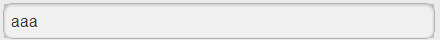

**文本输入域 Textarea:**

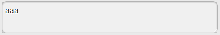

**搜索输入框 Search inputs**

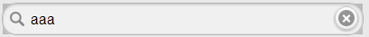

**滑动条 Slider**

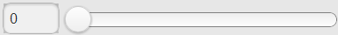

**开关 Flip toggle switches**

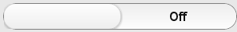

**复选按钮 checkbox**

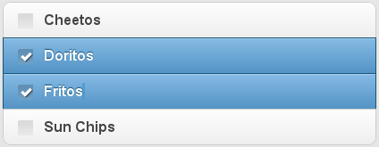

**文字设置**

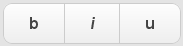

**单选按钮组 radiobox**

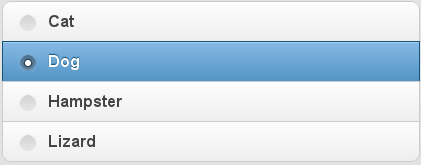

**列表按钮?select**

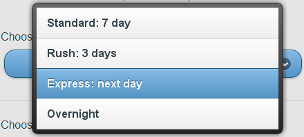

**按钮 button**

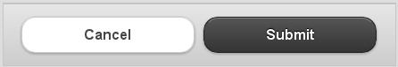

# 文本输入框 Text inputs

# 文本输入框 Text inputs

文本输入框和文本输入域使用标准的 html 标记的，然后 Jquery Mobile 会让他们变得更吸引人而且易于触摸使用

要使用输入标准文字的输入框，给 input 增加 type="text"属性。注意要把 label 的 for 属性设为 input 的 id 值，使他们能够在语义上相关联，并且要用 div 容器包裹它们，并给他设定 data-role="fieldcontain"属性

**HTML 代码:**

```
<div data-role="fieldcontain">    
    <label for="name">Text Input:</label>    
    <input type="text" name="name" id="name" value=""  />
</div> 
```

**文本输入?Text Input:**


## 密码输入框 Password inputs

给 input 设置 type="password"属性，可以设置为密码框，注意要把 label 的 for 属性设为 input 的 id 值，使他们能够在语义上相关联，并且要用 div 容器包裹它们，并给他设定 data-role="fieldcontain"属性

**HTML 代码:**

```
<div data-role="fieldcontain">
    <label for="password">Password Input:</label>
    <input type="password" name="password" id="password" value="" />
</div> 
```

**密码输入框 Password inputs**

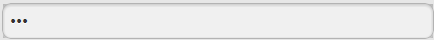

## 其他的标准的 HTML5 输入框类型 More standard HTML5 input types

在 Jquery Mobile 中，你可以使用新的 HTML5 输入框类型，比如 email, tel, number。Jquery Mobile 会把某些类型的输入框降级为普通的文字输入框（目前?range 和 search）。你可以在页面的插件选项里设置，把需要的 input 类型降级为普通的文字输入框

## 文本域 Textareas

对于多行输入可以使用 textarea 元素。Jquery Mobile 框架会自动加大文本域的高度防止出现在移动设备中很难使用的滚动条的出现

注意要把 label 的 for 属性设为 input 的 id 值，使他们能够在语义上相关联，并且要用 div 容器包裹它们，并给他设定 data-role="fieldcontain"属性

**HTML 代码:**

```
<div data-role="fieldcontain">
    <label for="textarea">Textarea:</label>
    <textarea cols="40" rows="8" name="textarea" id="textarea"></textarea>
</div> 
```

**文本域 Textareas**


# 搜索输入框 Search inputs

# 搜索输入框 Search inputs

搜索输入框是一个新兴的 html 元素，外观为圆角，当你输入文字后右边会出现一个叉的图标，点击则会清除你输入的内容。给 input 增加 type="search" 属性来定义

注意要把 label 的 for 属性设为 input 的 id 值，使他们能够在语义上相关联，并且要用 div 容器包裹它们，并给他设定 data-role="fieldcontain"属性

**HTML 代码:**

```
<div data-role="fieldcontain">
    <label for="search">Search Input:</label>
    <input type="search" name="password" id="search" value="" />
</div> 
```

**搜索输入框 Search inputs**


# 滑动条 Slider

# 滑动条 Slider

给 input 的设置一个新的 HTML5 属性为 type="range"，可以给页面添加滑动条组件，可以指定它的 value 值（当前值），min 和 max 属性的值配置滑动条。Jquery Mobile 会解析这些属性来配置滑动条。当你滑动滑动条时，input 会随之更新数值，反之亦然，使你能够很简单的在表单里提交数值。注意要把 label 的 for 属性设为 input 的 id 值，使他们能够在语义上相关联，并且要用 div 容器包裹它们，并给他设定 data-role="fieldcontain"属性

**HTML 代码:**

```
<div data-role="fieldcontain">
    <label for="slider">Input slider:</label>
    <input type="range" name="slider" id="slider" value="0" min="0" max="100"  />
</div> 
```

**滑动条 Slider**


设置 min 和 max 属性的值你可以配置滑动条上下能取到的值，而 value 值是用来指定滑动条初始的位置和 input 框内的值

滑动杆同样对键盘有响应。右箭头，上箭头，Page Up 键可以用来增加当前值，左箭头，下箭头 ，Page Down 键则减少当前值。Home 键和 End 键则可以分别调到滑动条的最小值和最大值

## 刷新滑动条 Refreshing a slider

如果你想通过 js 手动控制滑动条，务必调用 refresh 方法刷新滑动条的样式

```
 $("input[type=range]").val(60).slider("refresh"); 
```

# 开关 Flip toggle switches

# 开关 Flip toggle switches

开关在移动设备上是一个常用的 ui 元素，用来二元的切换开/关或者输入 true/false 类型的数据。你可以像滑动框一样拖动开关，或者点击开关任意一半进行操作

创建一个只有 2 个 option 的选择菜单就可以构造一个开关了。第一个 option 会被样式化为 开，第二个 option 会被样式化为 关，所以请注意代码书写顺序。注意要把 label 的 for 属性设为 input 的 id 值，使他们能够在语义上相关联，并且要用 div 容器包裹它们，并给他设定 data-role="fieldcontain"属性。

**HTML 代码:**

```
<div data-role="fieldcontain">
    <label for="slider">Select slider:</label>
    <select name="slider" id="slider" data-role="slider">
        <option value="off">Off</option>
        <option value="on">On</option>
    </select>
</div> 
```

**开?Flip toggle switches**


## 刷新开关 Refreshing a flip switch

如果你想通过 js 手动控制开关，务必调用 refresh 方法刷新样式

```
var myswitch = $("select#bar");
myswitch[0].selectedIndex = 1;
myswitch .slider("refresh"); 
```

# 复选按钮 Checkboxes

# 复选按钮 Checkboxes

复选框用来提供一组选项，可以选中不止一个选项。传统的桌面程序的单选按钮组没有对触摸输入的方式进行优化，所以在 Jquery Mobile 中，label 也被样式化为复选按钮，使按钮更长，容易点击。并添加了自定义的一组图标来增强视觉反馈。

单选按钮组和复选按钮组都是用标准的 html 代码写的，但是都被样式化得更容易点击。你所看见的控件其实是覆盖在 input 上的 label 元素， 所以如果图片没有正确加载，你仍然可以正常使用控件。在大多数浏览器里，点击 label 会自动触发在 input 上的点击，但是我们不得不为部分不支持该特性的移动浏览器人工去触发该点击。在桌面程序里，键盘和屏幕阅读器也可以使用这些控件。

要创建一组复选框，为 input 添加 type="checkbox"属性和相应的 label 即可。注意要把 label 的 for 属性设为 input 的 id 值，使他们能够在语义上相关联。

因为复选按钮使用 label 元素放置 checkbox 后，用来显示其文本，我们推荐把复选按钮组用 fieldset 容器包裹，并给 fieldset 容器内增加一个 legend 元素，用来表示该问题的标题。

最后，还需将 fieldset 包裹在有 data-role="controlgroup"属性的 div 里以便于将该组元素和文本框，选择框等其他表单元素同时设置样式。

**HTML 代码:**

```
<div data-role="fieldcontain">
<fieldset data-role="controlgroup">
<legend>Agree to the terms:</legend>
<input type="checkbox" name="checkbox-1" id="checkbox-1" class="custom" />
<label for="checkbox-1">I agree</label>
</fieldset>
</div> 
```

## 垂直成组的复选按钮组 Vertically grouped checkboxes

通常情况下，复选按钮组会置于标题下面。 Jquery Mobile 会自动移除按钮间的 margin，给按钮组上下添加圆角，使得单选按钮组看起来为一个整体。


## 水平的复选按钮组 Horizontal toggle sets

复选按钮组也可用作复选的水平按钮组，,可以同时选择多个按钮。比如说文字编辑器的粗体,斜体, 下划线。只需要为 fieldset 添加 data-type="horizontal"属性即可。

```
<fieldset data-role="controlgroup" data-type="horizontal" data-role="fieldcontain"> 
```

Jquery Mobile 会自动将标签浮动，并排放置，并隐藏复选按钮的 icon,并给左右两边的按钮增加圆角。

## Refreshing a checkbox

复选按钮组也可用作复选的水平按钮组，,可以同时选择多个按钮。比如说文字编辑器的粗体,斜体, 下划线。只需要为 fieldset 添加 data-type="horizontal"属性即可。

# 单选按钮组 Radio buttons

# 单选按钮组 Radio buttons

复选框用来提供一组选项，可以选中不止一个选项。传统的桌面程序的单选按钮组没有对触摸输入的方式进行优化，所以在 Jquery Mobile 中，label 也被样式化为复选按钮，使按钮更长，容易点击。并添加了自定义的一组图标来增强视觉反馈

单选按钮组和复选按钮组都是用标准的 html 代码写的，但是都被样式化得更容易点击。你所看见的控件其实是覆盖在 input 上的 label 元素?所以如果图片没有正确加载，你仍然可以正常使用控件。在大多数浏览器里，点击 label 会自动触发在 input 上的点击，但是我们不得不为部分不支持该特性的移动浏览器人工去触发该点击。在桌面程序里，键盘和屏幕阅读器也可以使用这些控件

要创建一组复选框，为 input 添加 type="checkbox"属性和相应的 label 即可。注意要把 label 的 for 属性设为 input 的 id 值，使他们能够在语义上相关联

因为复选按钮使用 label 元素放置 checkbox 后，用来显示其文本，我们推荐把复选按钮组用 fieldset 容器包裹，并给 fieldset 容器内增加一个 legend 元素，用来表示该问题的标题

最后，还需将 fieldset 包裹在有 data-role="controlgroup"属性的 div 里以便于将该组元素和文本框，选择框等其他表单元素同时设置样式?p>

**HTML 代码:**

```
<div data-role="fieldcontain">
<fieldset data-role="controlgroup">
<legend>Agree to the terms:</legend>
<input type="checkbox" name="checkbox-1" id="checkbox-1" class="custom" />
<label for="checkbox-1">I agree</label>
</fieldset>
</div> 
```

## 垂直成组的复选按钮组 Vertically grouped checkboxes

通常情况下，复选按钮组会置于标题下面,Jquery Mobile 会自动移除按钮间的 margin，给按钮组上下添加圆角，使得单选按钮组看起来为一个整体

## 水平的复选按钮组 Horizontal toggle sets

复选按钮组也可用作复选的水平按钮组，,可以同时选择多个按钮。比如说文字编辑器的粗体,斜体, 下划线。只需要为 fieldset 添加 data-type="horizontal"属性即可

```
<fieldset data-role="controlgroup" data-type="horizontal" data-role="fieldcontain"> 
```

Jquery Mobile 会自动将标签浮动，并排放置，并隐藏复选按钮的 icon,并给左右两边的按钮增加圆角


## 刷新复选按钮　Refreshing a checkbox

如果你想通过 js 手动控制复选按钮，务必调用 refresh 方法刷新样式

```
$("input[type='checkbox']").attr("checked",true).checkboxradio("refresh"); 
```

# 选择菜单 Select menus

# 选择菜单 Select menus

选择菜单摒弃了原生的 select 元素的样式，原生的 select 元素被隐藏，并被一个由 jquery mobile 框架自定义样式的按钮和菜单替代。菜单是 ARIA 的（即 Accessible Rich Internet Applications)并且桌面电脑的键盘也是可访问的。

当被点击时，手机自带的原生的菜单选择器会打开。菜单内某个值被选中后，自定义的选择按钮的值更新为你选择的那一个。

要添加这样的选择菜单组件，使用标准的 select 元素和位于其内的一组 option 元素。注意要把 label 的 for 属性设为 select 的 id 值，使他们能够在语义上相关联。把它们包裹在 data-role="fieldcontain" 的 div 里面进行分组。

框架会自动找到 所有的 select 元素并自动把他们增强为自定义的选择菜单。

**选择菜单 Select menus**

```
<div data-role="fieldcontain">
　 <label for="select-choice-1" class="select">Choose shipping method:</label>
　 <select name="select-choice-1" id="select-choice-1">
　　 <option value="standard">Standard: 7 day</option>
　　 <option value="rush">Rush: 3 days</option>
　　 <option value="express">Express: next day</option>
　　 <option value="overnight">Overnight</option>
　 </select>
</div> 
```

**选择菜单 Select menus　**


就会形成这样的列表菜单

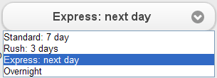

注意：原生的选择菜单不能通过 multiple="multiple" 属性进行多项选择，如果你有这个需求，我们建议使用自定义菜单。

## 使用自定义菜单的选项 Option to use custom menus

你可以自己选择使用自定义样式的选择菜单，而不是原生的。这样可以给菜单定义主题，使你的网站在视觉和体验上更加出色，而且在跨平台时也能够保持一致性。 并且，他提供了对菜单的多项选择，并且修复了某些平台缺失的功能，比如 Android 对于 optgroup 的支持，并且增加了一种优雅的方式来处理占位符值。（下面会解释）。最后，自定义的菜单在桌面电脑浏览器上视觉上会更出色，因为原生的菜单在桌面电脑上看上去比移动设备上要小一些，那如果你的项目主要面对桌面用户的话，那视觉上就有点奇怪了。

注意，把原生菜单解析为自定义菜单的话会有性能开销。如果你页面里面有很多选择菜单，，或者某个菜单有很多选项，就会影响页面性能，所以我们的建议是不要滥用自定义菜单。

给菜单添加 data-native-menu="false"属性，就可以把菜单转为自定义菜单。或者，在页面的 mobileinit 事件的回调函数中将选择菜单的 nativeMenu 设为 false 也可以达到相同的效果。这将会在全局把所有的选择菜单都默认设为自定义菜单。以下代码必须在 jQuery 加载后且 jQuery Mobile 加载前添加：

```
$(document).bind('mobileinit',function(){
　　$.mobile.selectmenu.prototype.options.nativeMenu = false;
}); 
```

如果菜单的选项不多的话，会以小弹出框的形式和动画出现。


如果选择菜单太多的选项而不能显示在屏幕中，框架会自动创建一个新 "page"，表现为一个标准的列表，包含了所有的选项。使我们能通过设备原生的滚动条在很长的一个列表内选择所有的选项。页面的标题就是 label 的文本。

## 占位符选项 Placeholder options

• 没有值的 option（或者一个空值属性）

• 没有文本节点的 option

• 带有 data-placeholder="true"属性的 option。（使你将带有值以及文本节点的选项用来作为占位符。）

你可以通过插件的 hidePlaceholderMenuItems 选项禁用该特性，方法如下：

```
$.mobile.selectmenu.prototype.options.hidePlaceholderMenuItems = false; 
```

## 禁用选项 Disabled options

jQuery Mobile 会把带有 disabled 属性的选项禁用并且在样式上标记。

在下面的实例中，第二个选项 "Rush: 3 days"被设置为禁用：

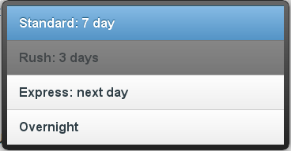

## 对于选项组的支持 Optgroup support

如果一个选择菜单包含 optgroup 元素，jQuery Mobile 会根据 label 的文本创建一个分割项的选项：

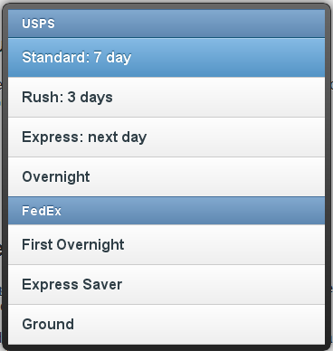

## 多项选择 Multiple selects

如果给你的选单加入 multiple 属性，jQuery Mobile 通过一系列的方式来增强元素：

• 菜单里面会创建一个 header 元素并在占位符文本旁边显示一个关闭按钮。

• 点击选项时不会关闭弹出菜单。

• 选项旁边会出现类似 checkbox 的图标。

• 超过 2 项被选择时会在选择按钮里出现一个表示当前选项数目的气泡。

• 选择的各项文本会在按钮里变成一行用逗号分隔的文本。如果按钮不够宽，多余的部分则会变成省略号。

• 如果没有选项被选择，按钮文本会保持占位符的文本

• 如果占位符元素不存在，默认按钮文本会是空白的，header 也仅仅显示一个关闭按钮。因为这不是友好的用户体验， 我们建议你在使用多选菜单时总是指定一个占位符元素。。

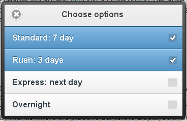

当选项太多以至于菜单会在一个新的页面出现时，占位符文本会在没有选项是显示在按钮中，label 文本会在菜单的 header 中显示。这与小对话框式的选择菜单不同的，小对话框式的选择菜单的占位符文本会同时显示在按钮和 header 中。

## Data 属性的支持 Data attribute support

你可以对 select 指定 jqmobile 的针对 button 的 data- 属性。例如：我们给下面的例子添加了 theme, icon and inline 属性。

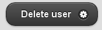

## 刷新选择菜单 Refreshing a select

如果你通过 js 操作了选择菜单，务必通过 refresh 方法来更新他的样式。

```
var myselect = $("select#foo");
myselect[0].selectedIndex = 3;
myselect.selectmenu("refresh"); 
```

# 表单的主题样式 Form themes

# 表单的主题样式 Form themes

Jquery Mobile 内建了一套样式主题系统，让你给页面和表单添加样式时有丰富的选择。默认情况下所有的表单元素都会应用与父容器相同的主题样式。是的表单元素融合进他们的布局中。给表单元素单独地应用 data-theme 属性，可以指定它的主题样式，使他在布局中凸现出

下面实例中的所有表单的 html 都是相同的，并且没有为表单内的元素单独地指定主题样式。表单之间唯一的不同就是给表单父容器通过 data-theme 属性指定了不同的主题样式。这表现了表单元素自动应用父容器的主题样式的特性

BODY 为 A 主题

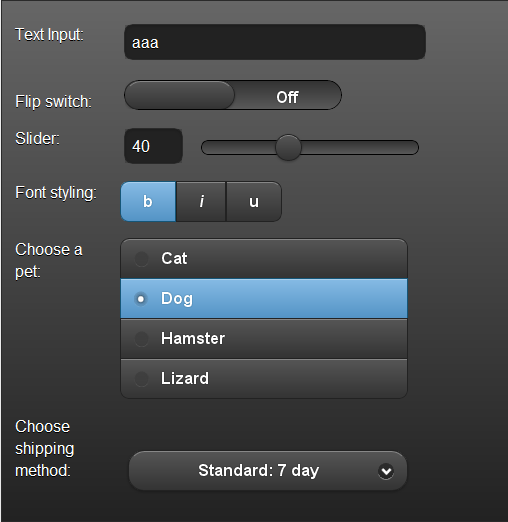

BODY 为 B 主题

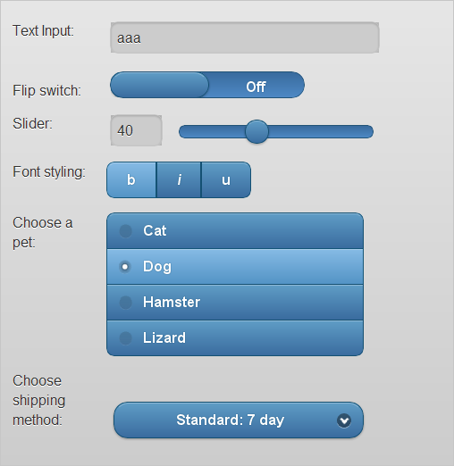

BODY 为 C 主题

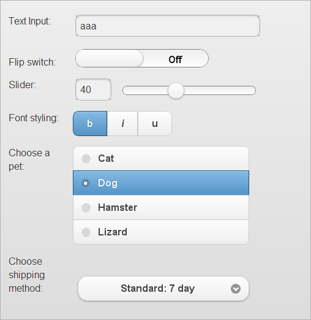

BODY 为 D 主题


BODY 为 E 主题

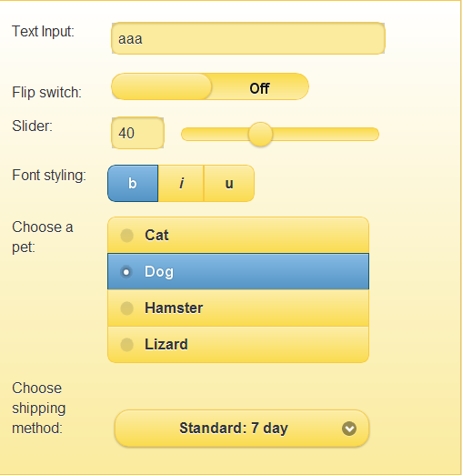

# ajax 的表单提交 Ajax form submission

# ajax 的表单提交 Ajax form submission

Jquery Mobile 会自动通过 ajax 处理表单的提交，并在表单页面和结果页面之间创建一个平滑的转场效果。注意请在 form 元素上正确设定 action 和 method 属性，保证表单的提交。如果没有指定，提交方法默认为 get,action 默认为当前页的相对路径（通过$.mobile.path.get()方法取得

表单也可以像链接一样指定转场效果的属性，比如 data-transition="pop"，和 data-direction="reverse".如果不希望通过 ajax 提交表单，可以在全局事件禁用 ajax，或给 form 设定 data-ajax="false" 属性。target 属性也可以在 form 上设置，表单提交时默认为浏览器的打开规则。。而与链接不同，rel 属性不可以在 form 上设

## 非 ajax 的处理 Non-Ajax handling

要防止表单提交时自动通过 ajax 提交，给 form 元素增加 data-ajax="false"属性。也可以通过 ajaxFormsEnabled 方法在全局控制.

## Simple Ajax form example

本页面展示了表单自动通过 ajax 处理的提交。下面的表单采用常规（get 方式提交）forms-sample-response.php 。在提交时，Jquery Mobile 会确保指定的 Url 地址可以通过 Ajax 获取，并且适当的处理。请注意，就像普通的 HTTP 请求表单提交一样，Jquery Mobile 允许通过 get 请求成功得到的结果页通过更新 Url 的哈希值被添加为收藏页。而就像普通的表单提交一样，post 请求不包含查询参数，因此结果页不能被添加为收藏页

# 表单插件的方法 Form Plugin Methods

# 表单插件的方法 Form Plugin Methods

在将 jquery mobile 对表单控件进行自定义增强之后，你依然可以通过插件的方法手动的控制他们的许多属性。当前可用的方法已经列举在下面。你可以查看 Github 上的项目来检查更新，我们正在努力完成中

**选择菜单 Select menus**

```
open 打开一个选择菜单
$('select').selectmenu('open');

close 关闭一个选择菜单
$('select').selectmenu('close'); 

refresh: 更新自定义菜单来体现原生元素的值。如果自定义菜单的选项数目和原生的 select 元素 option 的数目不一样，它将会重建该自定义菜单。同样，如果你传递一个 true 参数，你可以强制执行该重建

//刷新选择菜单的?
$('select').selectmenu('refresh');

//刷新选择菜单的值并重建菜单
$('select').selectmenu('refresh', true);

enable:启用该选择菜单
$('select').selectmenu('enable'); 

disable: 禁用该选择菜单.
$('select').selectmenu('disable'); 
```

**文本框 Textinput**

```
enable: 启用文本域
$('input').textinput('enable'); 

disable: 禁用文本域
$('textarea').textinput('disable'); 
```

**单选复选框 checkboxradio**

```
enable: 启用单选复选框.
$('input').checkboxradio('enable'); 

disable: 禁用单选复选框.
$('input').checkboxradio('disable'); 

refresh: 刷新单选复选框的值
$('input').checkboxradio('refresh'); 
```

**滑动条 slider**

```
enable: 启用滑动
$('input').slider('enable'); 

disable: 禁用滑动
$('input').slider('disable'); 

refresh: 刷新滑动条的
$('input').slider('refresh'); 
```

**表单按钮 Form buttons**

```
enable: 启用 按钮.
$('input').button('enable'); 

disable: 禁用按钮
$('input').button('disable'); 
```

## 降级的表单输入框元素 Degraded Form Input Types

Jquery Mobile 在应用了增强效果之后，会把几种 html5 输入框类型降级为了 type=text 或者 type=number 的输入框类型。例如，type=range 的输入框被增强成为一个滑动条，类型被设置为数字，而 type=search 的输入框在我们添加了一些针对搜索输入文字的样式后会降级为 type=text 输入框

页面插件包含一组 input 的类型，这些 input 的类型可以设置为 true，这意味着它们会降级成 type=text 输入框，或者 false，意味着不处理，或者一个字符串比如"number"，意为将他们转化为该类型

你可以配置哪些类型可以通过页面插件 degradeInputs 选项来改变，而哪一些是需要通过 $.mobile.page.prototype.options.degradeInputs 在外部手动操作，其中以下 type 可以使用 color, date, datetime, "datetime-local", email, month, number, range, search, tel, time, url, week. 请务必在 mobileinit 事件的处理函数里配置这些选项，以便于在加载第一个页面以及后续页面都能应用这些选项

# Jquery UI 的移动版日期拾取器插件 Jquery UI's Datepicker Styled for mobile

# Jquery UI 的移动版日期拾取器插件 Jquery UI's Datepicker Styled for mobile

下面这个示例是 Jquery UI 为移动设备开发的日期拾取器插件，这个插件并不包含在 Jquery Mobile 默认库当中，你需要自己手动 include 这些文件

**日期拾取器 Datepicker**

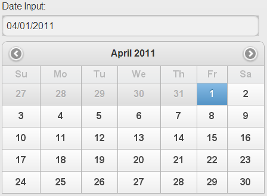

## 使用说明 Usage Instructions

日期拾取器自动从 type="date"属性的输入框中生成

```
<label for="date">Date Input:</label>
<input type="date" name="date" id="date" value="" /> 
```

我们推荐将 label 和 input 包裹在 data-role=fieldcontain 的 div 中作为描述，而且这些元素应该添加 form 中以便在 C 级浏览器也能够正常访问

**注意：**该插件并不包含在 Jquery Mobile 默认库当中，你需要包含以下文件来使用该插件：

```
<link rel="stylesheet" href="Jquery.ui.datepicker.mobile.css" /> 
<script src="Jquery.ui.datepicker.js"></script>
<script src="Jquery.ui.datepicker.mobile.js"></script> 
```

你同样可能需要配置页面插件来使"date" input 转换为"text" input 以避免原生"date" input 与我们自定义的 datepicker 所冲突，要实现这样的功能需要在"mobileinit"事件处理函数中使用如下代码：

```
<script>
　　　//reset type=date inputs to text
　　　$( document ).bind( "mobileinit", function(){
　　　$.mobile.page.prototype.options.degradeInputs.date = true;
　　　}); 
</script> 
```

把这些代码放置在在 Jquery 加载后，Jquery Mobile 加载前。你可以查看该页面的源代码是如何写的

# 列表

# 列表

# 列表 List views

# 列表 List views

列表用来展示数据，导航，结果列表以及列表标记的规约数据条目，所以 Jquery Mobile 提供了多种的列表类型以适应大多数的设计模式。

# 列表标记的规约 List markup conventions

# 列表标记的规约 List markup conventions

## 1.基本的带连接的列表 Basic linked list

列表的代码为一个含 data-role="listview" 属性无序列表 ul。Jquery Mobile 会把所有必要的样式(列表项右出现一个向右箭头，并使列表与屏幕同宽等)应用在列表上，使其成为易于触摸的控件。当你点击列表项时，Jquery Mobile 会触发该列表项里的第一个链接，通过 ajax 请求链接的 URL 地址，在 DOM 中创建一个新的页面并产生页面转场效果。

**html 代码**

```
<ul data-role="listview">
　　<li><a href="index.html">Acura</a></li>
　　<li><a href="index.html">Audi</a></li>
</ul> 
```

**效果图：**


## 2.嵌套的列列表 Nested list

通过“ul” “ol”的 li 中嵌套子 ul ，ol 你可以创建嵌套列表。当一个拥有子列表的列表项被点击时，Jquery Mobile 框架会生成一个新的 ul 页面充满屏幕，并自动生成一个为父列表项名称为标题的 header,以及一个子列表。这个动态生成的嵌套的列表默认的主题样式“b"(蓝色)，提示你是在二级菜单里。列表可以嵌套多层，Jquery Mobile 会自动处理这些链接和页面。

**html 代码**

```
<ul>
　<li>Pets
　　 <ul>
　　　<li><a href="index.html">Canary</a></li>
　　　 <li><a href="index.html">Cat</a></li>
　　 </ul>
　 </li>
　 <li>Farm animals
　　 <ul>
　　　 <li><a href="index.html">Chicken</a></li>
　　　 <li><a href="index.html">Cow</a></li>
　　 </ul>
　 </li>
</ul> 
```

**效果图：**


## 3.数字排序的列表 Numbered list

通过有序列表 ol 可以创建数字排序的列表用来表现顺序序列比如说搜索结果或者电影排行榜时非常有用。当增强效果应用到列表时，Jquery Mobile 优先使用 css 的方式给列表添加编号，当浏览器不支持这种方式时，框架会采用 JavaScript 将编号写入列表中。

**html 代码**

```
<ol data-role="listview">
　 <li><a href="index.html">The Godfather</a></li>
　 <li><a href="index.html">Inception</a></li>
</ol> 
```

**效果图：**


## 4.只读列表 Read-only list

列表也可以用来展示没有交互的条目，通常会是一个内嵌的列表。通过有序或者无序列表都可以创建只读列表，列表项内没有链接即可，Jqmobil 默认将他们的主题样式为“c”白色无渐变色，并把字号设为比可点击的列表项的小，以节省空间。

**html 代码**

```
<ul data-role="listview" data-inset="true">
　 <li>Acura</li>
　 <li>Audi</li>
</ul> 
```

**效果图：**


## 5.拆分的按钮列表 Split button lists

有时每个列表项会有多于一个操作，这时拆分按钮用来提供 2 个独立的可点击的部分：列表项本身和列表项右边的小 icon。要创建这种拆分按钮，在 li 插入第二个链接即可，框架会创建一个竖直的分割线，并把链接样式化为一个只有 icon 的按钮，记得设置 title 属性以保证可访问性。

你可以通过指定 data-split-icon 属性来设置位于右边的分隔项的图标（图标详情参见 图标?分隔项的主题样式可以通过 data-split-theme 属性来设置。

**html 代码**

```
<ul data-role="listview" data-split-icon="gear" data-split-theme="d">
　<li>
　　
　　<h3><a href="index.html">Broken Bells</a></h3>
　　<p>Broken Bells</p>
　　<a href="lists-split-purchase.html" data-rel="dialog" data-transition="slideup">Purchase album</a>
　</li>
　<li>
　　
　　<h3><a href="index.html">Warning</a></h3>
　　<p>Hot Chip</p>
　　<a href="lists-split-purchase.html" data-rel="dialog" data-transition="slideup">Purchase album</a>
　</li>

</ul> 
```

**效果图：**


## 6.列表分割项 List dividers

列表项也可以转化为列表分割项，用来组织列表，使列表项成组。给任意列表项添加 data-role="list-divider" 属性即可。默认情况下列表项的主题样式为“b“浅灰)，但给列表（ul 或 ol）添加 data-dividertheme 属性可以设置列表分割项的主题样式。

**html 代码**

```
<ul data-role="listview">
　<li data-role="list-divider">A</li>
　 <li><a href="index.html">Adam Kinkaid</a></li>
　 <li><a href="index.html">Alex Wickerham</a></li>
　 <li><a href="index.html">Avery Johnson</a></li>
　 <li data-role="list-divider">B</li>
　 <li><a href="index.html">Bob Cabot</a></li> 

</ul> 
```

**效果图：**


## 7.搜索过滤框 Search filter

Jquery Mobile 提供了一种非常方便的方式通过在客户端进行的搜索机制过滤列表。要使一个列表可过滤，只需为列表设置 data-filter="true" 属性即可。框架会在列表上方增加一个搜索框，当用户在搜索输入框中输入时，Jquery Mobile 会自动过滤掉不含输入字符的列表项。

搜索输入框默认的字符为 "Filter items...".通过设置 mobileinit 事件的绑定程序或者给 $.mobile.listview.prototype.options.filterPlaceholder 选项设置一个字符串，或者给列表设置 data-filter-placeholder 属性，可以设置搜索输入框的默认字符。

**html 代码**

```
<ul data-role="listview" data-filter="true" >
　　<li><a href="index.html">Acura</a></li>
　　<li><a href="index.html">Audi</a></li>
</ul> 
```

**效果图：**


## 8.文本格式和计数气泡 Text formatting & counts

Jquery Mobile 支持通过 HTML 语义化的标签来显示列表项中所需常见的文本格式（比如 标题/描述，二级信息，计数等）

*   • 将数字用一个元素包裹，并添加 ui-li-count 的 class,放置于列表项内，可以给列表项右侧增加一个计数气泡

*   • 要添加有层次关系的文本可以使用标题来强调，用段落文本来减少强调

*   • 补充信息（比如日期）可以通过包裹在 class="ui-li-aside"的容器中来添加到列表项的右侧

**html 代码**

```
<ul data-role="listview">
　<li data-role="list-divider">Friday, October 8, 2010 <span class="ui-li-count">2</span></li>
　<li>
　　 <h3><a href="index.html">Stephen Weber</a></h3>
　　<p><strong>You've been invited to a meeting at Filament Group in Boston, MA</strong></p>
　　 <p>Hey Stephen, if you're available at 10am tomorrow, we've got a meeting with the Jquery team.</p>
　　 <p class="ui-li-aside"><strong>6:24</strong>PM</p>
　 </li>
　 <li>
　　 <h3><a href="index.html">Jquery Team</a></h3>
　　 <p><strong>Boston Conference Planning</strong></p>
　　 <p>In preparation for the upcoming conference in Boston, we need to start gathering a list of sponsors and speakers.</p>
　　 <p class="ui-li-aside"><strong>9:18</strong>AM</p>
　 </li>
</ul> 
```

**效果图：**


**html 代码**

```
<ul data-role="listview">
　<li><a href="index.html">Inbox</a> <span class="ui-li-count">12</span></li>
　 <li><a href="index.html">Outbox</a> <span class="ui-li-count">0</span></li>
</ul> 
```

**效果图：**


## 9.列表项的缩略图与图标 Thumbnails & icons

要在列表项左侧添加缩略图，只需在列表项中添加一幅图片作为第一个子元素即可。Jquery Mobile 会自动缩放图片为大小 80px 的正方形，而要使用标准?6*16 的图标作为缩略图的话，为图片元素添加 ui-li-icon class 即可

**html 代码**

```
<ul data-role="listview">
　<li>
　　 
　　 <h3><a href="index.html">Broken Bells</a></h3>
　　 <p>Broken Bells</p>
　 </li>
　 <li>
　　 
　　<h3><a href="index.html">Warning</a></h3>
　　 <p>Hot Chip</p>
　 </li>
</ul> 
```

**效果图：**

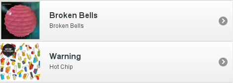

**html 代码**

```
<ul data-role="listview">
　<li><a href="index.html">France</a> <span class="ui-li-count">4</span></li>
　 <li><a href="index.html">Germany</a> <span class="ui-li-count">4</span></li>
</ul> 
```

**效果图：**

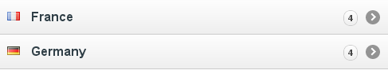

## 10.内嵌的列表 Inset lists

如果列表需要嵌入在有其他内容的页面中，内嵌列表会将列表设为边缘圆角，周围留有 magin 的块级元素。给列表（ul 或 ol）添加 data-inset="true"属性 即可

**html 代码**

```
<ul data-role="listview" data-filter="true" >
　　<li><a href="index.html">Acura</a></li>
　　<li><a href="index.html">Audi</a></li>
</ul> 
```

**效果图：**


## 更新列表 Updating lists

如果你给列表项添加了列表项，你需要调用 refresh()方法将列表的样式更新并且将添加进的列表项生成嵌套列表。例如： $('ul').listview('refresh');

我们目前正在改进 refresh 方法，所以请关注 Github。