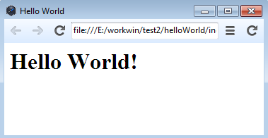
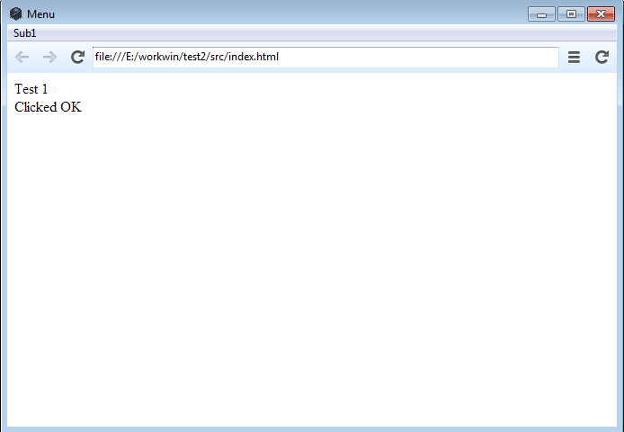

# 中文 Wiki

# nw.js 中文 Wiki

来源：[nw.js Wiki](https://github.com/nwjs/nw.js/wiki)

# 支持列表

# Features list for simplified Chinese(支持列表)

Translation for Features list

翻译自 Features list

下面的列表是 node-webkit 的支持列表，如果你正在考虑使用 node-webkit 或其他的东西来作为未来的发展方向。你可以耐心阅读并作出正确的决定。 *页面尚未完成*

*   完全支持在浏览器中运行 node.js
*   使用方便
*   原生 UI 库
*   无边框窗口
*   打包与发布
*   兼容 NPM
*   调试器支持
*   丰富的文档
*   Kiosk 模式(PS:直译为自助模式，疑为诸如自动取款机等程序所使用的全屏模式。MAC 系统下未发现区别)
*   文件对话框
*   媒体
*   良好的 HTML5 支持
    *   web 组件
    *   拖放
    *   数据持久性
    *   WebGL
    *   WebRTC
    *   datalist
    *   CSS3

# 开始 nw.js

# Getting Started with nw.js for simplified Chinese(开始 nw.js)

Translation for Getting Started with nw.js

翻译自 Getting Started with nw.js

本章节包涵了一些指导信息，以帮助您开始 nw.js 编程。假定你有 nw.js 的二进制文件(这样的文件都可以在 “[下载](https://github.com/nwjs/nw.js#downloads)”READEME 的部分，如果你想建立自己的二进制文件请参阅[Building nw.js]) nw.js 基于[Chromium](http://www.chromium.org) and [io.js](http://iojs.org/)。它可以让你直接从 DOM 调用 Node.js 的代码及模块，使您可以使用 web 技术来开发应用程序。此外，你可以很轻松的打包 web 应用到本地应用程序

## 基础

首先我们介绍 nw.js，我们先从最简单的程序开始。 **示例 1\. Hello World**



创建 `index.html`:

```js
<html>
<head>
<title>Hello World!</title>
</head>
<body>
<h1>Hello World!</h1>
</body>
</html> 
```

创建 `package.json`:

```js
{
  "name": "nw-demo",
  "main": "index.html"
} 
```

压缩 `index.html` 和 `package.json` 到 zip 压缩文件，并修改文件名为 `app.nw`:

```js
app.nw
|-- package.json
`-- index.html 
```

下载你所使用的平台的预构建的二进制文件并用它打开 `app.nw` 文件:

```js
$ ./nw app.nw 
```

注意: 在 Windows, 你可以拖拽 `app.nw` 到 `nw.exe` 来打开它。

**示例 2\. Native UI API**



nw.js 有原生 UI 控制 API。 你可以用这些来控制窗口、菜单等等

下面的示例演示如何使用菜单的 API。

```js
<html>
<head>
  <title> Menu </title>
</head>
<body>
<script> // 载入原生 UI 库
var gui = require('nw.gui');

// 创建空菜单
var menu = new gui.Menu();

// 添加菜单项，label 为菜单项的显示名
menu.append(new gui.MenuItem({ label: 'Item A' }));
menu.append(new gui.MenuItem({ label: 'Item B' }));
menu.append(new gui.MenuItem({ type: 'separator' }));
menu.append(new gui.MenuItem({ label: 'Item C' }));

// 移除菜单项
menu.removeAt(1);

// 遍历菜单项
for (var i = 0; i < menu.items.length; ++i) {
  console.log(menu.items[i]);
}

// 添加菜单项并绑定菜单点击后的回调函数
menu.append(new gui.MenuItem({
label: 'Click Me',
click: function() {
  // 创建 HTML 元素
  var element = document.createElement('div');
  element.appendChild(document.createTextNode('Clicked OK'));
  document.body.appendChild(element);
}
}));

// 弹出上下文菜单
document.body.addEventListener('contextmenu', function(ev) { 
  ev.preventDefault();
  // 在你点击后弹出
  menu.popup(ev.x, ev.y);
  return false;
}, false);

// 获取当前窗口
var win = gui.Window.get();

// 创建一个窗口的菜单栏
var menubar = new gui.Menu({ type: 'menubar' });

// 创建一个菜单项
var sub1 = new gui.Menu();

sub1.append(new gui.MenuItem({
label: 'Test1',
click: function() {
  var element = document.createElement('div');
  element.appendChild(document.createTextNode('Test 1'));
  document.body.appendChild(element);
}
}));

// 添加子菜单
menubar.append(new gui.MenuItem({ label: 'Sub1', submenu: sub1}));

// 设置菜单窗口的菜单
win.menu = menubar;

// 添加一个点击事件到已有菜单
menu.items[0].click = function() { 
    console.log("CLICK"); 
}; </script>  
</body>
</html> 
```

**示例 3\. Using node.js**

您可以直接在 DOM 调用的 Node.js 和模块。因此，它实现了无限的可能性，写的应用程序与 nw.js.

```js
<html>
<body>
<script> // 使用 node.js 获取系统平台
var os = require('os')
document.write('Our computer is: ', os.platform()) </script>
</body>
</html> 
```

## 运行与打包应用

现在，我们可以写简单的 nw.js 应用程序。下一步是了解如何运行并将其打包。

**运行应用程序**

多平台运行的两种常见方式

*   从一个文件夹。启动路径指定该文件夹。
*   从.nw 文件（重命名.ZIP 文件）。启动路径指定文件。

例如:

```js
nw path_to_app_dir
nw path_to_app.nw 
```

## 故障排除

如果有任何问题，请参阅 [[Troubleshooting]] 。

回到 [Wiki](https://github.com/nwjs/nw.js/wiki) 以查看更多

# package.json

> 译者：[VDON](http://segmentfault.com/u/vdon)
> 
> 来源：[node-webkit 文档翻译#package.json](http://segmentfault.com/a/1190000000374529)

title: node-webkit 文档翻译#package.json date: 2013-12-07 21:38:25

## tags: node-webkit

### 基本示例

```js
{
    "main": "index.html",
    "name": "nw-demo",
    "description": "demo app of node-webkit",
    "version": "0.1.0",
    "keywords": [ "demo", "node-webkit" ],
    "window": {
        "title": "node-webkit demo",
        "icon": "link.png",
        "toolbar": true,
        "frame": false,
        "width": 800,
        "height": 500,
        "position": "mouse",
        "min_width": 400,
        "min_height": 200,
        "max_width": 800,
        "max_height": 600
    },
    "webkit": {
       "plugin": true
    }
} 
```

### 必填字段

#### main

（*字符串*）当 node-webkit 打开时的默认页面。

#### name

（*字符串*）包的名字，必须为独一无二的，可由字母，数字，下划线组成，不能有空格。

### 功能性字段

#### nodejs

（*布尔型*）nodejs 是否 node-webkit 中启用。

#### node-main

（*字符串*）当 node-webkit 打开时的加载的 node.js 文件。可通过`process.mainModule`访问

##### Example：

index.html

```js
 <html>
    <head>
        <title>Hello World!</title>
    </head>
    <body onload="process.mainModule.exports.callback0()">
        <h1>Hello World!</h1>
        We are using node.js <script>document.write(process.version); </script>
    </body>
    </html> 
```

index.js

```js
var i = 0;
exports.callback0 = function () {
    console.log(i + ": " + window.location);
    window.alert ("i = " + i);
    i = i + 1;
} 
```

package.json

```js
{
  "name": "nw-demo",
  "node-main": "index.js",
  "main": "index.html"
} 
```

#### window

控制窗口的样子，后文细讲。

#### webkit

控制 webkit 特性是否启用，后文细讲。

### 窗口字段

#### title

（*字符串*）默认打开的窗口的名字。

#### toolbar

（*布尔值*）是否显示工具栏。

#### icon

（*字符串*）图标的路径。

#### position

（*字符串*）只可能是这么几个值`null` `center` `mouse`。null 指无定位，center 指在显示器中间，mouse 指在鼠标的位置。

#### min_width/min_height

（*整形*）定义宽度和高度的最小值。

#### resizable

（*布尔值*）窗口是否可调整大小。

#### always-on-top

（*布尔值*）窗口是否总在最上。

#### fullscreen

（*布尔值*）打开时是否全屏。

#### frame

（*布尔值*）是否显示窗口框架。

如果不显示，那应该怎么拖动呢？

可以在代替框架的元素上添加 css。

```js
.titlebar {
  -webkit-user-select: none;//禁止选中文字
  -webkit-app-region: drag;//拖动
} 
```

#### show

（*布尔值*）是否在任务栏上显示。

#### kiosk

（*布尔值*）是否处于 kiosk 状态，在 kiosk 状态下将全屏并且阻止用户关闭窗口。

常用的就这些吧（其实是我懒得写了），差不多够了。