# 中文教程

# node-webkit 中文教程

> 作者：玄魂
> 
> 来源：[node-webkit](http://www.cnblogs.com/xuanhun/tag/node-webkit/)

# 前言

几个月前，要开发一个简易的展示应用，要求支持离线播放（桌面应用）和在线播放（web 应用）。

当时第一想到的是 flex，同一套代码（或者只需少量的更改）就可以同时运行在桌面和浏览器上。由于很多展现效果要全新开发，我想到了 impress.js([`github.com/bartaz/impress.js/`](https://github.com/bartaz/impress.js/))。如果选择 impress.js，就意味着要将 html5 作为桌面应用，当时想到要封装 webkit，但是本人对这方面也不是很熟悉，时间也很有限，就又沿着这个方向搜索，找到了 node-webkit([`github.com/rogerwang/node-webkit`](https://github.com/rogerwang/node-webkit))。

`node-webkit`解决了我通过`html`和`js`来编写桌面应用的难题。

至于 node-webkit 的定义，按照作者的说法：

“ 基于 node.js 和 chromium 的应用程序实时运行环境，可运行通过 HTML(5)、CSS(3)、Javascript 来编写的本地应用程序。node.js 和 webkit 的结合体，webkit 提供 DOM 操作，node.js 提供本地化操作；且将二者的 context 完全整合，可在 HTML 代码中直接使用 node.js 的 API。”

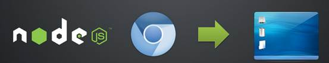

# node-webkit 学习(1)hello world

# node-webkit 学习(1)hello world

> 作者：玄魂
> 
> 来源：[node-webkit 学习(1)hello world](http://www.cnblogs.com/xuanhun/p/3653816.html)

## 目录

*   1.1 环境安装
    *   1.1.1 windows 下的安装
    *   1.1.2 linux 环境下的安装
*   1.2 hello world

## 1.1 环境安装

webkit 是开源项目，项目地址为[`github.com/rogerwang/node-webkit`](https://github.com/rogerwang/node-webkit)。

我们可以在该项目首页找到 downloads 节（[`github.com/rogerwang/node-webkit#downloads`](https://github.com/rogerwang/node-webkit#downloads)），该处提供了预编译版本：

Prebuilt binaries (v0.9.2 - Feb 20, 2014):

*   Linux: [32bit](http://dl.node-webkit.org/v0.9.2/node-webkit-v0.9.2-linux-ia32.tar.gz) / [64bit](http://dl.node-webkit.org/v0.9.2/node-webkit-v0.9.2-linux-x64.tar.gz)

*   Windows: [win32](http://dl.node-webkit.org/v0.9.2/node-webkit-v0.9.2-win-ia32.zip)

*   Mac: [32bit, 10.7+](http://dl.node-webkit.org/v0.9.2/node-webkit-v0.9.2-osx-ia32.zip)

### 1.1.1 windows 下的安装

下载 windows 版本的安装包，解压到磁盘。

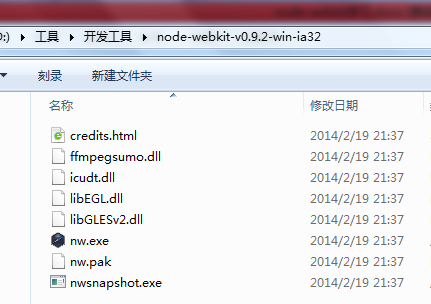

双击 nw.exe,出现如下界面：

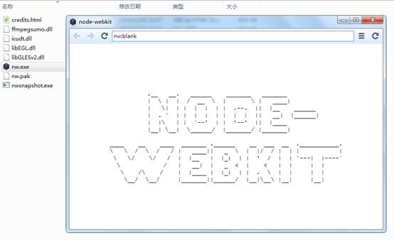

### 1.1.2 linux 环境下的安装

以 ubuntu 为例，首先下载安装包。

```
wget http://dl.node-webkit.org/v0.8.5/node-webkit-v0.8.5-linux-ia32.tar.gz 
```

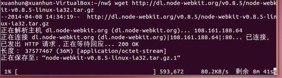

解压：

```
tar -xzf node-webkit-v0.8.5-linux-ia32.tar.gz 
```

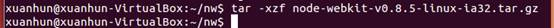

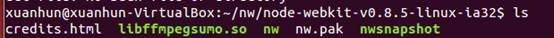

运行 nw，看是否正常。

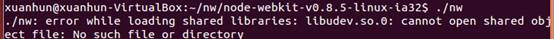

我出现

```
./nw: error while loading shared libraries: libudev.so.0: cannot open shared object file: No such file or directory 
```

的错误。可以按如下方式解决：

1)下载安装 ghex：sudo apt-get install ghex


2)在 nw 可执行文件目录中用 ghex 打开 nw：

```
ghex nw 
```

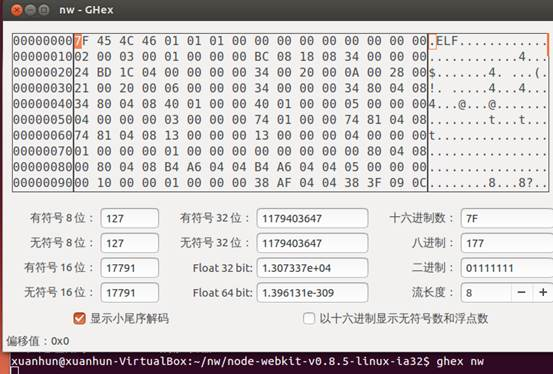

3)在 ghex 中，ctrl+f,打开搜索工具，查找 libudev.so.0。

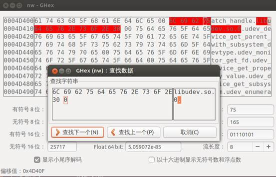

关闭搜索框，在右侧字符窗口，修改 0 为 1。

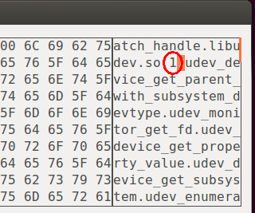

4)ctrl+s 保存后退出 ghex，现在再打开 nw 就会看到一个小窗口了，这就成功了。

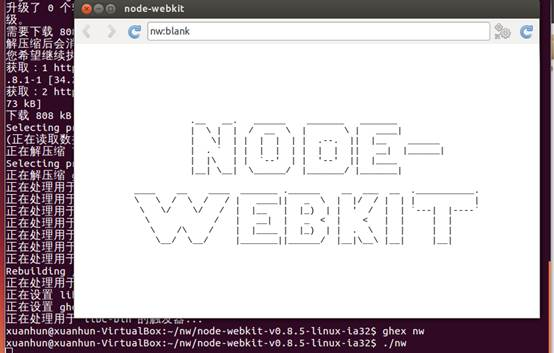

## 1.2 hello world

对新的运行时的尝试，往往都是从经典的 hello world 开始，本人也不免落俗。

先新建一个 helloWorld 目录，存放相关文件。

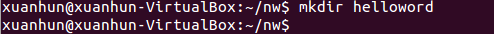

先创建 helloWorld.html 文件，内容如下（来自作者的示例）：

```
<!DOCTYPE html>
<html>
<head>
<title>Hello World!</title>
</head>
<body>
<h1>Hello World!</h1>
We are using node.js <script>document.write(process.version)</script>.
</body>
</html> 
```

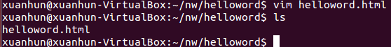

下一步，创建 package.json 文件：

```
{
    "name": "helloworld",
    "main": "helloworld.html"
} 
```

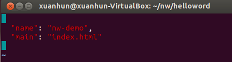

第三步，将 helloworld.html 和 package.json 打包到一个 zip 文件包中。

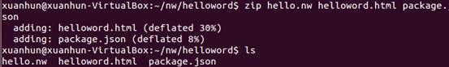

下面我们使用 nw 来执行压缩包。

```
./nw ../helloword/hello.nw 
```

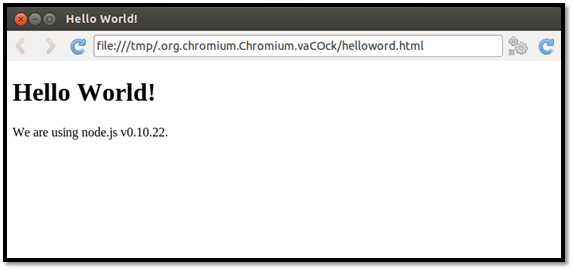

下一篇文章，讲解基本的程序结构和配置。

# node-webkit 学习(2)基本结构和配置

# node-webkit 学习(2)基本结构和配置

> 作者：玄魂
> 
> 来源：[node-webkit 学习(2)基本结构和配置](http://www.cnblogs.com/xuanhun/p/3656003.html)

## 目录

*   2.1 基本程序结构
*   2.2 package.json
    *   2.2.1 必须的配置
    *   2.2.2 特性控制字段
*   2.3 小结

## 2.1 基本程序结构

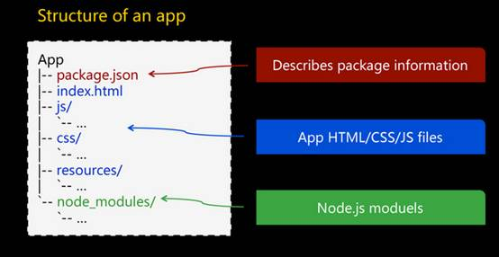

如上图，是一个 nw 程序的基本组织结构，在根目录下 package.json,程序的配置文件；index.html(可以是任意名称)，应用的启动页面；js/css/resources，应用的样式、脚本、html、图片等资源文件；node_modules 存放 node.js 的扩展组件。

nw 在启动应用程序时，首先要读取 package.json 文件，初始化基本属性，下面我们看看 package.json 的参数。

## 2.2 package.json

一个完整的 package.json 实例如下：

```
{
    "main": "index.html",
    "name": "nw-demo",
    "description": "demo app of node-webkit",
    "version": "0.1.0",
    "keywords": [ "demo", "node-webkit" ],
    "window": {
        "title": "node-webkit demo",
        "icon": "link.png",
        "toolbar": true,
        "frame": false,
        "width": 800,
        "height": 500,
        "position": "mouse",
        "min_width": 400,
        "min_height": 200,
        "max_width": 800,
        "max_height": 600
    },
    "webkit": {
        "plugin": true
    }
} 
```

### 2.2.1 必须的配置

在上面的配置中`main`和`name`是必须的属性。

`main`指定程序的起始页面。

`name`字符串必须是小写字母或者数字，可以包含"." 或者"_"或者"-" ，不允许带空格。`name`必须全局唯一。

### 2.2.2 特性控制字段

`nodejs`

bool 值，如果设置为 false，将禁用 webkit 的 node 支持。

在上一篇文章（[node-webkit 学习（1）hello world](http://www.xuanhun521.com/Blog/2014/4/9/node-webkit%E5%AD%A6%E4%B9%A01hello-world)）中的示例，在 helloWorld.html 中，输出了 node.js 的版本信息，现在我们在 pakage.json 中禁用 node。

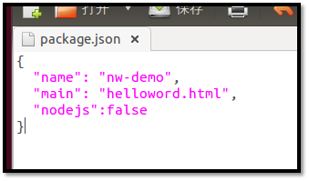

结果如下：


版本信息没有输出，同时在终端会出现未捕获异常：

```
[10894:0409/144559:INFO:CONSOLE(8)] "Uncaught ReferenceError: process is not defined", source: file:///tmp/.org.chromium.Chromium.F4YVql/helloword.html (8) 
```

`node-main`

字符串。指定一个 node.js 文件，当程序启动时，该文件会被运行，启动时间要早于 node-webkit 加载 html 的时间。它在 node 上下文中运行，可以用它来实现类似后台线程的功能。

在 node-main 脚本中还可以访问全局的“`window`”对象，它指向 DOM 窗口，但是如果页面导航发生变化，访问到的 window 对象也会发生变化。因为它执行时间要早于 DOM 加载，所以要等页面加载完毕，才能使用“`window`”对象。

同时，在 DOM 页面中，可以通过`process.mainModule`来获取 node-main 信息。

继续修改之前的 helloworld，在程序源文件夹下，添加一个 hello.js，内容如下：

```
var i = 0;
exports.callback0 = function () {
    console.log(i + ": " + window.location);
    window.alert ("i = " + i);
    i = i + 1;
} 
```

修改 helloworld.html 为：

```
<html>
<head>
<title>Hello World!</title>
</head>
<bodyonload="process.mainModule.exports.callback0()">
<h1>Hello World!</h1>
We are using node.js <script>document.write(process.version); </script>
</body>
</html> 
```

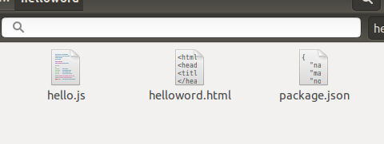

修改 package.json，添加“node-main”配置。

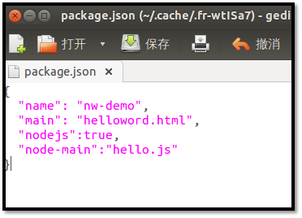

重新打包所有文件，运行。

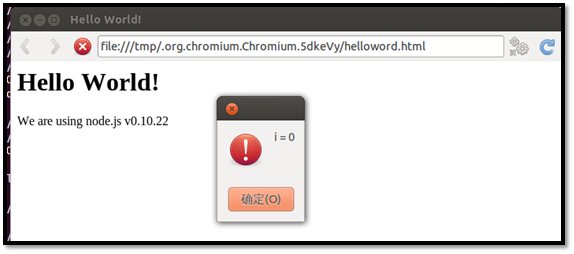

不停的刷新页面，可以看到 i 值在不断增加，证明 node-main 中的代码在单独的 contex 中运行。

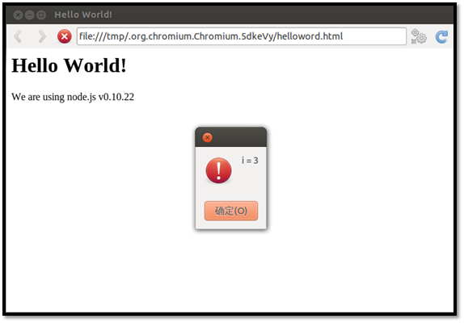

`single-instance`

bool 值。默认情况下，如果将 node-webkit 程序打包发布，那么只运行同时启动一个该应用的实例。如果你希望允许同时启动多个实例，将该值设置为 false。

`window`

设置窗口外观。由一组子属性构成，分别如下：

`title`

字符串，设置默认 title。

`width/height`

主窗口的大小。

`toolbar`

bool 值。是否显示导航栏。

现在修改 package.json 如下：

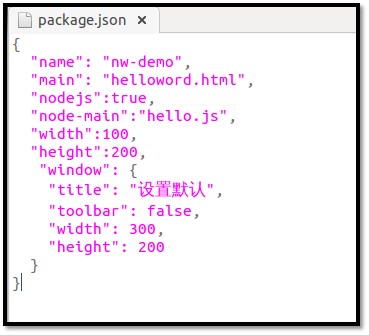

重新运行程序，结果如下：

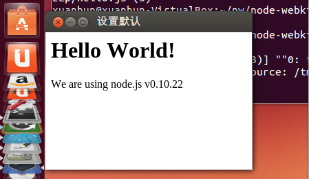

在图中我们可以看到，窗口的 title、大小和显示位置都发生 了变化，同时导航栏消失 了。

`icon`

窗口的 icon。

`position`

字符串。窗口打开时的位置，可以设置为“null”、“center”或者“mouse”。

`min_width/min_height`

窗口的最小值。

`max_width/max_height`

窗口显示的最大值。

`as_desktop`

bool 值。（暂时还没明白具体作用）

`resizable`

bool 值。是否允许调整窗口大小。

`always-on-top`

bool 值。窗口置顶。

`fullscreen`

bool 值。是否全屏显示。

`show_in_taskbar`

是否在任务栏显示图标。

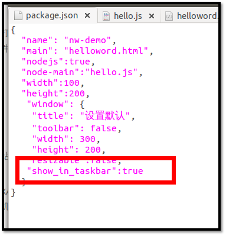

如上图，配置程序在任务栏显示，在 windows 和 ubuntu 下运行，都可以看到显示任务栏图标。

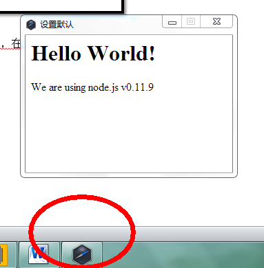

`frame`

bool 值。如果设置为 false，程序将无边框显示。

示例 package.json:

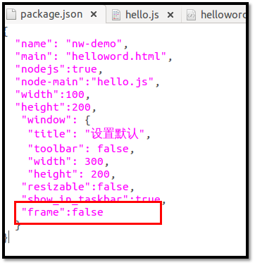

运行效果如下：

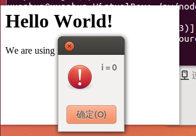

默认情况下，无边框的程序，将不可拖动。

可以通过添加如下样式来使窗口可拖动：

```
<html>
<head>
<style>
    body
    {
        -webkit-user-select:none;
        -webkit-app-region:drag;
    }
</style>
</head>
<body onload="process.mainModule.exports.callback0()">
<h1>Hello World!</h1>
We are using node.js
<script>document.write(process.version); </script>
</body>
</html> 
```

`show`

bool 值，如果设置为 false，启动时窗口不可见。

`kiosk`

bool 值。是否使用 kiosk 模式。如果使用 kiosk 模式，应用程序将全屏显示，并且阻止用户离开应用。

`webkit`

webkit 属性，用来控制 webkit 一些特性的打开或者关闭，由一组属性组成。

`plugin`

bool 值，是否加载插件，如 flash，默认值为 false。

`java`

bool 值，是否加载 Java applets，默认为 false。

`page-cache`

bool 值，是否启用页面缓存，默认为 false。

`user-agent`

应用发起 http 请求时，使用的 user-agent 头信息。下列占位符可以被替换：

*   %name: 替换配置中的 name 属性

*   %ver: 替换配置中的 version 属性

*   %nwver: 被 node-webkit 版本信息替换.

*   %webkit_ver: 被 WebKit 引擎的版本信息替换.

·+%osinfo: 被 操作系统和 CPU 信息 替换，在浏览器的 user agent 字符串中可以被看到.

示例配置：

```
{
    "name": "nw-demo",
    "main": "helloword.html",
    "nodejs":true,
    "node-main":"hello.js",
    "window": {
        "title": "设置默认",
        "toolbar": true,
        "width": 300,
        "height": 200,
        "resizable":true,
        "show_in_taskbar":true,
        "frame":true,
        "kiosk":false
    },
    "webkit":{
        "plugin":true
    }
    "user-agent": "测试 %ver %nwver %webkit_ver windows7" /* 替换占位符内容即可 */
} 
```

`chromium-args`

string 类型，自定义 chromium 启动参数。详细的参数列表参考：[`src.chromium.org/svn/trunk/src/content/public/common/content_switches.cc`](http://src.chromium.org/svn/trunk/src/content/public/common/content_switches.cc)

`js-flags`

string 类型，传递给 js 引擎（V8）的参数。例如，想启用 Harmony Proxies 和 Collections 功能，可以使用如下配置方式：

```
{
    "name": "nw-demo",
    "main": "index.html",
    "js-flags": "--harmony_proxies --harmony_collections"
} 
```

`inject-js-start / inject-js-end`

string 类型。指定一个 js 文件。

对于 inject-js-start，该 js 文件会在所有 css 文件加载完毕，dom 初始化之前执行。

对于 inject-js-end，该 js 文件会在页面加载完毕，onload 事件触发之前执行。

`snapshot`

string 类型，应用程序的快照文件路径。包含编译的 js 代码。使用快照文件可以有效的保护 js 代码。后续文章会详细介绍。

`dom_storage_quota`

int 类型，dom 存储的限额（以自己为单位）。建议限制为你预想大小的 2 倍。

`no-edit-menu`

bool 值，Edit 菜单是否显示。仅在 Mac 系统下有效。

`description`

简要描述

`version`

版本信息

`keywords`

关键词

`maintainers`

软件维护者信息，是一个数组，示例如下：

```
"maintainers":[ {
    "name": "Bill Bloggs",
    "email": "billblogs@bblogmedia.com",
    "web": "http://www.bblogmedia.com",
}] 
```

每个维护人的信息中，name 字段是必须字段，其他两个（email 和 web）是可选字段。

`contributors`

贡献者信息，格式同 maintainers，按照约定，第一个 contributor 是该应用的作者。

`bugs`

提交 bug 的 url。可以是“mailto：”或者“[http://](http://i.cnblogs.com)”格式。

`licenses`

一个数组，可以包含多个声明。每个声明包含“type”和“url”两个属性，分别指定声明的类型和文本。

示例如下：

```
"licenses": [
    {
        "type": "GPLv2",
        "url": "http://www.example.com/licenses/gpl.html",
    }
] 
```

`repositories`

程序包的存储地址数组。示例如下：

```
"repositories": [
    {
        "type": "git",
        "url": "http://github.com/example.git",
        "path": "packages/mypackage"
    }
] 
```

type 和 url 指定可以下载或者克隆程序包的地址，如果程序包不在根目录中，需要在 path 属性指定相对目录。

## 2.3 小结

本篇文章基本涵盖了 package.json 的所有字段的说明，有些字段本人也不明白实际用途，还有些字段现阶段 node-webkit 也没有使用（description，version，keywords，maintainers，contributors，bugs，licenses，repositories）。

下一篇文章介绍常用的 native api。

# node-webkit 学习(3)Native UI API 概览

# node-webkit 学习(3)Native UI API 概览

> 作者：玄魂
> 
> 来源：[node-webkit 学习(3)Native UI API 概览](http://www.cnblogs.com/xuanhun/p/3658275.html)

目录

node-webkit 学习(3)Native UI API 概览

*   3.1 Native UI api 概览
    *   Extended Window APIs.
    *   Menus.
    *   Platform Services.
    *   Tips.
*   3.2 注意事项
*   3.3 EventEmitter
*   3.4 小结

## 3.1 Native UI api 概览

Native UI API，是提供了在代码中访问、控制应用程序界面显示的接口。和使用 node.js 模块类似，想要访问 node-webkit 的 Native UI API，需要先加载“nw.gui”模块。node-webkit 的模块命名遵循 node.js 规范，所以不必担心产生冲突。

下面我们创建本文的示例程序。

先创建 guidemo.html，内容如下：

```
<html>
<head>
</head>
<body>
<h1>Hello GUI</h1>
<script>
</script>
</body>
</html> 
```

package.json 内容如下：

```
{
    "name": "gui-demo",
    "main": "guidemo.html",
    "nodejs":true,
    "width":100,
    "height":200,
    "window": {
        "title": "GUI DEMO",
        "toolbar": true,
        "width": 800,
        "height": 600,
        "resizable":true,
        "show_in_taskbar":true,
        "frame":true,
        "kiosk":false
    },
    "webkit":{
        "plugin":true
    }
} 
```

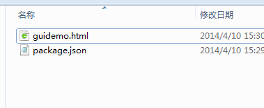

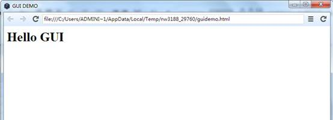

若要访问 native ui api，需要先加载“nw.gui”模块，代码如下：

```
var gui = require('nw.gui'); 
```

加载 gui 模块之后，就可以像创建普通的 javascript 对象一样，创建 GUI 元素了。例如，我们可以使用如下代码创建一个菜单：

```
var menu = new gui.Menu({ title: '菜单' }); 
```

下面，我们按如下内容修改 guidemo.html：

```
<html>
<head>
<title>gui</title>
<meta http-equiv="Content-Type" content="text/html; charset=utf-8" />
</head>
<body >
<h1>Hello GUI 菜单</h1>
<script>
    var gui = require('nw.gui');
    var menubar = new gui.Menu({ type: 'menubar' });
    var sub1 = new gui.Menu();
    sub1.append(new gui.MenuItem({
        label: '子菜单 1',
        click: function() {
            var element = document.createElement('div');
            element.appendChild(document.createTextNode('Test 1'));
            document.body.appendChild(element);
        }
    }));
    menubar.append(new gui.MenuItem({ label: '菜单 1', submenu: sub1 }));
    var win = gui.Window.get();
    win.menu = menubar;
</script>
</body>
</html> 
```

首先，通过

```
var gui = require('nw.gui'); 
```

加载 nw.gui 模块。

随后通过

```
var menubar = new gui.Menu({ type: 'menubar' }); 
```

创建了一个 menubar 类型的 Menu，即菜单栏。有了菜单栏之后就可以向其中添加菜单了。我们创建了一个菜单“sub1”，通过添加 MenuItem 对象，添加该菜单的下拉选项，并定义了 click 事件。

随后通过

```
menubar.append(new gui.MenuItem({ label: '菜单 1', submenu: sub1 })); 
```

将 sub1 添加为菜单 1 的子菜单。

目前为止，菜单项创建完毕，需要将其添加到当前窗口上。通过

```
var win = gui.Window.get(); 
```

获取窗口对象，然后通过

```
win.menu = menubar; 
```

设置窗口的菜单。

运行效果如下：

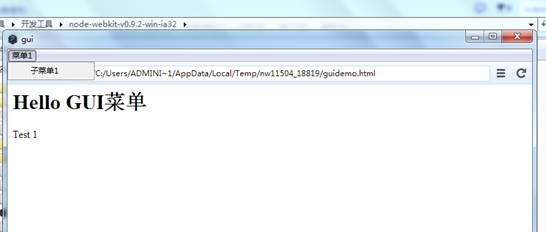

对于每个 gui 对象的属性，比如 title、label、 icon 和 menu，可以直接通过对象去访问和修改。比如下面的代码：

```
menu.title = 'New Title'; 
```

remove、append 和 insert 方法，在每个 GUI 对象上都可以使用，例如：

```
menu.append(new gui.MenuItem({ label: 'Im an item' }));
menu.removeAt(0); 
```

子元素通常被存储在 items 字段中，可以通过索引进行访问:

```
for (var i = 0; i < menu.items.length; ++i) {
    console.log('MenuItem', i, menu.items[i]);
} 
```

在上面的示例代码中，我们主要以 menue 为例进行介绍，native ui api 大致可划分为如下的类别：

*   Extended Window APIs
    *   Window
    *   Frameless Window
*   Menus
    *   Menu
    *   MenuItem
    *   Window menu
*   Platform Services
    *   App – 每一个应用都可以访问的全局函数
    *   Clipboard – 剪贴板
    *   Tray – 状态显示与通知
    *   File dialogs-文件对话框
    *   Shell
    *   Handling files and arguments
*   Tips
    *   Show window after page is ready
    *   Minimize to tray Preserve window state between sessions

## 3.2 注意事项

不要通过赋值的方式直接修改一个 GUI 对象，比如：

```
menu.items[0] = item 
```

或者

```
item = new gui.MenuItem({}) 
```

想要替换一个元素，需要先 remove 再 insert。

在调用 gui api 过程中出现的异常，目前 node-webkit 并没有做处理，程序会直接崩溃。要小心重复删除元素之类的操作。

删除一个对象之后，要将其设置为 null 值，如：

```
var tray = new gui.Tray(...);
// blablabla...
// We are done with it
tray.remove();
tray = null; // This line is very important
Do not change UI types' prototype（没明白具体指什么，望读者告知） 
```

## 3.3 EventEmitter

在 node-webkit 中，每一个 ui 元素都从 node.js 的 EventEmitter 继承而来，所以你可以用如下的方式监听元素的实践：

```
menuitem.on('click', function() {
    console.log('Item is clicked');
}); 
```

## 3.4 小结

本文内容主要来自 node-webkit 的官方英文文档（[`github.com/rogerwang/node-webkit/wiki/API-Overview-and-Notices`](https://github.com/rogerwang/node-webkit/wiki/API-Overview-and-Notices)），做了适当的改编和调整。主要目的是从整体上认识 Native UI API，同时了解基本用法。之后的文章，会对每一个类别的 api 做详细的介绍。

# node-webkit 学习(4)Native UI API 之 window

# node-webkit 学习(4)Native UI API 之 window

> 作者：玄魂
> 
> 来源：[node-webkit 学习(4)Native UI API 之 window](http://www.cnblogs.com/xuanhun/p/3664635.html)

## 目录

*   4.1 window api 概述
*   4.2 获取和创建窗口
*   4.3 window 对象属性和方法
    *   4.3.1 Window.window
    *   4.3.2 Window.x/Window.y
    *   4.3.3 Window.width/Window.height
    *   4.3.4 Window.title
    *   4.3.5 Window.menu
    *   4.3.6 Window.isFullscreen
    *   4.3.7 Window.isKioskMode
    *   4.3.8 Window.zoomLevel
    *   4.3.9 Window.moveTo(x, y)
    *   4.3.10 Window.moveBy(x, y)
    *   4.3.11 Window.resizeTo(width, height)
    *   4.3.12 Window.resizeBy(width, height)
    *   4.3.13 Window.focus()
    *   4.3.14 Window.blur()
    *   4.3.15 Window.show()
    *   4.3.16 Window.hide()
    *   4.3.17 Window.close([force])
    *   4.3.18 Window.reload()
    *   4.3.19 Window.reloadIgnoringCache()
    *   4.3.20 Window.maximize()
    *   4.3.21 Window.minimize()
    *   4.3.22 Window.restore()
    *   4.3.23 Window.enterFullscreen()
    *   4.3.24 Window.leaveFullscreen()
    *   4.3.25 Window.toggleFullscreen()
    *   4.3.26 Window.enterKioskMode()
    *   4.3.27 Window.leaveKioskMode()
    *   4.3.28 Window.toggleKioskMode()
    *   4.3.29 Window.showDevTools([id | iframe, headless])
    *   4.3.30 Window.closeDevTools()
    *   4.3.31 Window.isDevToolsOpen()
    *   4.3.32 Window.setMaximumSize(width, height)
    *   4.3.33 Window.setMinimumSize(width, height)
    *   4.3.34 Window.setResizable(Boolean resizable)
    *   4.3.35 Window.setAlwaysOnTop(Boolean top)
    *   4.3.36 Window.setPosition(String position)
    *   4.3.37 Window.setShowInTaskbar(Boolean show)
    *   4.3.38 Window.requestAttention(Boolean attention)
    *   4.3.39 Window.capturePage(callback [, image_format | config_object ])
    *   4.3.40 Window.cookies.*
    *   4.3.41 Window.eval(frame, script)
*   4.4 window 事件
    *   4.4.1 close
    *   4.4.2 closed
    *   4.4.3 loading
    *   4.4.4 loaded
    *   4.4.5 document-start
    *   4.4.6 document-end
    *   4.4.7 focus
    *   4.4.8 blur
    *   4.4.9 minimize
    *   4.4.10 restore
    *   4.4.11 maximize
    *   4.4.12 unmaximize
    *   4.4.13 move
    *   4.4.14 resize
    *   4.4.15 enter-fullscreen
    *   4.4.16 leave-fullscreen
    *   4.4.17 zoom
    *   4.4.18 capturepagedone
    *   4.4.19 devtools-opened
    *   4.4.20 devtools-closed
    *   4.4.21 new-win-policy
*   4.5 存在的问题
*   4.6 小结

## 4.1 window api 概述

node-webkit 版本 >= v0.3.0 才支持 window api。

Native GUI API 中的 window 是对 DOM 页面的 windows 的一个封装，扩展了 DOM window 的操作，同时可以接收各种事件。

每一个 window 都继承 了 node.js 中的 [EventEmitter](http://nodejs.org/api/events.html#events_class_events_eventemitter) 对象，你可以使用 Window.on(...)的方式监听 native window 的事件。

为了有一个整体上的认识，和上一篇文章（[node-webkit 学习(3)Native UI API 概览](http://www.xuanhun521.com/Blog/2014/4/11/node-webkit%E5%AD%A6%E4%B9%A03native-ui-api%E6%A6%82%E8%A7%88)）一样，我们先做一个小例子。之后会在这个示例的基础上测试 window api 的各个属性和方法。

先创建 windowdemo.html 和 package.json 文件。

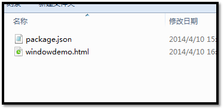

windowdemo.html 文件代码如下：

```
<html>
<head>
<title>windowdemo</title>
<metahttp-equiv="Content-Type"content="text/html; charset=utf-8"/>
</head>
<body>
<h1>window api 测试</h1>
    <script>
    var gui = require('nw.gui');
    var win = gui.Window.get();
    win.on('minimize', function () {
        var element = document.createElement('div');
        element.appendChild(document.createTextNode('窗口最小化'));
        document.body.appendChild(element);
    });
    win.minimize();
    var new_win = gui.Window.get(
        window.open('http://ebook.xuanhun521.com')
    );
    new_win.on('focus', function () {
        var element = document.createElement('div');
        element.appendChild(document.createTextNode('新窗口被激活'));
        document.body.appendChild(element);
        //Unlisten the minimize event
        win.removeAllListeners('minimize');
    });
</script>
</body>
</html> 
```

package.json 代码如下：

```
{
    "name": "window-demo",
    "main": "windowdemo.html",
    "nodejs":true,
    "width":100,
    "height":200,
    "window": {
        "title": "windowdemo",
        "toolbar": true,
        "width": 800,
        "height": 600,
        "resizable":true,
        "show_in_taskbar":true,
        "frame":true,
        "kiosk":false
    },
    "webkit":{
        "plugin":true
    }
} 
```

现在我们简单解释下 windowdemo.html，首先通过

```
var gui = require('nw.gui');
var win = gui.Window.get(); 
```

获得当前窗口对象 win，然后通过下面的代码定义了窗口最小化事件的处理函数。

```
win.on('minimize', function () {
    var element = document.createElement('div');
    element.appendChild(document.createTextNode('窗口最小化'));
    document.body.appendChild(element);
}); 
```

当窗口最小化时，在当前 DOM 文档中添加一个 div 元素，文本内容为“窗口最小化”。

下面的代码示例了如何打开一个新窗口。

```
var new_win = gui.Window.get(
    window.open('[`ebook.xuanhun521.com`](http://ebook.xuanhun521.com/)')
); 
```

通过类似的方式监听新窗口的获取焦点事件。

```
new_win.on('focus', function () {
    var element = document.createElement('div');
    element.appendChild(document.createTextNode('新窗口被激活'));
    document.body.appendChild(element);
    //Unlisten the minimize event
}); 
```

上面的代码中通过 removeAllListeners 函数，移除了主窗口所有最小化事件的处理函数。

```
win.removeAllListeners('minimize'); 
```

运行程序，结果如下：

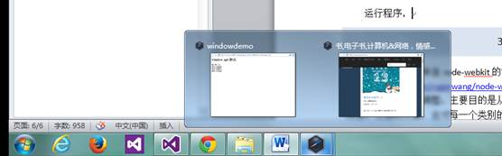

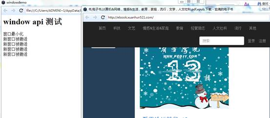

基本的获取、新建窗口，创建和移除事件监听函数的方式，现在都有了整体上的认识，下面对 window 的属性和方法逐一介绍。

## 4.2 获取和创建窗口

获取和创建新的 window 都是使用 get 方法，在上面的示例中，已经演示的很清楚，无参的 get 方法获取当前窗口对象。

```
var win = gui.Window.get(); 
```

向 get 方法传入一个 DOM window 对象，会打开新的窗口。

```
var new_win = gui.Window.get(
    window.open('https://github.com')
); 
```

获取新窗口对象的另一种方法是，使用 nw.gui.Window.open 方法。

```
var win = gui.Window.open('[`ebook.xuanhun521.com`](http://ebook.xuanhun521.com/)', {
    position: 'center',
    width: 901,
    height: 127
}); 
```

该方法传入一个 url，可选的配置参数，新窗体会加载 url。在最新版本的 node-webkit，默认情况下新打开的窗口是没有被激活的（未获取焦点）,如果想默认获取焦点，可以在在配置中设置“focus”属性为 true，如下：

```
var win = gui.Window.open('[`ebook.xuanhun521.com`](http://ebook.xuanhun521.com/)', {
    position: 'center',
    width: 901,
    height: 127,
    focus:true
}); 
```

修改 windowdemo.html 如下，使用 gui.Window.open 的方式打开新窗口。

```
<html>
<head>
<title>windowdemo</title>
<meta http-equiv="Content-Type" content="text/html; charset=utf-8" />
</head>
<body >
<h1>window api 测试</h1>
<script>
    var gui = require('nw.gui');
    var win = gui.Window.get();
    win.on('minimize', function () {
        var element = document.createElement('div');
        element.appendChild(document.createTextNode('窗口最小化'));
        document.body.appendChild(element);
    });
    win.minimize();
    //var new_win = gui.Window.get(
    // window.open('[`ebook.xuanhun521.com`](http://ebook.xuanhun521.com/)')
    //);
    var new_win = gui.Window.open('[`ebook.xuanhun521.com`](http://ebook.xuanhun521.com/)', {
        position: 'center',
        width: 901,
        height: 127,
        focus: true
    });
    new_win.on('focus', function () {
        var element = document.createElement('div');
        element.appendChild(document.createTextNode('新窗口被激活'));
        document.body.appendChild(element);
        //Unlisten the minimize event
        win.removeAllListeners('minimize');
    });
</script>
</body>
</html> 
```

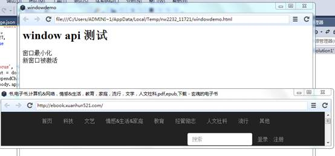

## 4.3 window 对象属性和方法

### 4.3.1 Window.window

Window.window 属性获取的是当前 DOM 文档中的 window 对象。

修改 windowdemo.html 内容如下：

```
<html>
<head>
<title>windowdemo</title>
<meta http-equiv="Content-Type" content="text/html; charset=utf-8" />
</head>
<body >
<h1>window api 测试</h1>
<script>
    var gui = require('nw.gui');
    var win = gui.Window.get();
    if (win.window == window)//比较是否为 DOM window
    {
        var element = document.createElement('div');
        element.appendChild(document.createTextNode('Window.window 和 DOM window 对象相同'));
        document.body.appendChild(element);
    }
</script>
</body>
</html> 
```

运行结果如下：

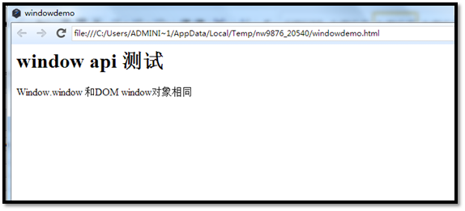

### 4.3.2 Window.x/Window.y

获取或者设置当前窗口在当前显示屏幕内的 x/y 偏移。

下面我们修改 windowdemo.html，使其显示后移动到屏幕的左上角。

```
var gui = require('nw.gui');
var win = gui.Window.get();
win.x = 0;
win.y = 0; 
```

### 4.3.3 Window.width/Window.height

获取或设置当前窗口的大小。

修改 windowdemo.html 的 script 如下：

```
<script>
    var gui = require('nw.gui');
    var win = gui.Window.get();
    var windowWidth = win.width;
    var windowHeight = win.height;
    if (win.window == window)
    {
        var element = document.createElement('div');
        element.appendChild(document.createTextNode('nativeWidth:' + windowWidth ));
        document.body.appendChild(element);
    }
</script> 
```

运行结果如下：

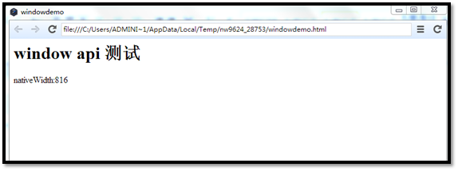

### 4.3.4 Window.title

获取或者窗体的标题。

到目前为止，有两个地方可以设置起始窗体的标题，package.json 和 DOM 页面的 title。下面我们通过 Window.title 属性先获取再修改窗口标题。

修改后的页面内容为：

```
<html>
<head>
<title>windowdemo</title>
<meta http-equiv="Content-Type" content="text/html; charset=utf-8" />
</head>
<body >
<h1>window api 测试</h1>
<input type="button" value="修改窗口标题" id="btn_ChangeTitle" onclick="changeTitle()"/>
<script>
    var gui = require('nw.gui');
    var win = gui.Window.get();
    var windowWidth = win.width;
    var windowHeight = win.height;
    if (win.window == window)
    {
        var element = document.createElement('div');
        element.appendChild(document.createTextNode('nativeWidth:' + windowWidth ));
        document.body.appendChild(element);
    }
    function changeTitle()
    {
        win.title = "新标题";
    }
</script>
</body>
</html> 
```

程序启动时界面如下：

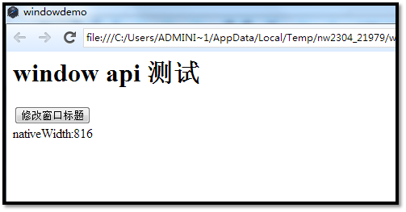

点击“修改窗口标题”按钮之后：

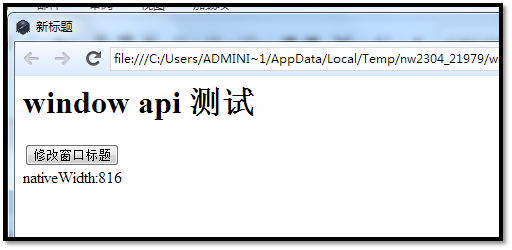

### 4.3.5 Window.menu

获取或设置 window 的 menubar。会在 menu 一节中详细介绍。

### 4.3.6 Window.isFullscreen

获取或设置是否以全屏模式展现窗体。如果程序启动时就全屏显示，需要在 package.json 中配置（参考：[`www.xuanhun521.com/Blog/2014/4/10/node-webkit%E5%AD%A6%E4%B9%A02%E5%9F%BA%E6%9C%AC%E7%BB%93%E6%9E%84%E5%92%8C%E9%85%8D%E7%BD%AE`](http://www.xuanhun521.com/Blog/2014/4/10/node-webkit%E5%AD%A6%E4%B9%A02%E5%9F%BA%E6%9C%AC%E7%BB%93%E6%9E%84%E5%92%8C%E9%85%8D%E7%BD%AE)）

### 4.3.7 Window.isKioskMode

获取或设置是否启用 KioskMode。

### 4.3.8 Window.zoomLevel

获取 或者设置窗体内页面的 zoom 值。正值代表 zoom in，负值代表 zoom out。

如在之前的脚本中添加

```
win.zoomLevel = 50; 
```

显示效果如下：

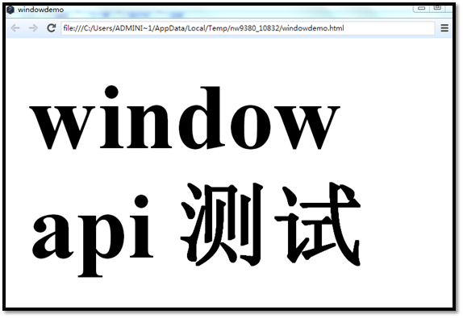

如果设置

```
win.zoomLevel = -50; 
```

效果如下：

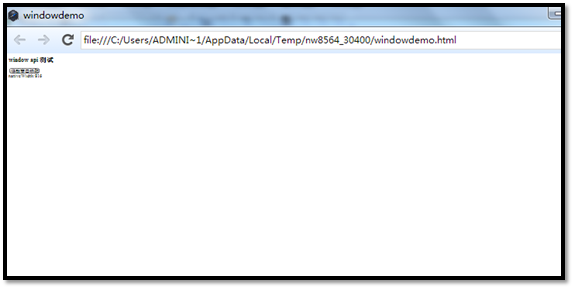

### 4.3.9 Window.moveTo(x, y)

移动窗口到指定坐标点。

### 4.3.10 Window.moveBy(x, y)

以当前位置为 0 点，移动 x,y 距离。

### 4.3.11 Window.resizeTo(width, height)

重新设置窗口大小。

### 4.3.12 Window.resizeBy(width, height)

以当前窗口大小为基准，重新增加指定值到窗口的宽高。

### 4.3.13 Window.focus()

使窗口获取焦点。

### 4.3.14 Window.blur()

使窗口失去焦点

### 4.3.15 Window.show()

显示隐藏的窗口。在某些平台上，show 方法并不会使窗口获取焦点，如果你想在窗口显示的同时使其获取焦点，需要调用 focus 方法。

show(false)和 Window.hide()方法效果一样。

### 4.3.16 Window.hide()

隐藏窗口。

### 4.3.17 Window.close([force])

关闭窗体。可以通过监听 close 事件，阻止窗口关闭。但是如果 force=true，将会忽略 close 事件的监听程序。

一般情况下，我们会在程序中先监听 close 事件，在事件处理函数中做一些基本工作再关闭窗口。如：

```
win.on('close', function() {
    this.hide(); // Pretend to be closed already
    console.log("We're closing...");
    this.close(true);
});
win.close(); 
```

### 4.3.18 Window.reload()

重新加载窗口。

### 4.3.19 Window.reloadIgnoringCache()

重新加载窗体，强制刷新缓存。

### 4.3.20 Window.maximize()

是窗口最大化

### 4.3.21 Window.minimize()

最小化窗口。

### 4.3.22 Window.restore()

恢复窗口到上一状态。

### 4.3.23 Window.enterFullscreen()

使窗口进入全屏模式。这和 html5 的 FullScreen API 不同，html5 可以使页面的一部分全屏，该方法只能使整个窗口全屏。

### 4.3.24 Window.leaveFullscreen()

退出全屏模式。

### 4.3.25 Window.toggleFullscreen()

切换全屏模式。

### 4.3.26 Window.enterKioskMode()

进入 Kiosk 模式。Kiosk 模式使应用全屏，并且阻止用户退出。所以在该模式下必须提供退出 Kiosk 模式的途径。

### 4.3.27 Window.leaveKioskMode()

退出 Kiosk 模式。

### 4.3.28 Window.toggleKioskMode()

切换 Kiosk 模式。

### 4.3.29 Window.showDevTools([id | iframe, headless])

在窗口中打开开发者工具。

详情 参见：[`github.com/rogerwang/node-webkit/wiki/Devtools-jail-feature`](https://github.com/rogerwang/node-webkit/wiki/Devtools-jail-feature)

### 4.3.30 Window.closeDevTools()

关闭开发者工具。

### 4.3.31 Window.isDevToolsOpen()

返回开发者工具是否被打开的状态信息。

### 4.3.32 Window.setMaximumSize(width, height)

设置窗口的最大值。

### 4.3.33 Window.setMinimumSize(width, height)

设置窗口的最小值。

### 4.3.34 Window.setResizable(Boolean resizable)

设置窗口是否可以被重置大小。

### 4.3.35 Window.setAlwaysOnTop(Boolean top)

设置窗口是否总在最前端。

### 4.3.36 Window.setPosition(String position)

移动窗体到指定位置。目前只有“center”支持所有平台，将窗口移动到屏幕中央。

### 4.3.37 Window.setShowInTaskbar(Boolean show)

设置是否允许在任务栏显示图标。

### 4.3.38 Window.requestAttention(Boolean attention)

是否需要身份验证。

### 4.3.39 Window.capturePage(callback [, image_format | config_object ])

对窗口内的内容作截图。我们通过一个实例来理解它的用法。

新建 html：

```
<html>
<head>
<title>windowdemo</title>
<meta http-equiv="Content-Type" content="text/html; charset=utf-8" />
</head>
<body style="background: #333">
<h1>window 测试</h1>
<script>
    var gui = require('nw.gui');
    var win = gui.Window.get();
    function takeSnapshot() {
        win.capturePage(function (img) {
            var base64Data = img.replace(/^data:image\/(png|jpg|jpeg);base64,/, "");
            require("fs").writeFile("out.png", base64Data, 'base64', function (err) {
                console.log(err);
            });
        }, 'png');
    }
</script>
<div style="background: #123; width:100px; height:100px; border:1px solid #000">
</div>
<button onclick="takeSnapshot()">截图</button>
</body>
</html> 
```

在上面的代码中，调用 win.capturePage 进行截图，截图的结果会传入到回调函数中，传入的数据是 base64 字符串，程序通过 require("fs").writeFile 方法将图片输出。

运行结果如下：

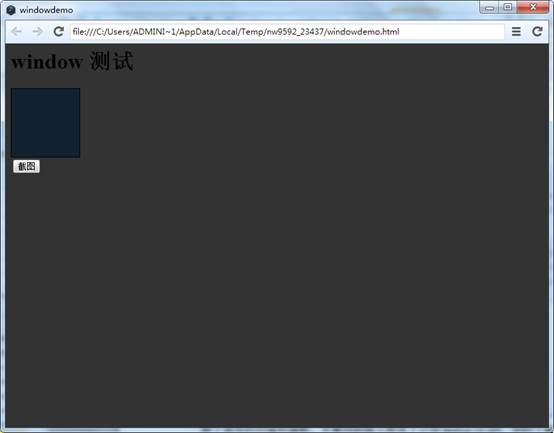

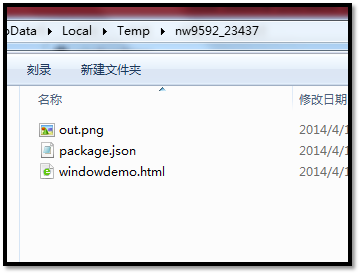

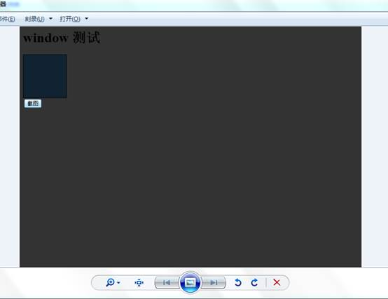

从 node-webkit *v0.9.3*开始，可以通过配置参数的方式进行截图了，使用方法如下：

```
// png as base64string
win.capturePage(function(base64string){
    // do something with the base64string
}, { format : 'png', datatype : 'raw'} );
// png as node buffer
win.capturePage(function(buffer){
    // do something with the buffer
}, { format : 'png', datatype : 'buffer'} ); 
```

配置项可用值参考：

```
{
    format : "[jpeg|png]",
    datatype : "[raw|buffer|datauri]"
} 
```

默认情况下，format 值为 jpeg，datatype 为 datauri。

### 4.3.40 Window.cookies.*

包含一些列处理 cookie 的方法。这些 api 的定义方式和 chrome 扩展相同。node-webkit 支持 get, getAll, remove 和 set 方法; onChanged 事件 (该事件支持支持 both addListener 和 removeListener 方法)。

和 CookieStore 有关的扩展 api 不被支持，因为 node-webkit 只有一个全局的 cookie 存储。

### 4.3.41 Window.eval(frame, script)

在目标 window 或者 iframe 中执行 javascript 代码段。script 参数是要执行的 javascript 代码。

## 4.4 window 事件

本节介绍的事件，都可以通过 Window.on()方法进行监听，更多接收事件相关内容参考 node.js 文档， [EventEmitter](http://nodejs.org/api/events.html#events_class_events_eventemitter)。

### 4.4.1 close

关闭窗口事件。参考上文 window.close()方法。

### 4.4.2 closed

窗口关闭完毕事件。正常情况下在同一窗体内是无法监听此事件的，以为窗口已经关闭，所有 javascript 对象都被释放掉了。

但是我们可以通过在另一窗口，监听被关闭窗口的已关闭事件。如：

```
<script>
    var gui = require('nw.gui');
    //var new_win = gui.Window.get(
    // window.open('http://ebook.xuanhun521.com')
    //);
    var new_win = gui.Window.open('http://ebook.xuanhun521.com', {
        position: 'center',
        width: 901,
        height: 127,
        focus: true
    });
    new_win.on('closed', function () {
        var element = document.createElement('div');
        element.appendChild(document.createTextNode('新窗口已经关闭'));
        document.body.appendChild(element);
    });
</script> 
```

在当前窗体监听新建窗体的已关闭事件，关闭新窗口后的显示结果：

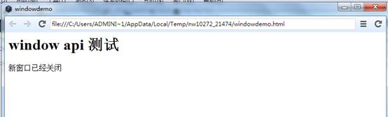

### 4.4.3 loading

窗口正在初始化时的事件。

该事件只能在刷新窗口或者在其他窗口中监听。

### 4.4.4 loaded

窗口初始化完毕。

### 4.4.5 document-start

function (frame) {}

窗体中的 document 对象或者 iframe 中的 css 文件都加载完毕，DOM 元素还未开始渲染，javascript 代码还未执行，触发此事件。

监听事件的函数会接收一个 frame 参数，值为具体的 iframe 对象或者为 null。

读者可同时参考[node webkit 学习(2)基本结构和配置](http://www.xuanhun521.com/Blog/2014/4/10/node-webkit%E5%AD%A6%E4%B9%A02%E5%9F%BA%E6%9C%AC%E7%BB%93%E6%9E%84%E5%92%8C%E9%85%8D%E7%BD%AE)中的 inject-js-start

### 4.4.6 document-end

```
function (frame) {} 
```

文档加载完毕触发的事件。

### 4.4.7 focus

获取焦点的事件。

### 4.4.8 blur

失去焦点的事件。

### 4.4.9 minimize

窗口最小化事件。

### 4.4.10 restore

当窗口从最小化重置到上一状态时触发的事件。

### 4.4.11 maximize

窗口最大化事件。

### 4.4.12 unmaximize

窗口从最大化状态重置到之前的状态时触发的事件。

### 4.4.13 move

窗口被移动后引发的事件。

事件处理函数应该接收两个参数(x,y)，是窗口的新位置。

### 4.4.14 resize

窗体大小被重置时触发的事件。

事件监听的回调函数接收两个参数(width,height)，窗口的新大小。

### 4.4.15 enter-fullscreen

窗口进入全屏模式时触发的事件。

### 4.4.16 leave-fullscreen

退出全屏模式时触发的事件。

### 4.4.17 zoom

当窗体中文档发生 zooming 时触发的事件，带有 zoomlevel 参数，参见上文的 window.zoom 属性。

### 4.4.18 capturepagedone

截图完毕触发的事件，事件的传递参数参考上文 Window.capturePage 函数的回调函数的参数定义。

### 4.4.19 devtools-opened

开发者工具被打开触发的事件。

事件的回调函数接收一个 url 参数，是打开开发者工具的窗口地址。

### 4.4.20 devtools-closed

开发者工具被关闭时触发的事件。

### 4.4.21 new-win-policy

当一个新窗口被从当前窗口打开，或者打开一个 iframe 时触发该事件。

```
function (frame, url, policy) {} 
```

*   `frame` 发起请求的子 iframe，如果从顶层窗口中发起的请求，该值为 null
*   `url` 请求的地址
*   `policy` 带有以下方法的对象
    *   ignore() : 忽略请求。
    *   forceCurrent() :强制在同一 frame 中打开链接
    *   forceDownload() : 强制链接被下载或者在其他应用中打开
    *   forceNewWindow() : 强制在新窗口中打开链接
    *   forceNewPopup() : 强制在新的 popup window 中打开链接

## 4.5 存在的问题

在 linux 下， `setMaximumSize()/setMinimumSize()` 和 `setResizable()`方法不能被同时使用。

## 4.6 小结

本文内容主要参考 node-webkit 的官方英文文档（[`github.com/rogerwang/node-webkit/wiki/Window`](https://github.com/rogerwang/node-webkit/wiki/Window)）。

下一篇文章，介绍 Frameless window。

# node-webkit 教程(5)Native UI API 之 Frameless window

# node-webkit 教程(5)Native UI API 之 Frameless window

> 作者：玄魂
> 
> 来源：[nnode-webkit 教程(5)Native UI API 之 Frameless window](http://www.cnblogs.com/xuanhun/p/3666461.html)

## 5.1 Frameless window 概述

Frameless window，是没有操作系统默认样式的边框的窗口，也就意味着最大、最小和关闭按钮也访问不到，同时默认情况下窗口不能被拖拽。

在[node webkit 学习(2)基本结构和配置](http://www.xuanhun521.com/Blog/2014/4/10/node-webkit%E5%AD%A6%E4%B9%A02%E5%9F%BA%E6%9C%AC%E7%BB%93%E6%9E%84%E5%92%8C%E9%85%8D%E7%BD%AE)一文中，介绍 frame 属性时，给出了一个简单示例，本篇文章以该示例为基础进行扩展。

Frameless window 的使用场景，通常是我们需要自定义标题栏，窗口边框样式和按钮的时候。

首先创建示例程序文件，framelessDemo.html 和 package.json。

framelessDemo.html 代码如下：

```
<html>
<head>
<title>frame less windowdemo</title>
<meta http-equiv="Content-Type" content="text/html; charset=utf-8" />
</head>
<body >
<h1>frameless window 测试</h1>
<script>
    var gui = require('nw.gui');
</script>
</body>
</html> 
```

package.json 内容如下：

```
{
    "name": "framelessWindow-demo",
    "main": "framelessDemo.html",
    "nodejs":true,
    "window": {
        "title": " framelessWindow-demo ",
        "toolbar": true,
        "width": 800,
        "height": 600,
        "resizable":true,
        "show_in_taskbar":true,
        "frame":false,
        "kiosk":false
    },
    "webkit":{
        "plugin":true
    }
} 
```

运行程序，效果如下：

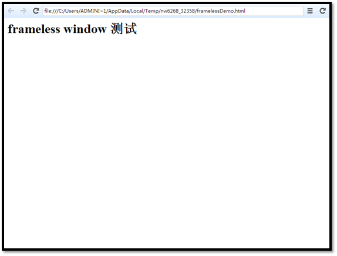

此时窗口无边框，无标题栏，不能拖拽。

## 5.2 如何启用无边框窗口

注意 package.json 中 window 的配置，将字段 frame 设置为 false 即可。

```
{
    "window": {
        "frame": false
    }
} 
```

## 5.3 窗口拖拽

默认情况下，无框窗口是不可拖拽的，可以通过给 body 添加“-webkit-app-region: drag”样式，来启用拖拽。

如果在 body 上设置了拖拽，需要在 button 上去除拖拽，否则按钮无法点击，添加如下样式：

```
button {
    -webkit-app-region: no-drag;
} 
```

如果你仅仅使用自定义 titlebar 组件，也需要设置在 titlebar 中的按钮 no-drag。

## 5.4 窗口操作

在无框窗口中，我们仍然需要使用户能够进行最大、最小，关闭窗口等操作。

首先我们可以使用 javascript 中的 window 对象来关闭窗口。

因为 node-webkit 有 window 对象，使用 window api 是我们的首选，详见：node-webkit 学习(4)[Native UI API 之 window](http://www.xuanhun521.com/Blog/2014/4/14/node-webkit%E5%AD%A6%E4%B9%A04native-ui-api-%E4%B9%8Bwindow)（[`www.xuanhun521.com/Blog/2014/4/14/node-webkit%E5%AD%A6%E4%B9%A04native-ui-api-%E4%B9%8Bwindow`](http://www.xuanhun521.com/Blog/2014/4/14/node-webkit%E5%AD%A6%E4%B9%A04native-ui-api-%E4%B9%8Bwindow)）

## 5.5 推荐 demo

demo 地址：[`github.com/zcbenz/nw-sample-apps/tree/master/frameless-window`](https://github.com/zcbenz/nw-sample-apps/tree/master/frameless-window)。

这个示例演示了使用 frameless window 时，如何自定义实现所有标准窗口的功能。

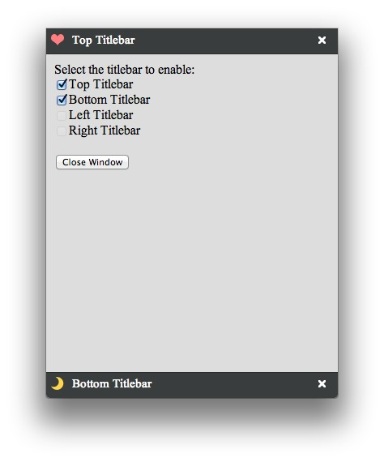

## 5.6 小结

本文内容主要参考 node-webkit 的官方英文文档（[`github.com/rogerwang/node-webkit/wiki/Frameless-window`](https://github.com/rogerwang/node-webkit/wiki/Frameless-window)）。

下一篇文章，介绍 menu。

# node-webkit 教程(6)Native UI API 之 Menu(菜单)

# node-webkit 教程(6)Native UI API 之 Menu(菜单)

> 作者：玄魂
> 
> 来源：[node-webkit 教程(6)Native UI API 之 Menu(菜单)](http://www.cnblogs.com/xuanhun/p/3669216.html)

## 目录

*   6.1 Menu 概述
*   6.2 menu api
    *   6.2.1 new Menu([option])
    *   6.2.2 Menu.items
    *   6.2.3 Menu.items.length
    *   6.2.4 Menu.items[i]
    *   6.2.5 Menu.append(MenuItem item)
    *   6.2.6 Menu.insert(MenuItem item, int i)
    *   6.2.7 Menu.remove(MenuItem item)
    *   6.2.8 Menu.removeAt(int i)
    *   6.2.9 Menu.item[x].click
    *   6.2.10 Menu.popup(int x, int y)
*   6.3 创建右键菜单
*   6.4 MenuItem
    *   6.4.1 new MenuItem(option)
    *   6.4.2 MenuItem.type
    *   6.4.3 MenuItem.label
    *   6.4.4 MenuItem.icon
    *   6.4.5 MenuItem.tooltip
    *   6.4.6 MenuItem.checked
    *   6.4.7 MenuItem.enabled
    *   6.4.8 MenuItem.submenu
    *   6.4.9 MenuItem.click
*   6.6 小结

## 6.1 Menu 概述

Menu API 提供的是本地化的窗口菜单，即 windows 下常说的菜单栏，定义的菜单显示在本地化（native）window 上，而不是属于 DOM 文档。参考：[node-webkit 学习(4)Native UI API 之 window](http://www.xuanhun521.com/Blog/2014/4/14/node-webkit%E5%AD%A6%E4%B9%A04native-ui-api-%E4%B9%8Bwindow)

Menu 分为两种，window 菜单和上下文（右键）菜单（context menu）。

创建 menu 对象使用构造函数 Menu([option])，如：

```
// Load native UI library
var gui = require('nw.gui');
// Create an empty menu
var menu = new gui.Menu(); 
```

不带参数构造的 menu 属于 context menu，如果想创建 window menu，使用如下方式：

```
var your_menu = new gui.Menu({ type: 'menubar' }); 
```

将 window menu 直接赋值给 window 对象的 menu 属性即可生效。

```
gui.Window.get().menu = your_menu; 
```

创建 menuDemo.html 和 package.json。menuDemo.html 代码如下：

```
<html>
<head>
<title>menuDemo</title>
<meta http-equiv="Content-Type" content="text/html; charset=utf-8" />
</head>
<body >
<h1>menu api 测试</h1>
<script>
    // Load native UI library
    var gui = require('nw.gui');
    var win = gui.Window.get();
    //创建 window menu
    var windowMenu = new gui.Menu({ type: 'menubar' });
    var windowSubmenu = new gui.Menu();
    var subMenuItem = new gui.MenuItem({ label: '子菜单项' });
    windowSubmenu.append(subMenuItem);
    windowMenu.append(
        new gui.MenuItem({ label: '子菜单', submenu: windowSubmenu })
    );
    win.menu = windowMenu;
    // Create an empty menu
    var menu = new gui.Menu();
    // Add some items
    menu.append(new gui.MenuItem({ label: 'Item A' }));
    menu.append(new gui.MenuItem({ label: 'Item B' }));
    menu.append(new gui.MenuItem({ type: 'separator' }));
    menu.append(new gui.MenuItem({ label: 'Item C' }));
    // Remove one item
    menu.removeAt(1);
    // Popup as context menu
    menu.popup(10, 10);
    // Iterate menu's items
    for (var i = 0; i < menu.items.length; ++i) {
        var element = document.createElement('div');
        element.appendChild(document.createTextNode(menu.items[i].label));
        document.body.appendChild(element);
    }
</script>
</body>
</html> 
```

package.json 文件内容如下：

```
{
    "name": "menu-demo",
    "main": "menuDemo.html",
    "nodejs":true,
    "width":100,
    "height":200,
    "window": {
        "title": "MenuDemo",
        "toolbar": true,
        "width": 800,
        "height": 600,
        "resizable":true,
        "show_in_taskbar":true,
        "frame":true,
        "kiosk":false
    },
    "webkit":{
        "plugin":true
    }
} 
```

运行结果如下：

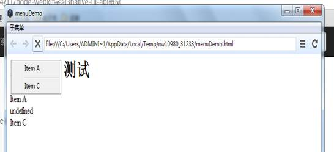

## 6.2 menu api

### 6.2.1 new Menu([option])

构造函数，见上文。

### 6.2.2 Menu.items

获取该 Menu 下所有的 MenuItem 对象，返回结果为数组。上文中的例子，有这样的代码：

```
for (var i = 0; i < menu.items.length; ++i) {
    var element = document.createElement('div');
    element.appendChild(document.createTextNode(menu.items[i].label));
    document.body.appendChild(element);
} 
```

上面的代码通过 menu.items 获取所有 menuitem 对象，遍历输出 label。这里需要注意的是，并不是所有的 menuitem 都有 label 属性。

### 6.2.3 Menu.items.length

menuitem 的个数。参加上文 demo。

### 6.2.4 Menu.items[i]

通过索引返回一个 menuitem 对象。

### 6.2.5 Menu.append(MenuItem item)

向当前菜单中添加一个 menuitem 对象，该对象在整个 menuitem 集合的尾部。

### 6.2.6 Menu.insert(MenuItem item, int i)

在 menuitem 集合的指定位置插入一个 menuitem 对象。

### 6.2.7 Menu.remove(MenuItem item)

从 menuitem 集合中移除一个 menuitem 对象。

### 6.2.8 Menu.removeAt(int i)

删除 menuitem 集合中指定位置的 menuitem 对象。

### 6.2.9 Menu.item[x].click

设置 menuitem 集合中指定位置的 menuitem 对象的 click 事件，在 menuDemo.html 中添加如下代码：

```
menu.items[0].click = function() {
    var element = document.createElement('div');
    element.appendChild(document.createTextNode(‘我被点击了’));
    document.body.appendChild(element);
}; 
```

结果如下：

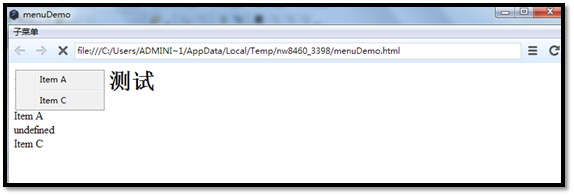

点击前

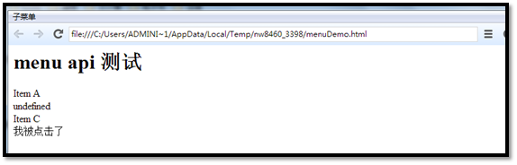

点击后

### 6.2.10 Menu.popup(int x, int y)

在当前窗口的指定位置弹窗菜单。示例代码见上文。

## 6.3 创建右键菜单

创建右键菜单，需要在页面监听`contextmenu` 事件，然后控制弹出菜单。修改之前的菜单弹出代码：

```
document.body.addEventListener('contextmenu', function (ev) {
    ev.preventDefault();
    menu.popup(10, 10);
    return false;
}); 
```

启动时页面如下：


单击右键后，界面显示菜单：


## 6.4 MenuItem

从上面的叙述中，我们已经知道，menu 和 menuitem 的一起组合，才能最终组成界面上的菜单。到目前为止，我们已经基本了解了 menuitem 的基本使用方法，下面根据 api 文档，详细介绍属性、方法和事件。

### 6.4.1 new MenuItem(option)

初始化一个 Menuitem 对象，其中 option 是一个对象，包含 label, icon, tooltip, type, click, checked, enabled 和 submenu 这些字段。这些字段都具有自己的属性，下面分别叙述。

### 6.4.2 MenuItem.type

获取一个 menuitem 的类别信息，到目前为止有三类 menuitem，分别为 separator, checkbox 和 normal。

normal 和 separator 类型的 menuitem 我们都已经在上面的示例中见到，下面我们添加一个 checkbox 类型的 menuitem。

menu.append(new gui.MenuItem({ label: '请选择',type:'checkbox' }));

结果如下：


需要注意的是，type 字段只能在初始化时设定，在运行时是不能修改 menuitem 的类型的。

### 6.4.3 MenuItem.label

获取或设置 menuitem 的 label 值，目前只支持纯文本。

### 6.4.4 MenuItem.icon

菜单的图标，支持 app 内部的相对路径和系统路径。sepatater 类型的 menuitem 不支持 icon 属性。只支持 png 格式的图片。

修改 sumMenuItem，为它添加 icon：

var subMenuItem = new gui.MenuItem({ label: '子菜单项', icon: '2655716405282662783.png' });

效果如下：


### 6.4.5 MenuItem.tooltip

或者或者设置 tooltip 字段。所谓 tooltip 就是当鼠标滑动到菜单上显示的文本信息，类似于 DOM 元素中的 title。

下面我们继续修改 subMenuItem，为其添加 tooltip：

```
var subMenuItem = new gui.MenuItem({
    label: '子菜单项',
    icon: '2655716405282662783.png',
    tooltip:'我是帅气的子菜单'
}); 
```

很不幸，在我的 windows 7 机器上，tooltip 无法显示。在 ubuntu 上，menubar 是显示在全局菜单上，看起来有点怪异：


### 6.4.6 MenuItem.checked

获取或设置 menuitem 是否被选中。

### 6.4.7 MenuItem.enabled

获取或者 menuitem 的 enaled 属性，enabled 设置为 false 的 menuitem 不可被选中。

### 6.4.8 MenuItem.submenu

获取或者是子菜单。可以参考本文的示例。

### 6.4.9 MenuItem.click

获取或设置 click 事件的回调函数。

## 6.6 小结

本文内容主要参考 node-webkit 的官方英文文档（[`github.com/rogerwang/node-webkit/wiki/Menu`](https://github.com/rogerwang/node-webkit/wiki/Menu)，[`github.com/rogerwang/node-webkit/wiki/MenuItem`](https://github.com/rogerwang/node-webkit/wiki/MenuItem)，[`github.com/rogerwang/node-webkit/wiki/Window-menu`](https://github.com/rogerwang/node-webkit/wiki/Window-menu)）。

下一篇文章，介绍 Platform Services。

# node-webkit 教程(7)Platform Service 之 APP

# node-webkit 教程(7)Platform Service 之 APP

> 作者：玄魂
> 
> 来源：[node-webkit 教程(7)Platform Service 之 APP](http://www.cnblogs.com/xuanhun/p/3670906.html)

从本篇文章开始，为您介绍 Platform Services 些列的 API，本系列由以下类别：

*   App – 每个应用运行时全局 api
*   Clipboard – 剪贴板
*   Tray – 状态栏图标，消息通知
*   File dialogs-文件选择对话框
*   Shell – 桌面相关
*   Handling files and arguments-处理文件和相关参数

## 7.1 APP 概述

APP 类别的 API 是针对当前正在运行的应用程序实例的，换个说法是进程级别的（这样说还不准确，node-webkit 每一个窗口在单独进程中，应用本身是多进程的）。这些 API 和程序的启动、关闭关系最密切。但是从目前文档中的 API 来看，APP 类别的 API 显得不是很丰富。

新建 appDemo.html 和 package.json 文件。

package.json 内容如下：

```
{
    "name": "app-demo",
    "main": "appDemo.html",
    "nodejs":true,
    "window": {
        "title": "appDemo",
        "toolbar": true,
        "width": 800,
        "height": 600,
        "resizable":true,
        "show_in_taskbar":true,
        "frame":true,
        "kiosk":false,
        "icon": "2655716405282662783.png",
    },
    "webkit":{
        "plugin":true
    }
} 
```

appDemo.html 内容如下：

```
<html>
<head>
<title>appDemo</title>
<meta http-equiv="Content-Type" content="text/html; charset=utf-8" />
</head>
<body >
<h1>app api 测试</h1>
<script>
    // Load native UI library
    var gui = require('nw.gui');
    var win = gui.Window.get();
</script>
</body>
</html> 
```

## 7.1 获取 APP 对象

通过如下方式获得 APP 对象：

```
// Load native UI library
var gui = require('nw.gui');
var app = gui.App; 
```

## 7.2 获取命令行参数

很多时候，我们启动程序需要从命令行输入参数，可以通过 argv、fullArgv 和 filteredArgv 获取输入参数。关于三者的区别参考：[`github.com/rogerwang/node-webkit/wiki/App#fullargv`](https://github.com/rogerwang/node-webkit/wiki/App#fullargv)。我的测试结果和文档还是有出入的。

修改 appDemo.html 如下：

```
<html>
<head>
<title>appDemo</title>
<meta http-equiv="Content-Type" content="text/html; charset=utf-8" />
</head>
<body >
<h1>app api 测试</h1>
<script>
    // Load native UI library
    var gui = require('nw.gui');
    var app = gui.App;
    apendText(app.argv);
    apendText(app.fullArgv);
    apendText(app.filteredArgv);
    function apendText(text)
    {
        var element = document.createElement('div');
        element.appendChild(document.createTextNode(text));
        document.body.appendChild(element);
    }
</script>
</body>
</html> 
```

在命令行启动程序：


运行结果如下：


## 7.3 dataPath

应用的数据存储目录，在不同的操作系统上路径不同，

*   Windows: `%LOCALAPPDATA%/<name>`

*   Linux: `~/.config/<name>`;

*   OSX:`~/Library/Application Support/<name>`

这里的`<name>`是在 package.json 中定义的 name 字段的值，所以需要在定义 name 值的时候保证全局唯一。

## 7.4 获取 manifest

使用 manifest 属性，可以获取 package.json 中的 json 对象。修改 appDemo。html 的脚本内容如下：

```
<script>
    // Load native UI library
    var gui = require('nw.gui');
    var app = gui.App;
    var manifest = app.manifest;
    apendText(manifest.name);
    function apendText(text)
    {
        var element = document.createElement('div');
        element.appendChild(document.createTextNode(text));
        document.body.appendChild(element);
    }
</script> 
```

结果如下：


## 7.5 清除缓存

可以调用 clearCache()方法，清除应用在内存和磁盘上的缓存。

## 7.6 关闭程序

关闭程序有两个函数可以调用，分别为 closeAllWindows()和 quit()方法，两者的区别在于 closeAllWindows()方法会发送窗口的关闭消息，我们可以监听 close 事件（参考：[`www.xuanhun521.com/Blog/2014/4/14/node-webkit%E5%AD%A6%E4%B9%A04native-ui-api-%E4%B9%8Bwindow`](http://www.xuanhun521.com/Blog/2014/4/14/node-webkit%E5%AD%A6%E4%B9%A04native-ui-api-%E4%B9%8Bwindow)），阻止窗口关闭或者做其他日志等工作。quit()方法不会发送任何消息，直接退出程序。

## 7.7 Crash dump

从 node-webkit 0.8.0 版本开始，如果应用崩溃，一个`minidump` 文件会被保存到磁盘，用以调试和寻找程序崩溃的原因。默认情况下，dump 文件保存在系统的临时文件夹中，我们也可以通过 api 来设置 dump 文件的存放目录。以下是个版本系统的临时目录：

*   Linux: `/tmp`

*   Windows: [System temporary directory](http://msdn.microsoft.com/en-us/library/windows/desktop/aa364992%28v=vs.85%29.aspx)

*   Mac: `~/Library/Breakpad/product name` (product name is defined in .plist file in the application bundle)

为了方便测试，node-webkit 提供了 App.crashBrowser()和 App.crashRenderer()两个 api，分别保存 browser 进程和 render 进程的数据。下面我们通过实例演示将 dump 文件保存到本地磁盘 D。

```
<script>
    // Load native UI library
    var gui = require('nw.gui');
    var app = gui.App;
    app.setCrashDumpDir('d:\\');//设置转储目录
    app.crashBrowser();
    app.crashRenderer();
    function apendText(text)
    {
        var element = document.createElement('div');
        element.appendChild(document.createTextNode(text));
        document.body.appendChild(element);
    }
</script> 
```

运行程序，应用启动后会崩溃退出，在 D 盘会看到转储文件：


如何查看转储文件，这里就不详细介绍了，会在专门的文章中讲解，读者现在可以参考文档中的链接：

### Decoding the stack trace

To extract the stack trace from the minidump file, you need the `minidump_stackwalk` tool, symbols file of node-webkit binary and the minidump (.dmp) file generated from the crash.

See [`www.chromium.org/developers/decoding-crash-dumps`](http://www.chromium.org/developers/decoding-crash-dumps)

[`code.google.com/p/google-breakpad/wiki/GettingStartedWithBreakpad`](http://code.google.com/p/google-breakpad/wiki/GettingStartedWithBreakpad)

Symbols file of official node-webkit binary is provided staring from 0.8.0\. It can be downloaded from:

### Resources

**Linux symbol files of breakpad**

[`s3.amazonaws.com/node-webkit/v0.8.0/nw.breakpad.ia32.gz`](https://s3.amazonaws.com/node-webkit/v0.8.0/nw.breakpad.ia32.gz)

[`s3.amazonaws.com/node-webkit/v0.8.0/nw.breakpad.x64.gz`](https://s3.amazonaws.com/node-webkit/v0.8.0/nw.breakpad.x64.gz)

**windows pdb file**

[`s3.amazonaws.com/node-webkit/v0.8.0/nw.exe.pdb.zip`](https://s3.amazonaws.com/node-webkit/v0.8.0/nw.exe.pdb.zip)

**mac dSYM files**

[`s3.amazonaws.com/node-webkit/v0.8.0/node-webkit-osx-dsym-v0.8.0.tar.gz`](https://s3.amazonaws.com/node-webkit/v0.8.0/node-webkit-osx-dsym-v0.8.0.tar.gz)

## 7.8 获取代理

使用 getProxyForURL(url)，可以获得加载该 url 时使用的代理信息。返回值使用 PAC 格式（参考：[`en.wikipedia.org/wiki/Proxy_auto-config`](http://en.wikipedia.org/wiki/Proxy_auto-config)）。

## 7.9 小结

本文内容主要参考 node-webkit 的官方英文文档，做了适当的调整（[`github.com/rogerwang/node-webkit/wiki/App`](https://github.com/rogerwang/node-webkit/wiki/App)，

[`github.com/rogerwang/node-webkit/wiki/Crash-dump`](https://github.com/rogerwang/node-webkit/wiki/Crash-dump)）。

下一篇文章，介绍 Clipboard。

# node-webkit 教程(8)Platform Service 之 Clipboard

# node-webkit 教程(8)Platform Service 之 Clipboard

> 作者：玄魂
> 
> 来源：[node-webkit 教程(8)Platform Service 之 Clipboard](http://www.cnblogs.com/xuanhun/p/3671461.html)

## 目录

*   8.1 Clipboard 操作
*   8.6 小结

## 前言

## 8.1 Clipboard 操作

Clipboard 是对操作系统剪贴板的一个抽象，目前只支持获取和设置纯文本内容。

新建 clip.html 和 package.json。

clip.html 内容如下：

```
<html>
<head>
<title>appDemo</title>
<meta http-equiv="Content-Type" content="text/html; charset=utf-8" />
</head>
<body >
<h1>app api 测试</h1>
<button onclick="getText()">获取内容</button>
<button onclick="setText()">写入内容</button>
<button onclick="clearText()">清除内容</button>
<script>
    var gui = require('nw.gui');
    // We can not create a clipboard, we have to receive the system clipboard
    var clipboard = gui.Clipboard.get();
    function apendText(text) {
        var element = document.createElement('div');
        element.appendChild(document.createTextNode(text));
        document.body.appendChild(element);
    }
    function clearText()
    {
        // And clear it!
        clipboard.clear();
        apendText('剪贴板内容已清除');
    }
    function setText()
    {
        // Or write something
        clipboard.set('这是 node-webkit 向剪贴板写的内容', 'text');
    }
    function getText()
    {
        // Read from clipboard
        var text = clipboard.get('text');
        apendText(text);
    }
</script>
</body>
</html> 
```

package.json 内容如下：

```
{
    "name": "clip-demo",
    "main": "clip.html",
    "nodejs":true,
    "window": {
        "title": "clipDemo",
        "toolbar": true,
        "width": 800,
        "height": 600,
        "resizable":true,
        "show_in_taskbar":true,
        "frame":true,
        "kiosk":false,
        "icon": "2655716405282662783.png"
    },
    "webkit":{
        "plugin":true
    }
} 
```

示例代码准备完毕之后，我们打开程序，如图：


程序有三个按钮，分别是获取、写入和清除剪贴板内容。在操作剪贴板之前，我们需要先获取 clipboard 对象：

```
var clipboard = gui.Clipboard.get(); 
```

现在我们先单击第二个按钮，向剪贴板写入内容，代码如下：

```
function setText()
{
    // Or write something
    clipboard.set('这是 node-webkit 向剪贴板写的内容', 'text');
} 
```

clipboard.set 方法接收两个参数，第一个参数是要写入的内容，第二个参数是内容类型，目前只支持 text 类型。

是否写入成功了呢？我们再单击第一个按钮，事件处理代码如下：

```
function getText()
{
    // Read from clipboard
    var text = clipboard.get('text');
    apendText(text);
} 
```

第一个按钮通过 clipboard.get 方法获取剪贴板内容然后输出，get 方法接收一个参数，指明内容类型，目前只支持 text 类型。写入和获取都成功，会出现如下界面：


下面我们再看清楚内容的按钮做了什么：

```
function clearText()
{
    // And clear it!
    clipboard.clear();
    apendText('剪贴板内容已清除');
} 
```

调用了 clipboard.clear()方法，清除剪贴板，想要验证是否清除成功，只需再次点击获取内容按钮，看是否有内容输出即可。


## 8.6 小结

本文内容主要参考 node-webkit 的官方英文文档，做了适当的调整（[`github.com/rogerwang/node-webkit/wiki/Clipboard`](https://github.com/rogerwang/node-webkit/wiki/Clipboard)）。

下一篇文章，介绍 Tray。

# node-webkit 教程(9)native api 之 Tray(托盘)

# node-webkit 教程(9)native api 之 Tray(托盘)

> 作者：玄魂
> 
> 来源：[node-webkit 教程(9)native api 之 Tray(托盘)](http://www.cnblogs.com/xuanhun/p/3678943.html)

## 目录

*   9.1 Tray 简介
*   9.2 tray 的属性
*   9.3 tray 的构造函数
*   9.4 初始化一个 tray
*   9.5 删除 tray
*   9.6 小结

## 9.1 Tray 简介

Tray 在不同的平台下的展现形式不一样，通常以一个 ICON 的形式展现在操作系统状态通知的位置。在 Mac 下称之为 Status Item，GTK 环境下称为 Status Icon，windows 叫系统托盘。

新建 tray.html 和 package.json 作为本文的示例程序。

tray.html 内容如下：

```
<html>
<head>
<title>trayDemo</title>
<meta http-equiv="Content-Type" content="text/html; charset=utf-8" />
</head>
<body >
<h1>Tray 测试</h1>
<script>
    // Load native UI library
    var gui = require('nw.gui');
</script>
</body>
</html> 
```

package.json 内容如下：

```
{
    "name": "tray-demo",
    "main": "tray.html",
    "nodejs":true,
    "window": {
        "title": "trayDemo",
        "toolbar": true,
        "width": 800,
        "height": 600,
        "resizable":true,
        "show_in_taskbar":true,
        "frame":true,
        "kiosk":false,
        "icon": "2655716405282662783.png"
    },
    "webkit":{
        "plugin":true
    }
} 
```

## 9.2 tray 的属性

Tray 包含 title、tooltip、icon、menu、alticon 五个属性。

title 属性只在 mac 系统下有效，会和 icon 图标一起显示在状态栏。

tooltip 是当鼠标移动到 tray 上方时显示的提示语，在所有平台下都有效。

icon 是 tray 显示在托盘中的图标。

menu 是托盘中的菜单，是一个 gui.Menu 对象（参考：[node-webkit 教程 6native-ui-api-之 menu 菜单](http://www.xuanhun521.com/Blog/2014/4/16/node-webkit%E6%95%99%E7%A8%8B6native-ui-api-%E4%B9%8Bmenu%E8%8F%9C%E5%8D%95)）。

alticon 只有在 mac 下起作用，配置切换效果 icon 图标。

## 9.3 tray 的构造函数

```
new Tray(option) 
```

option 中用来初始化 tray 的属性值，但是只能配置 title, tooltip, icon 和 menu 四个属性。如：

```
var tray = new gui.Tray({ title: 'Tray', icon: 'img/icon.png' }); 
```

所有的属性都可以通过对象直接获取或赋值，如：

```
tray.menu = menu; 
```

## 9.4 初始化一个 tray

现在我们修改 tray.html：

```
<script>
    var isShowWindow = true;
    // Load native UI library
    var gui = require('nw.gui');
    var win = gui.Window.get();
    var tray = new gui.Tray({ title: '玄魂的软件', icon: '2655716405282662783.png' });
    tray.tooltip = '点此打开';
    //添加一个菜单
    var menu = new gui.Menu();
    menu.append(new gui.MenuItem({ type: 'checkbox', label: '选择我' }));
    tray.menu = menu;
    //click 事件
    tray.on('click', function() {
        if(isShowWindow)
        {
            win.hide();
            isShowWindow = false;
        }
        else
        {
            win.show();
            isShowWindow = true;
        }
    });
</script> 
```

运行效果如下：


点击托盘中的图标程序的窗体会相应的隐藏或者显示。

## 9.5 删除 tray

很可惜的是，现在还没有办法临时隐藏 Tray，只能删除它。

在删除需要调用 remove 方法，然后设置为 null。如：

```
tray.remove();

tray = null; 
```

## 9.6 小结

本文内容主要参考 node-webkit 的官方英文文档，做了适当的调整（[`github.com/rogerwang/node-webkit/wiki/Tray`](https://github.com/rogerwang/node-webkit/wiki/Tray)）。

下一篇文章，介绍 Tray。

# node-webkit 教程(10)Platform Service 之 File dialogs

# node-webkit 教程(10)Platform Service 之 File dialogs

> 作者：玄魂
> 
> 来源：[node-webkit 教程(10)Platform Service 之 File dialogs](http://www.cnblogs.com/xuanhun/p/3681246.html)

## 目录

*   10.1 File dialogs 简介
*   10.2 打开一个文件对话框
*   10.3 多文件选择对话框
*   10.4 文件类型过滤
*   10.5 选择文件夹
*   10.6 保存文件对话框
*   10.7 FileList8
*   10.8 指定默认路径
*   10.9 小结

## 10.1 File dialogs 简介

文件操作是桌面应用最常使用的功能之一，相应的打开或保存文件的文件对话框也是最常用的组件之一。

在 html 中，我们可以通过

```
<input type='file' /> 
```

去打开文件对话框，上传文件到服务端。但是 html 中的文件对话框对于桌面应用来说，显然是不够的，没有办法知道文件的来源，不能保存文件到本地等。

node-wekit 对 html 的文件对话框做了扩展，本文将对这些特性做详细的说明。下面创建示例应用。

新建 dialog.html 和 package.json 作为本文的示例程序的原型。

dialog.html 内容如下：

```
<html>
<head>
<title>dialogDemo</title>
<meta http-equiv="Content-Type" content="text/html; charset=utf-8" />
</head>
<body >
<h1>dialog 测试</h1>
<script>
    // Load native UI library
    var gui = require('nw.gui');
    var win = gui.Window.get();
</script>
</body>
</html> 
```

package.json 内容如下：

```
{
    "name": "dialog-demo",
    "main": "dialog.html",
    "nodejs":true,
    "window": {
        "title": "dialogDemo",
        "toolbar": true,
        "width": 800,
        "height": 600,
        "resizable":true,
        "show_in_taskbar":true,
        "frame":true,
        "kiosk":false,
        "icon": "2655716405282662783.png"
    },
    "webkit":{
        "plugin":true
    }
} 
```

## 10.2 打开一个文件对话框

修改 dialog.html 如下：

```
<html>
<head>
<title>dialogDemo</title>
<meta http-equiv="Content-Type" content="text/html; charset=utf-8" />
</head>
<body >
<h1>dialog 测试</h1>
<input id="fileDialog" type="file" />
<script>
    var chooser = document.querySelector('#fileDialog');
    chooser.addEventListener("change", function (evt) {
        apendText(this.value);
    }, false);
    function apendText(text) {
        var element = document.createElement('div');
        element.appendChild(document.createTextNode(text));
        document.body.appendChild(element);
    }
</script>
</body>
</html> 
```

首先，在代码中添加了“file”类型的 input 标签。

```
<input id="fileDialog" type="file" /> 
```

这就是一个普通的文件选择框，在 script 中，我们添加对改选择框的选择文件之后的事件监听代码，获取选择文件的路径。

```
var chooser = document.querySelector('#fileDialog');
chooser.addEventListener("change", function (evt) {
    apendText(this.value);
}, false); 
```

运行效果如下：


## 10.3 多文件选择对话框

若要支持文件选择框支持多文件，只需要在 input 标签内添加“`multiple` ”属性即可，这是 html5 支持的属性。

```
<input id="fileDialog" type="file" multiple /> 
```

此时 input 的 value 值为所有文件的路径，以分号分隔。运行效果如下：


## 10.4 文件类型过滤

使用 accept 属性来过滤需要的文件类型，如：

```
<input id="fileDialog" type="file" multiple accept=".html"/> 
```

## 10.5 选择文件夹

选择文件夹，而不是文件，在桌面应用中更有用，因为我们可以通过后端程序(node.js)进行文件遍历。

使用 nwdirectory 属性，可以是 input 支持选择文件夹。

```
<input id="fileDialog" type="file" nwdirectory /> 
```

运行效果如下：


## 10.6 保存文件对话框

当我们想要把某些内容保存到文档，保存文件对话框就十分重要了，当然这也是传统浏览器应用不具备的功能。

使用`nwsaveas` 属性可以启动保存文件对话框。

```
<input id="fileDialog" type="file" nwsaveas /> 
```

运行结果如下：


可以设置默认文件名，如：

```
<input id="fileDialog" type="file" nwsaveas="aa.txt"/> 
```

## 10.7 FileList

在前面我们通过 input 标签的 value 属性获取选择的文件，Html5 提供了`files` 属性，可以遍历文件。

修改示例程序的 script，如下：

```
<script>
    var chooser = document.querySelector('#fileDialog');
    chooser.addEventListener("change", function (evt) {
        var files = this.files;
        for (var i = 0; i < files.length; ++i)
        apendText(files[i].name);
    }, false);
    function apendText(text) {
        var element = document.createElement('div');
        element.appendChild(document.createTextNode(text));
        document.body.appendChild(element);
    }
</script> 
```

运行结果如下：


在上图中，我们看到程序输出了选择的文件名，但是并没有完整的路径。node-webkit，扩展了一个名为 path 的属性，通过这个属性，可以获取完整的文件路径。继续修改代码：

```
for (var i = 0; i < files.length; ++i)
apendText(files[i].path); 
```

运行结果如下：


## 10.8 指定默认路径

很多时候，我们需要引导用户从指定的目录打开或者保存文件，比如用户的文档目录，通过 nwworkingdir 属性可以完成这一需求。

修改 input 标签如下：

```
<input id="fileDialog" type="file" nwworkingdir="D:\xuanhunfile" /> 
```

在应用中打开文件对话框，会从指定目录开始。


## 10.9 小结

本文内容主要参考 node-webkit 的官方英文文档，做了适当的调整（[`github.com/rogerwang/node-webkit/wiki/File-dialogs`](https://github.com/rogerwang/node-webkit/wiki/File-dialogs)）。

下一篇文章，介绍 shell。

# node-webkit 教程(11)Platform Service 之 shell

# node-webkit 教程(11)Platform Service 之 shell

> 作者：玄魂
> 
> 来源：[node-webkit 教程(11)Platform Service 之 shell](http://www.cnblogs.com/xuanhun/p/3685100.html)

## 目录

*   11.1 Shell 是什么
*   11.2 示例
*   11.3 小结

## 11.1 Shell 是什么

Shell 是和桌面系统相关的一组 API。通常在操作系统中，我们有“核”和“壳”的区分，“核”是操作系统的内核，“壳”是一个操作界面，提供给用户输入命令，解析并执行命令（调用“核”），这个用户界面被称作 Shell（“壳”）。最常见的 shell 就是命令行（如 windows 下的 CMD）。

Node-Webkit 提供的 shell 功能很有限，现在能看到的只有三个 api:

*   openExternal(URI)

    用桌面系统默认的行为，在应用外部打开 URI。这和我们在浏览器中打开一个[mailto:](http://www.cnblogs.com/mailto:)链接是一样的，控制器会转到桌面系统默认的邮件客户端。

    

*   openItem(file_path)

    以操作系统默认方式打开指定路径。

*   showItemInFolder(file_path)

    在文件管理器中显示“file_path”指定的文件。

## 11.2 示例

新建 shell.html 和 package.json 文件。

shell.html 内容如下：

```
<html>
<head>
<title>shellDemo</title>
<meta http-equiv="Content-Type" content="text/html; charset=utf-8" />
</head>
<body >
<h1>shell 测试</h1>
<button onclick="openInexplorer()">在默认浏览器中打开玄魂的电子书</button>
<button onclick="openPdf()">打开 pdf</button>
<button onclick="showPdfInFloder()">打开 pdf 所在的文件夹</button>
<script>
    // Load native UI library.
    var gui = require('nw.gui');
    var shell = gui.Shell;
    function openInexplorer()
    {
    shell.openExternal('http://ebook.xuanhun521.com');
    }
    function openPdf()
    {
    shell.openItem('D:\\101.pdf');
    }
    function showPdfInFloder()
    {
    shell.showItemInFolder('D:\\学习资料\\技术类教程\\操作系统\\101-深入理解 Linux 内核(第三版 英文版)-1030 页-pdf-免费下载.pdf');
    }
</script>
</body>
</html> 
```

package.json 内容如下：

```
{
    "name": "shell-demo",
    "main": "shell.html",
    "nodejs":true,
    "window": {
        "title": "shellDemo",
        "toolbar": true,
        "width": 800,
        "height": 600,
        "resizable":true,
        "show_in_taskbar":true,
        "frame":true,
        "kiosk":false,
        "icon": "2655716405282662783.png"
    },
    "webkit":{
        "plugin":true
    }
} 
```

在上面的代码中，我们首先获取 shell 对象，

```
// Load native UI library.
var gui = require('nw.gui');
var shell = gui.Shell; 
```


函数 openInexplorer 中，调用 shell.openExternal 方法，在默认浏览器中打开“[玄魂的电子书站点](http://ebook.xuanhun521.com/)”。运行效果如下：


在函数 openPdf 中调用 shell.openItem('D:\101.pdf')，在系统默认的 paf 阅读器中打开 pdf 文档，效果如下：


在函数 showPdfInFloder 中，调用 shell.showItemInFolder 方法，在文件夹中显示并选中该文件。


## 11.3 小结

本文内容主要参考 node-webkit 的官方英文文档，做了适当的调整（[`github.com/rogerwang/node-webkit/wiki/Shell`](https://github.com/rogerwang/node-webkit/wiki/Shell)）。

# node-webkit 教程(12)全屏

# node-webkit 教程(12)全屏

> 作者：玄魂
> 
> 来源：[node-webkit 教程(12)全屏](http://www.cnblogs.com/xuanhun/p/3894272.html)

## 目录

*   前言
*   12.1 和全屏有关的三个 api
    *   Window.enterFullscreen()
    *   Window.leaveFullscreen()
    *   Window.toggleFullscreen()
*   11.2 示例
*   11.3 小结

## 前言

最近 node-webkit 新增了 fullScreen 和 widow notification 的 api，本篇文章主要简单演示下 fullScreen Api 的效果。

## 12.1 和全屏有关的三个 api

### Window.enterFullscreen()

该 api 使整个窗口进入全屏状态。

### Window.leaveFullscreen()

使窗口退出全屏状态。

### Window.toggleFullscreen()

逆转窗口的全屏状态。

## 11.2 示例

新建 fullscreenhtml 和 package.json 文件。

fullscreen.html 内容如下：

```
<html>
<head>
<title>玄魂测试 node-webkit 全屏 api</title>
<meta charset="gbk" />
</head>
<body >
<button id="full"> 全屏</button>
<button id="exitFull">退出全屏</button>
<div>
</div>
<script>
    var gui = require('nw.gui');
    var win = gui.Window.get();
    var fullBt = document.querySelector('#full');
    fullBt.addEventListener("click", function (evt) {
        win.enterFullscreen();
    }, false);
    var exitBt = document.querySelector('#exitFull');
    exitBt.addEventListener("click", function (evt) {
        win.leaveFullscreen();
    }, false);
</script>
</body>
</html> 
```

package.json 内容如下：

```
{
    "name": "nw-demo",
    "main": "fullscreen.html",
    "nodejs":true,
    "window": {
        "title": "全屏 api 测试",
        "toolbar": true,
        "width": 300,
        "height": 200,
        "resizable":true,
        "show_in_taskbar":true,
        "frame":true,
        "kiosk":false
    },
    "webkit":{
        "plugin":true
    }
} 
```

代码很简单，分别绑定了两个 button 的事件，用来全屏和退出全屏。

页面启动时效果如下：


点击全屏时效果如下：


点击退出全屏时效果如下：


## 11.3 小结

本文内容主要参考 node-webkit 的官方英文文档，做了适当的调整（[`github.com/rogerwang/node-webkit/wiki/Window）。`](https://github.com/rogerwang/node-webkit/wiki/Window）。)

# node-webkit 教程(13)gpu 支持信息查看

# node-webkit 教程(13)gpu 支持信息查看

> 作者：玄魂
> 
> 来源：[node-webkit 教程(13)gpu 支持信息查看](http://www.cnblogs.com/xuanhun/p/4034373.html)

## 目录

*   前言
*   13.1 操作步骤
    *   (一)打开 node-webkit，输入`chrome://gpu`。
    *   (二)打开开发者工具
    *   (三)在控制台输入代码：
    *   (四)在控制台继续输入：
    *   (五)查看返回的 json 数据
*   11.2 小结

## 前言

Chrome 中可以通过 chrome://gpu 来查看 gpu 的诊断信息。因为 chrome 对 gpu 的依赖越来越强，所以在应用开发过程中，查看某些特性的支持和问题诊断，gpu 信息都很重要。

但是 node-webkit 现在无法完整支持通过 chrome://gpu 的方式来显示 gpu 诊断信息。本文介绍的方法可以弥补这一缺憾

## 13.1 操作步骤

### (一)打开 node-webkit，输入`chrome://gpu`。


### (二)打开开发者工具


### (三)在控制台输入代码：

```
var browserBridge = {
    onGpuInfoUpdate:function(arg){console.log(JSON.stringify(arg,null,1));
}}; 
```


### (四)在控制台继续输入：

```
chrome.send('browserBridgeInitialized'); 
```


### (五)查看返回的 json 数据


## 11.2 小结

本文内容主要参考 node-webkit 的官方英文文档，做了适当的调整（[`github.com/rogerwang/node-webkit/wiki/Extract-info-about-gpu）。`](https://github.com/rogerwang/node-webkit/wiki/Extract-info-about-gpu）。)

# node-webkit 教程(14)禁用缓存

# node-webkit 教程(14)禁用缓存

> 作者：玄魂
> 
> 来源：[node-webkit 教程(14)禁用缓存](http://www.cnblogs.com/xuanhun/p/4127262.html)

## 1.在开发者工具中禁用缓存


上面这张图，是在 node-webkit 中 在开发工具中配置禁用缓存的选项。

使用这个选项可以有效的禁用所有页面缓存。

## 2\. 在配置文件中，配置 webkit 缓存禁用和启用

```
{
    "name": "name",
    "description": "description",
    "version": "0.1",
    "main": "https://path-to-intranet-site/",
    "node-remote": "https://path-to-intranet-site",
    "webkit": {
         "page-cache":false
    },
    "window": {
        "show": true,
        "toolbar": true,
        "frame": true,
        "position": "center",
        "width": 800,
        "height": 600,
        "min_width": 220,
        "min_height": 220
    }
} 
```

上面配置加粗的部分为禁用页面缓存。但是经过我的实验，仿佛页面缓存和 node-webkit 本身的缓存是两个不同的概念。

而且文档上说默认情况下页面缓存的值就是 false。

## 3.临时解决方案，不停的清除缓存

在开发过程中，我遇到了很多诡异的问题，都是由于 node-webkit 的缓存引起的。但是没有找到禁用缓存的 api，能起到像方案 1 那样在开发者工具中禁用缓存的效果。

但是找到了清除缓存的 api gui.App.clearCache();

要想达到禁用的效果，必须不停的清空缓存。

-----------------------几天之后-------------------

## 4\. 使用 Window.disableCache(bool) api

我在 github 上向 node-webkit 作者提交了关于清除缓存的 bug。作者响应很迅速，在 12 月 2 号编译的 的版本中

（[`dl.node-webkit.org/live-build/12-02-2014/831a6af-dad58ea-344f210-f2f89e2-d9a9d39-cdd879e/`](http://dl.node-webkit.org/live-build/12-02-2014/831a6af-dad58ea-344f210-f2f89e2-d9a9d39-cdd879e/)）

提供了 Window.disableCache(bool) api，用来禁用缓存。

现在再也不用纠结了。

# node-webkit 教程(15)当图片加载失败的时候

# node-webkit 教程(15)当图片加载失败的时候

> 作者：玄魂
> 
> 来源：[node-webkit 教程(15)当图片加载失败的时候](http://www.cnblogs.com/xuanhun/p/4127376.html)

在[node-webkit 教程(14)禁用缓存](http://www.cnblogs.com/xuanhun/p/4127262.html)中，简单讲了当前禁用缓存的几种方法。

在实际开发过程中，我遇到了一个因为缓存引起的诡异的问题。应用场景如下：

在一个编辑器里，不停的向画布上添加 svg 或者其他格式的图片文件，问题主要出在 svg 文件上。


插入 svg 图片的过程中，经常出现无法加载的现象，检测文件和 url 都是正确的。而且 svg 文件达到一定数量之后，再也无法插入新的文件。经过反复排查，确定是缓存引起的问题，无奈之下只能走清除缓存的路，实属下策。

# node-webkit 教程(16)调试 typescript

# node-webkit 教程(16)调试 typescript

> 作者：玄魂
> 
> 来源：[node-webkit 教程(16)调试 typescript](http://www.cnblogs.com/xuanhun/p/4172300.html)

本文所讲的内容同样适用于 chrome 浏览器。

在 chrome 的开发人员工具的配置项中，有一个 sourcemap 的选项，用来配置 javascript 源码和生成代码的关系。如果能在浏览器中直接调试 typescript 代码，才能让我们真正体会到 typescript 开发的快乐。

首先打开 chrome 开发者工具的配置项，然后查看 sources 下的 Enable source maps 选项，如果已经选中，请先取消，然后刷新页面，再选中，再刷新页面。


此时我们可以在开发这工具的 Sources 选项中看到 ts 文件。


如果你是使用 visual studio 开发 typescript 程序，默认项目是自动生成 map 文件的。在每一个 js 文件下会有 map 文件的注释说明。


如果没有生成 map 文件，到工具下的配置项中，配置 typescript 就可以了。


现在我们可以在开发者工具中设置断点了。


是不是很 happy 呢？